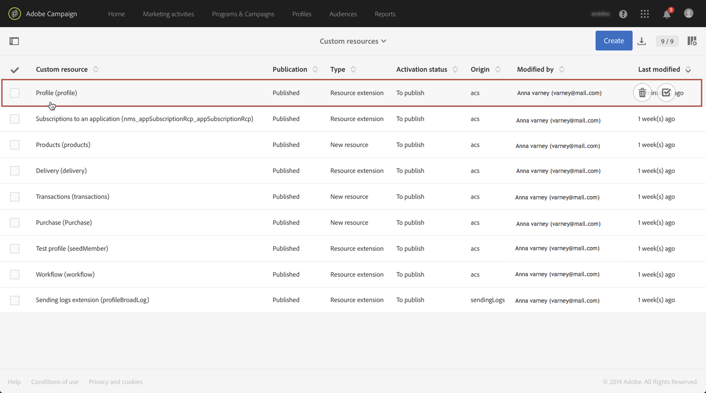
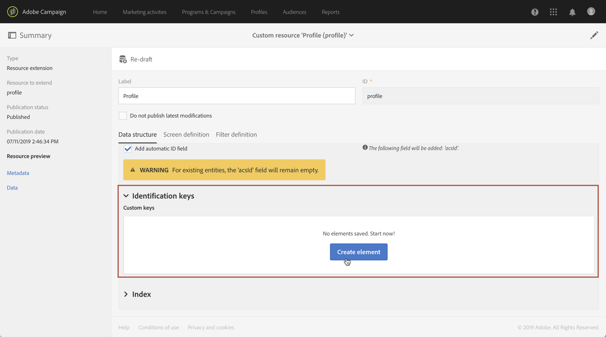
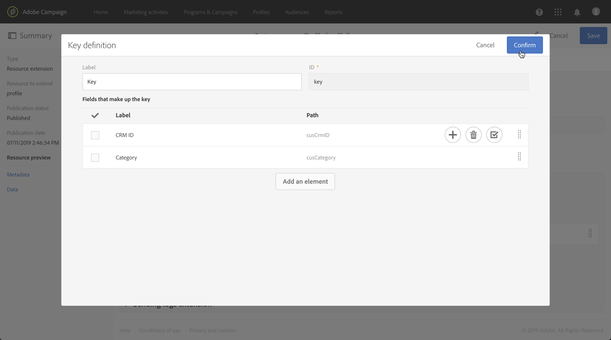
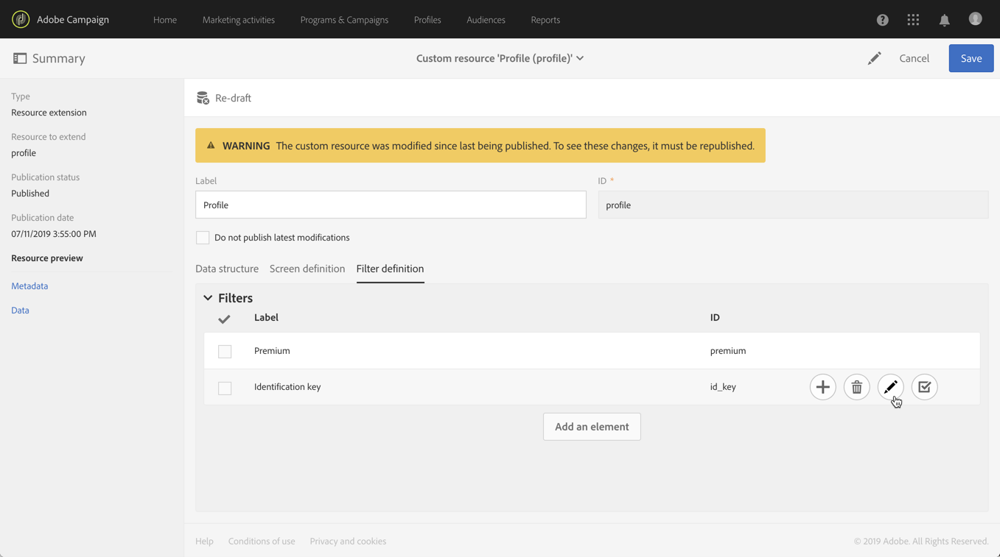
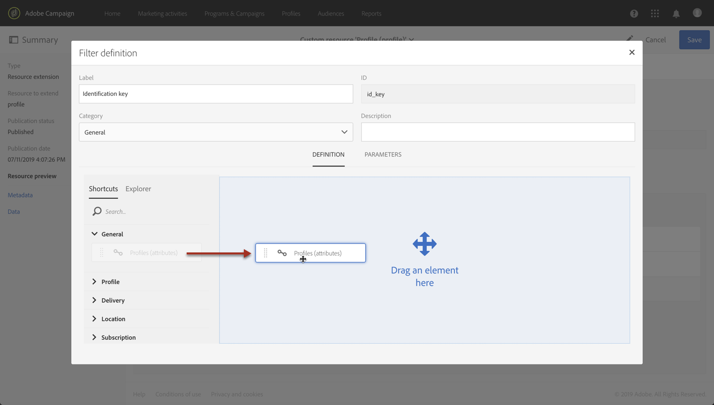
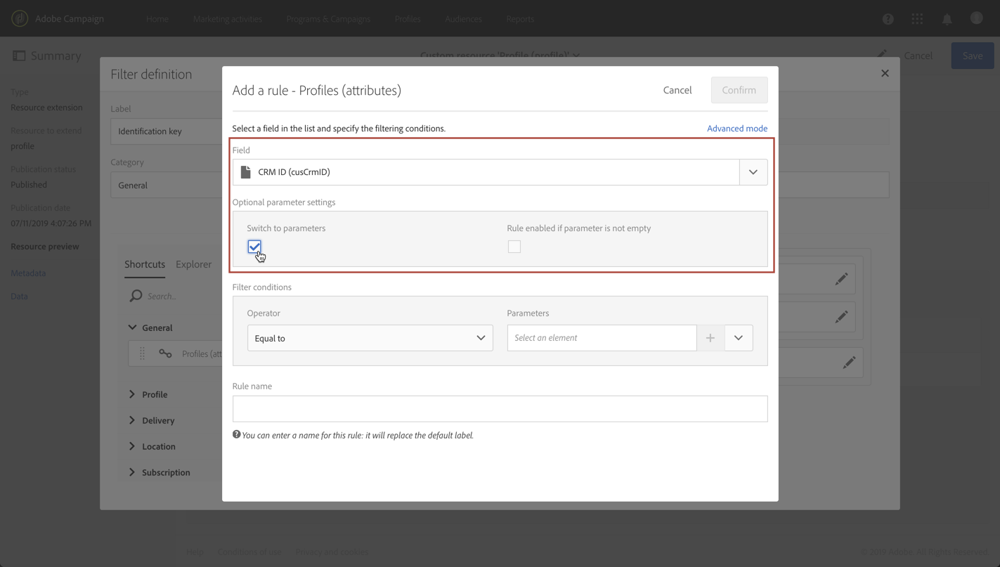
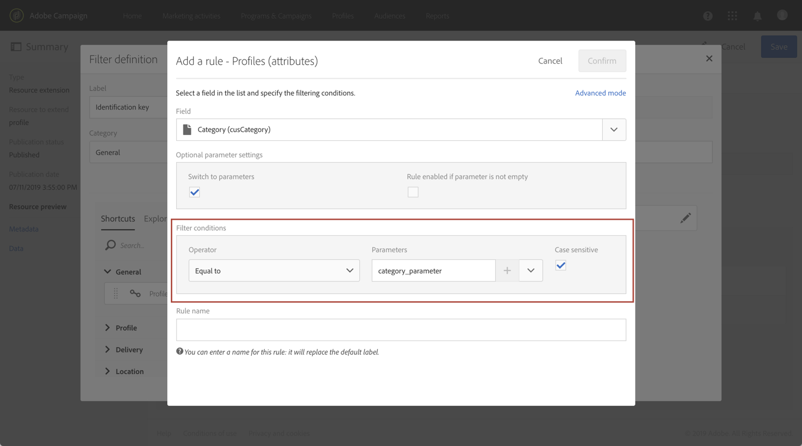
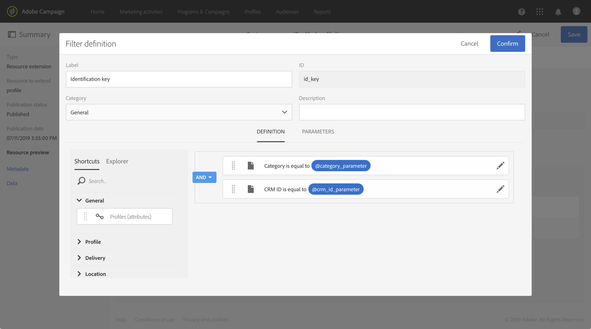
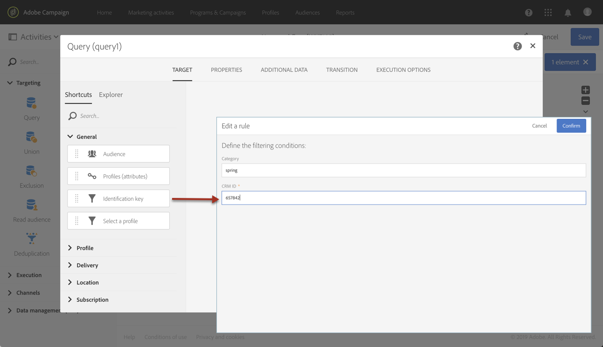

# Calling a resource using a composite identification key{#calling-a-resource-using-a-composite-identification-key}

In some cases, you may need to define for a resource an identification key that is made up of two fields. Once the identification key is configured, you need to configure a filter definition in order to be able to call the resource with this identification key, either from Campaign Standard interface or APIs.

In this use case, the **Profile** resource has been extended with custom **"CRM ID"** and **"category"** fields. We will create an identification key for the Profile resource, that will be made up of these two fields. We will then configure a filter definition, so that we can access the Profile resource using the identification key.

The main steps for this use case are:

1. Configure the identification key for the Profile resource, based on the two fields.
1. Configure the filter definition, to be able to call the Profile resource using its identification key.
1. Call the Profile resource from the interface or from the APis.

Related topics:

* [Creating or extending the resource](../../developing/using/creating-or-extending-the-resource.md)
* [Defining identification keys](../../developing/using/configuring-the-resource-s-data-structure.md#defining-identification-keys)
* [Campaign Standard REST APIs](../../api/using/get-started-apis.md)

## Step 1: Configure the identification key{#step-1-configure-the-identification-key}

   >[!NOTE]
   > Global concepts when configuring identification keys are detailed in [this section](../../developing/using/configuring-the-resource-s-data-structure.md#defining-identification-keys).

1. Before configuring the identification key, make sure that the resource has been extended with the desired fields and that it has been published. For more on this, refer to [this section](../../developing/using/creating-or-extending-the-resource.md).

1. Go to the **[!UICONTROL Administration]** / **[!UICONTROL Development]** / **[!UICONTROL Custom resources]** menu, then open the **[!UICONTROL Profile]** resource.

   

1. In the **[!UICONTROL Identification keys]** section, click the **[!UICONTROL Create element]** button.

   

1. Add the two custom "CRM ID" and "Category" fields, then click **[!UICONTROL Confirm]**.

   

   >[!NOTE]
   > If you want to display the two custom fields in the profile's interface, configure the **[!UICONTROL Screen definition]** tab. For more on this, refer to [this section](../../developing/using/configuring-the-screen-definition.md).

1. You can now configure the filter definition to be able to call the resource using its identification key.

## Step 2: Configure the filter definition{#step-2-configure-the-filter-definition}

   >[!NOTE]
   > Global concepts when configuring filter definitions are detailed in [this section](../../developing/using/configuring-filter-definition.md).

1. In the **[!UICONTROL Filter definition]** tab, click **[!UICONTROL Add an element]**, then enter the filter definition's label and ID.

1. Edit the filter definition's properties to configure its rules.

   

1. Drag and drop into the workspace the table that contains the fields used in the identification key.

   

1. Select the first field used in the identification key ("CRM ID"), then activate the **[!UICONTROL Switch to parameters]** option.

   

1. In the **[!UICONTROL Filter conditions]** section, keep the **[!UICONTROL Equal]** operator, then define the parameter's name and click the plus sign to create it.

   

   >[!NOTE]
   > Once you have clicked the **+** button, the parameter's name is automatically generated. Note this information, as you will need it to use the filter from the APIs.

1. Repeat the steps above with all the fields that compose the identification key ("category"), then save your changes.

   

1. The filter definition is now configured. You can publish the resource so that the filter is available.

## Step 3: Call the resource based on its identification key{#step-3-call-the-resource-based-on-its-identification-key}

Once the identification key and its filter definition are configured, you can use them to call the resource, either from Campaign standard interface or REST APIs.

To use the filter definition from the interface, use a **[!UICONTROL Query]** activity in a workflow (see [this section](../../automating/using/query.md)). The filter is then available in the left pane.

   

To use the filter definition from Campaign Standard REST APIs, use the syntax below:

```
GET /profileAndServicesExt/<resourceName>/by<filterName>?<param1_parameter>=<value>&<param2_parameter>=<value>
```

>[!NOTE]
>To call a custom filter, use the "by" prefix followed by the filter name defined when configuring the filter definition in [step 2](../../developing/using/uc-calling-resource-id-key.md#step-2-configure-the-filter-definition).

In our case, the syntax to retrieve a profile from the "spring" category with the "123456" CRM ID would be:

```
GET https://mc.adobe.io/<ORGANIZATION>/campaign/profileAndServicesExt/profile/byidentification_key?category_parameter=spring&crm_id_parameter=123456
```

For more details, refer to [Campaign Standard REST APIs documentation](../../api/using/filtering.md).