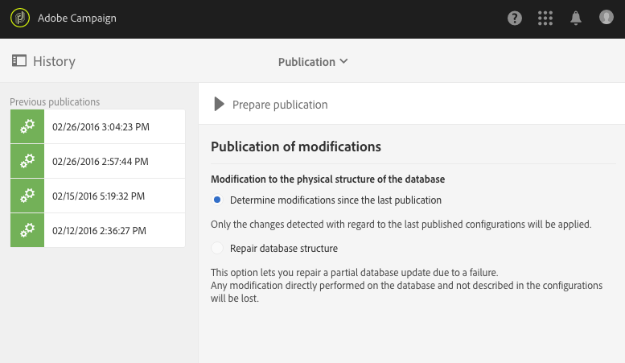
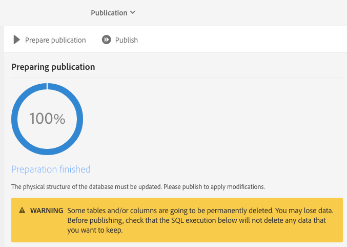
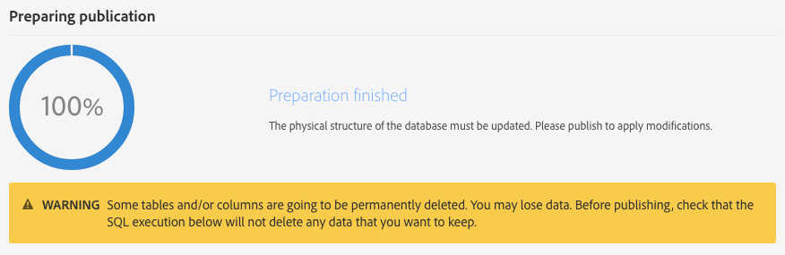
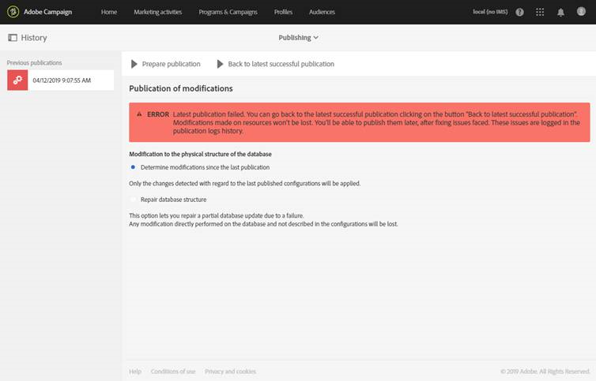
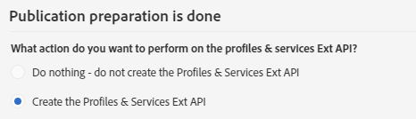
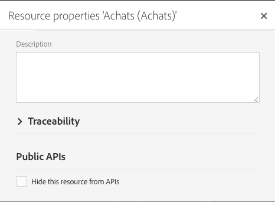
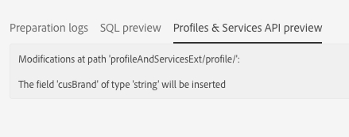

# Updating the database structure{#updating-the-database-structure}

To make your modifications to the data model effective and to be able to use them, the database structure needs to be updated.

>[!NOTE]
>
>Custom resources are automatically refreshed during automatic updates performed by Adobe.

## Publishing a custom resource {#publishing-a-custom-resource}

To apply the changes carried out on the resources, you must perform a database update.

>[!NOTE]
>
>If a field of a custom resource used on an event is modified or deleted, the corresponding event will automatically be unpublished. See [Configuring Transactional messaging](../../administration/using/configuring-transactional-messaging.md).

1. From the advanced menu, via the Adobe Campaign logo, select **[!UICONTROL Administration]** > **[!UICONTROL Development]**, then **[!UICONTROL Publishing]**.
1. By default, the option **[!UICONTROL Determine modifications since the last publication]** is checked, which means that only the changes carried out since the last update will be applied.

   >[!NOTE]
   >
   >The **[!UICONTROL Repair database structure]** reestablishes a correct configuration if the publication failed before completing. Any modification that was carried out directly in the database and not using custom resources will be deleted.

   

1. Click the **[!UICONTROL Prepare publication]** button to start the analysis. Please note that big table updates should be done when the instance is not intensively busy by workflows.

   To learn more on the action to perform on the Profiles & Services API, refer to [Publishing a resource with API extension](../../developing/using/updating-the-database-structure.md#publishing-a-resource-with-api-extension).

   

1. Once the publication has been carried out, click the **[!UICONTROL Publish]** button to apply your new configurations.
1. Once published, the **[!UICONTROL Summary]** pane of each resource indicates that the status is now **[!UICONTROL Published]** and specifies the date of the last publication.

   >[!NOTE]
   >
   >If you make new changes to a resource, you must repeat this operation for the changes to be applied.

   If resources have the **[!UICONTROL Pending re-draft]** status before publishing, then an additional message will appear inviting you to check your actions because publishing will result in definitive changes (deleting columns, tables...). To help you carry out this last change, an **[!UICONTROL SQL Script]** tab is available. It provides the SQL command that will be executed during the publication. 

   

   >[!NOTE]
   >
   >You can stop the Re-draft process by clicking the **[!UICONTROL Cancel re-draft]** button. This action will revert the resource's status back to its original one.

1. If your publication failed, you can always go back to the previous publication by clicking **[!UICONTROL Back to latest successful publication]**.

   Note that, if you leave your publication in a fail status, a pop-up window will open as soon as you log in to your instance to remind you to fix this publication. Your instance will not be upgraded with new product versions until your publication is fixed.

   

## Publishing a resource with API extension {#publishing-a-resource-with-api-extension}

You can create the Profile and Services API in the following cases:

* When you extend the custom resources **[!UICONTROL Profiles]** or **[!UICONTROL Services]**, you can perform an update of the Profiles and Services API to integrate the fields declared in the custom resources extension.
* When you define a custom resource and you create a link between the resources **[!UICONTROL Profiles]** or **[!UICONTROL Services]** and the custom resource, you can perform an update to include the new resource in the API.

You can select this option in the publication screen.

* If the API has not been published yet (meaning if you have never extended the resource or if you have never checked this option yet for this resource or another resource), you have the choice to create it or not.

  

* If the API has already been published (meaning if you have already extended the resource and checked this option once), the API update is forced.

  Indeed, once it has been created, the API is automatically updated each time you publish it again. This is to avoid breaking the profile or service resource of this API and harming your instance.

Note that by default, the custom resource is integrated, but, for a specific behavior, if you don't want to publish this resource, you can select the option **[!UICONTROL Hide this resource from APIs]** available in the **[!UICONTROL Resource Properties]**.

After the **[!UICONTROL Prepare Publication]** step, Adobe Campaign displays the delta between the current version of the API and the future version after the publication in the tab **[!UICONTROL Profiles & Services API Preview]**. If you extend the API for the first time, the delta compares the out-of-the-box custom resource definition with your extension.

The information displayed in the tab is divided into three sections: added, deleted and modified elements.

The analysis of the delta is a mandatory step as the publication step will modify the API behavior and will most likely affect the surrounding development in a domino effect.

>[!NOTE]
>
>This publication updates the **[!UICONTROL profilesAndServicesExt]** API. The **[!UICONTROL profilesAndServices]** API is not updated.

For more information on the Adobe Campaign API, consult the dedicated Adobe Campaign documentation on [Adobe IO](https://docs.campaign.adobe.com/doc/standard/en/adobeio.html).
