# Abandonment Triggers use cases{#abandonment-triggers-use-cases}

Abandonment Triggers use cases

This section presents different use cases that can be implemented using the integration between Adobe Campaign and Experience Cloud Triggers. You will find two examples of use cases:

* [Browse abandonment Trigger](../../integrating/using/abandonment-triggers-use-cases.md#browse-abandonment-trigger): send a communication to customers who abandoned their visit on your website.
* [Search abandonment Trigger](../../integrating/using/abandonment-triggers-use-cases.md#search-abandonment-trigger): reengage with visitors who made a search on your website, but didn't make a purchase.

>[!NOTE]
>
>The use cases described in this section rely on Experience Cloud Visitor ID. It is also possible to implement them with Experience Cloud Declared ID. Hashed and encrypted declared IDs are also supported. You can send emails/SMS to a profile which does not exist in Campaign by directly decrypting the encrypted email address/mobile number. But in this case, personalization using profile data cannot be used.

## Pre-requisites {#pre-requisites}

In order for these use cases to be implemented, you need to have access to the following solutions/core services:

* Adobe Campaign
* Adobe Analytics Ultimate, Premium, Foundation, OD, Select, Prime, Mobile Apps, Select, or Standard.
* Experience Cloud Triggers Core Service
* Experience Cloud DTM Core Service
* Experience Cloud Visitor ID and Experience Cloud People Core Service

You also need to have a working website.

For more information, refer to [Configuring solutions and services](../../integrating/using/configuring-triggers-in-experience-cloud.md#configuring-solutions-and-services).

## Browse abandonment Trigger {#browse-abandonment-trigger}

In this use case, we are going to create a simple trigger that will fire every time a client abandons a visit on the website. This example assumes you already have DTM collecting and pushing data to Adobe Analytics and have all your events created.

### Creating an Experience Cloud Trigger {#creating-an-experience-cloud-trigger}

1. Select **Triggers** from the Experience Cloud Activation Core Service menu. 

   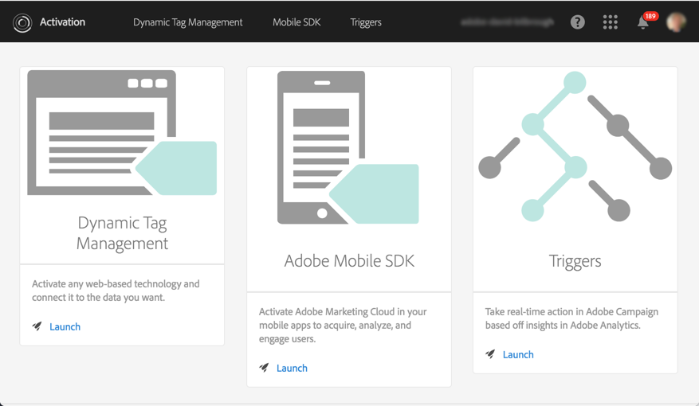

1. Choose a trigger type (**Abandonment** in our use case). 

   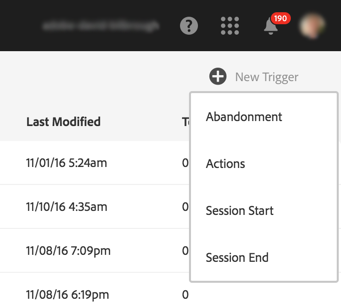

1. For this use case, we need a simple abandonment trigger. The business purpose is to identify visitors who browse our trip booking website, look at the "Deals" page but don't book any trip. Once we identify this audience, we want to reach back to them within a short period of time. In this example, we choose to send the trigger after a period of 10 minutes.

   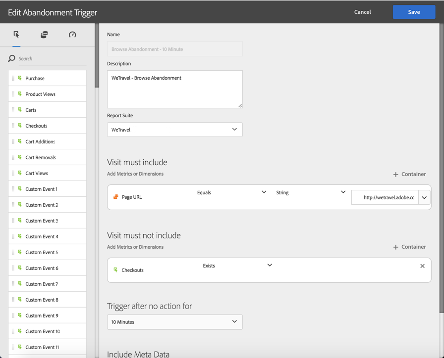

### Using the trigger in Adobe Campaign {#using-the-trigger-in-adobe-campaign}

Now that we've created an Experience Cloud Trigger, let's use it in Adobe Campaign.

In Adobe Campaign, you need to create a Trigger linked to the one you created in the Experience Cloud.

1. To create the Trigger in Adobe Campaign, click the **Adobe Campaign** logo, in the top left corner, then select **Marketing plans** > **Transactional messages** > **Experience Cloud triggers**.

   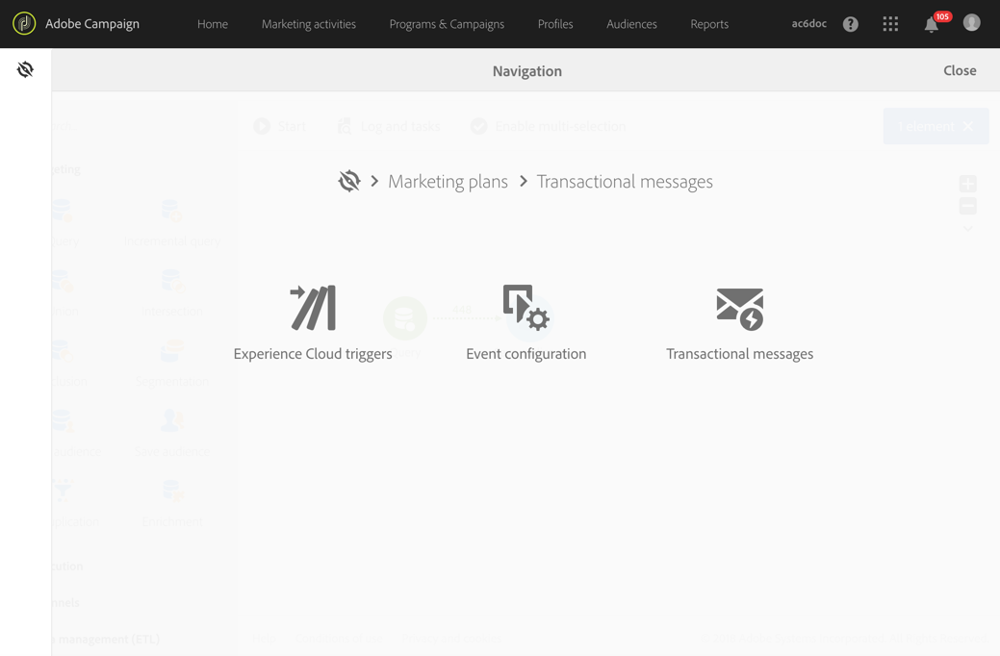

1. Click **Create**. 
1. Select the Trigger you created earlier.

   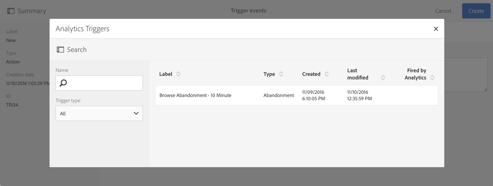

1. Publish the Trigger in Adobe Campaign. This process will automatically create a transactional message template.

   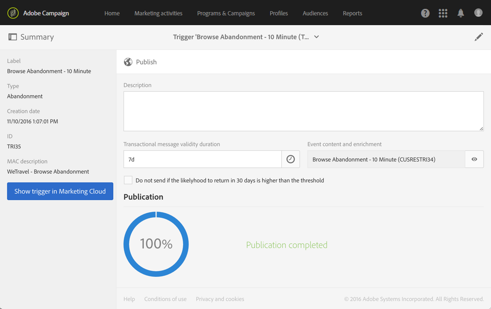

1. Click the **Adobe Campaign** logo, in the top left corner, then select **Marketing plans** > **Transactional messages** > **Transactional messages**. 

   

1. Identify and select the newly created transactional message template.

   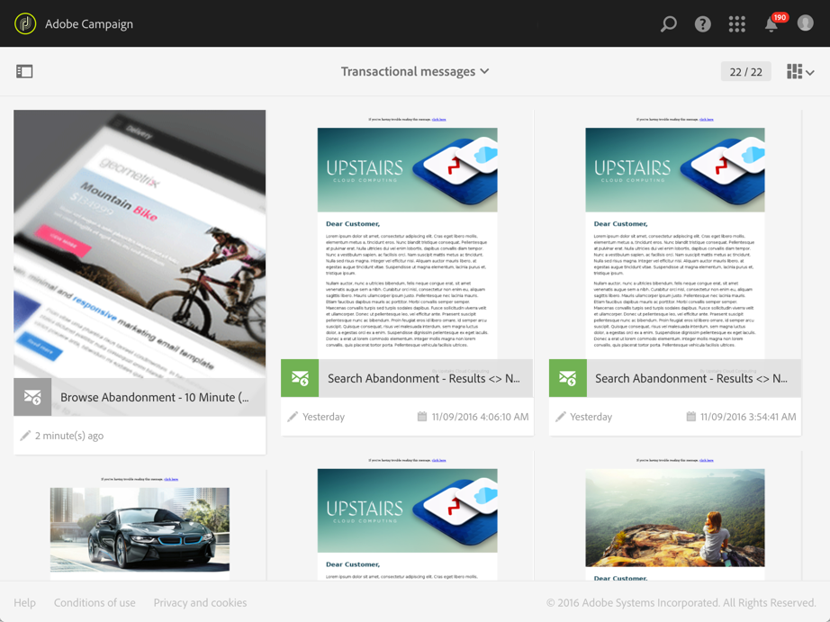

1. Personalize its content and sender details.

   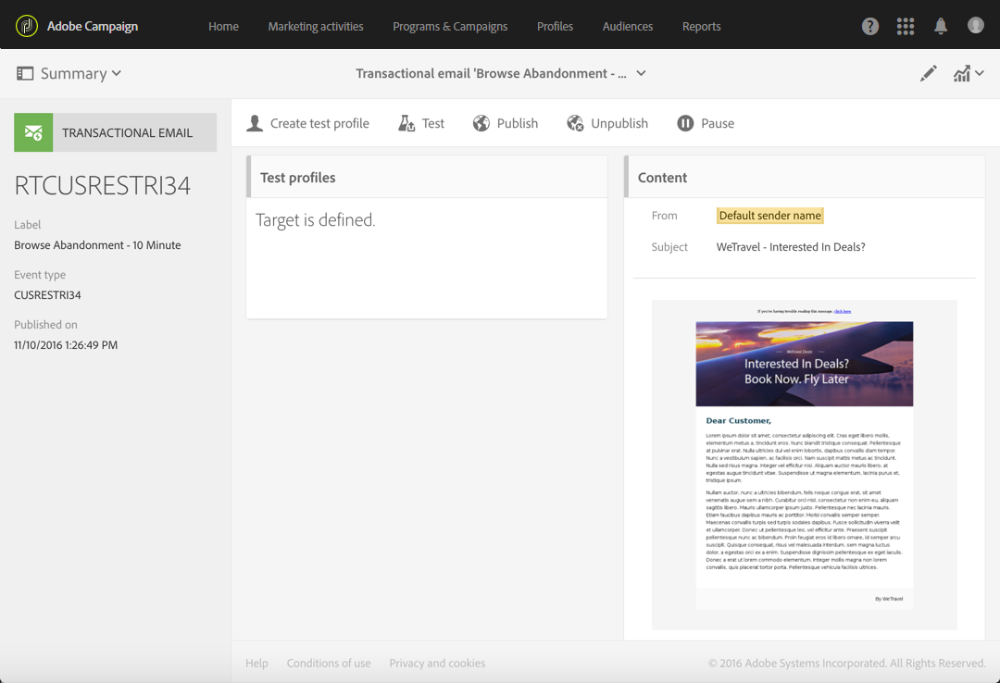

1. Publish the message template. The trigger is now live and functional. 

   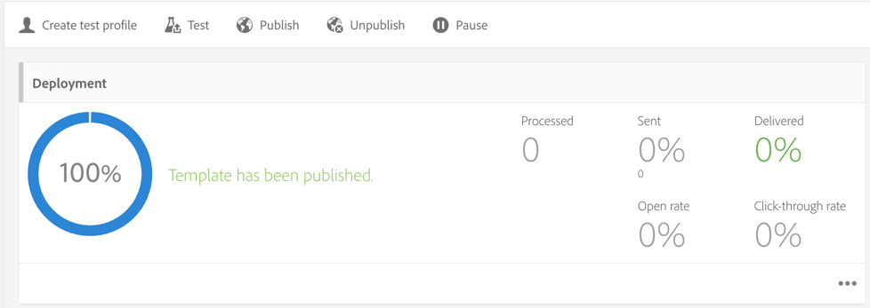

### Running the scenario {#running-the-scenario}

1. This use case starts with an initial email sent to your audience with Adobe Campaign. 

   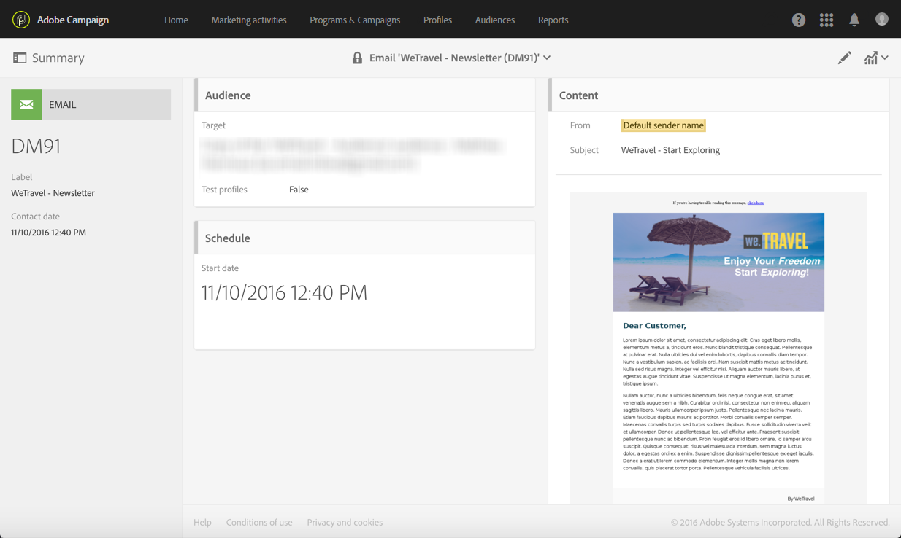

1. The recipient opens the email.

   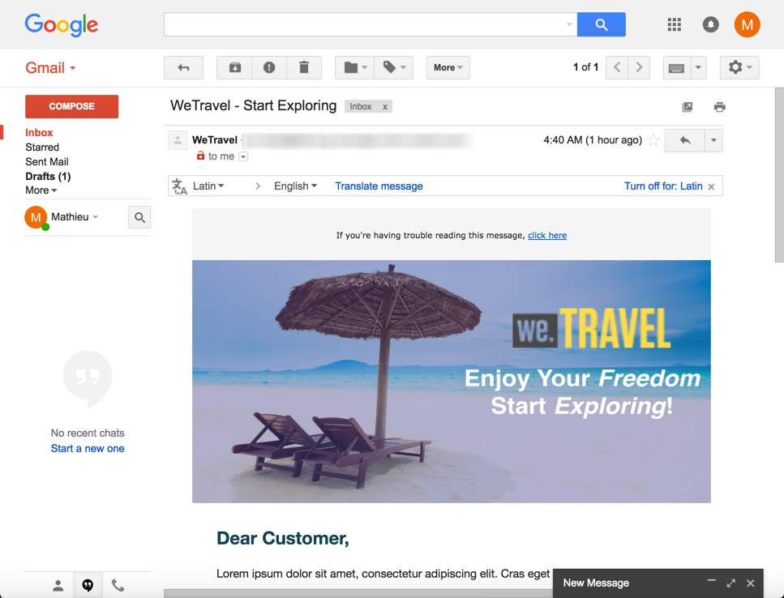

1. He clicks on a link that brings him to your website. In this example, the banner brings the recipient to the home page of the trip booking website.

   

1. The recipient goes to the "Deals" page but suddenly stops his visit. After a 10-minute period, Adobe Campaign triggers the sending of the transactional message.

   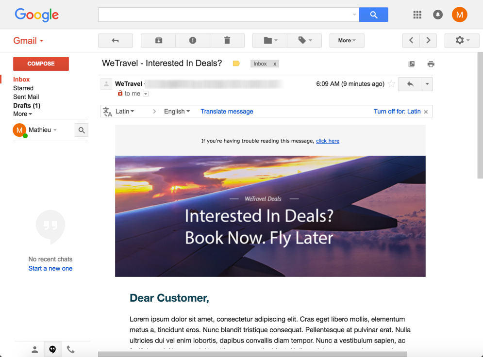

1. At any time, you can check the Experience Cloud logs to see how many times the trigger fired.

   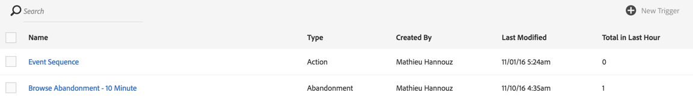

1. You can also display the Adobe Campaign trigger report.

   

## Search abandonment Trigger {#search-abandonment-trigger}

In this use case, we are going to create a trigger to reengage with visitors who went on our trip booking website, searched for a destination, found no successful results, and didn't book anything after that. The general process is the same as in the previous use case (see [Browse abandonment Trigger](../../integrating/using/abandonment-triggers-use-cases.md#browse-abandonment-trigger)). We will focus here on how to personalize the remarketing email message.

### Creating an Experience Cloud Trigger {#creating-an-experience-cloud-trigger-1}

Follow the steps described in the previous use case to create the Experience Cloud Trigger. See [Creating an Experience Cloud Trigger](../../integrating/using/abandonment-triggers-use-cases.md#creating-an-experience-cloud-trigger). The main difference is the trigger definition.

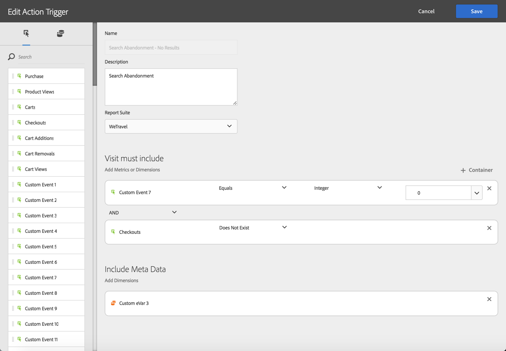

The **Include Meta Data** section allows you to pass any data collected from Analytics to the Trigger payload. In this example, we create a custom eVar (for example, eVar 3) to collect the search term the visitor enters. This term will then be used in the transactional email message sent to the same visitor.

### Using the trigger in Adobe Campaign {#using-the-trigger-in-adobe-campaign-1}

1. Follow the steps described in the previous use case to create the trigger in Adobe Campaign. See [Using the trigger in Adobe Campaign](../../integrating/using/abandonment-triggers-use-cases.md#using-the-trigger-in-adobe-campaign). The main difference is how we access and use, in Adobe Campaign, the meta data pushed in the Trigger payload. 
1. In the Search Abandonment trigger you created in Adobe Campaign, click on the **Event content and enrichment** icon to view the payload pushed to Adobe Campaign.

   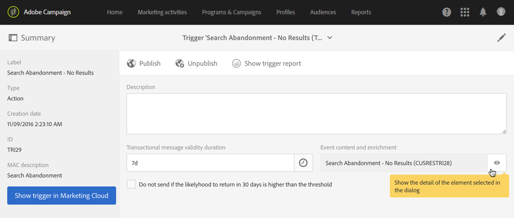

1. As you can see, the custom eVar is passed in the Trigger payload and mapped to the **Event Context** table (ctx). We can now access it to personalize the transactional message.

   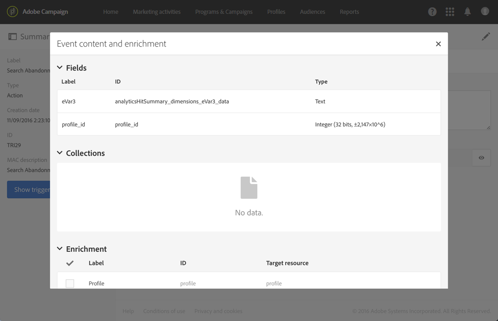

1. In this example, we choose to include the destination search term in the subject line as well as in the email body.

   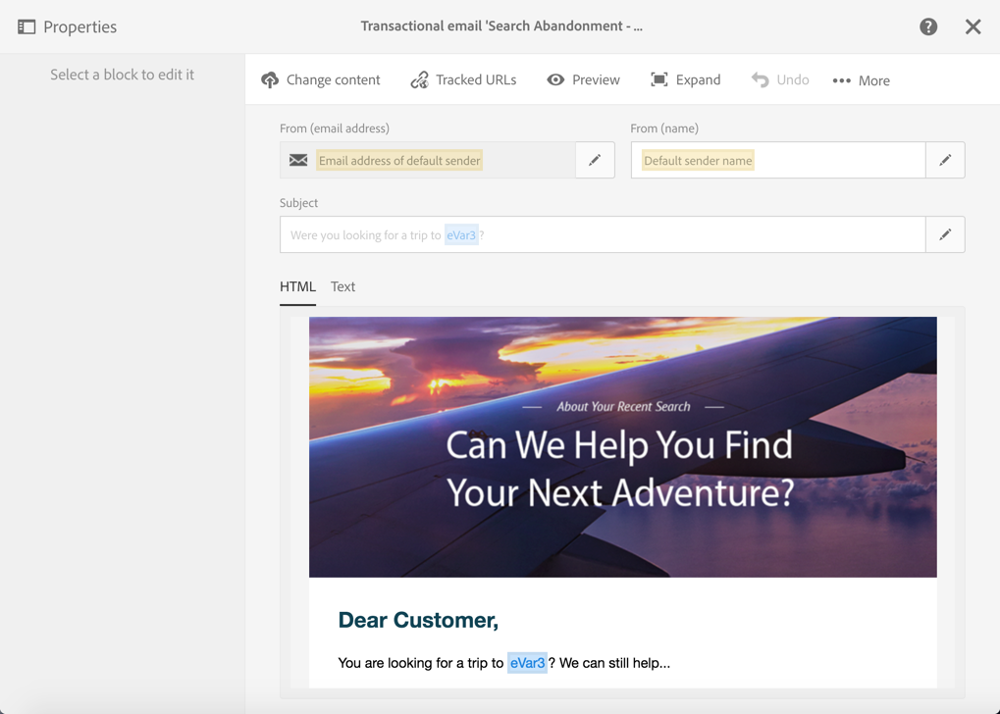

1. When selecting a personalized field, look for your payload meta data in the **Transactional event** (rtEvent) table then in the **Event context** (ctx) sub table.

   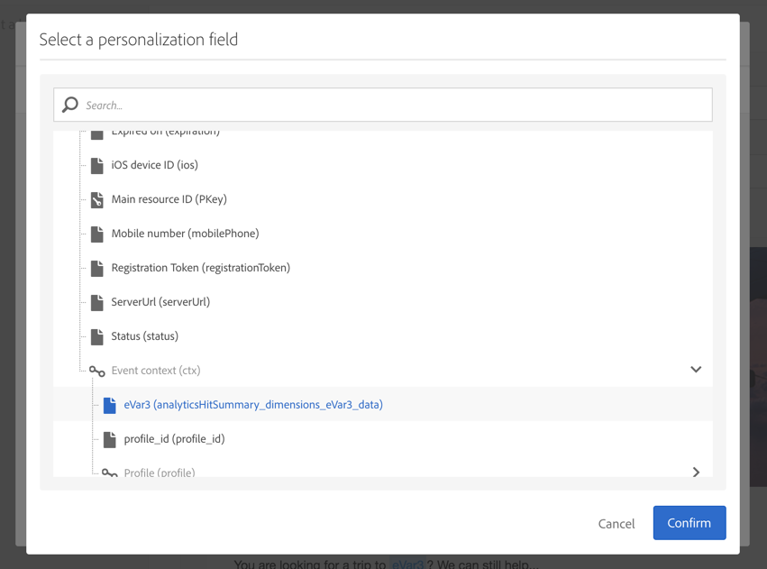

### Running the scenario {#running-the-scenario-1}

1. The visitor goes on the trip booking website and searches for a destination. In this example, the visitor is looking for a trip to Japan but finds no result. This is an opportunity for us to reach back to this visitor and recommend an alternative travel plan.

   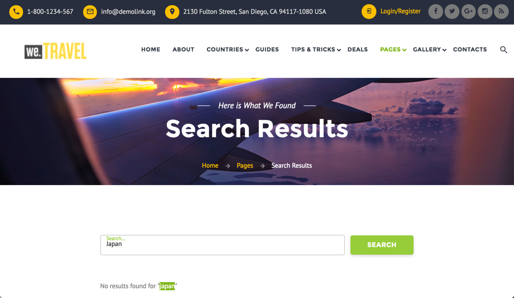

   >[!NOTE]
   >
   >In this use case, we assume the visitor/recipient has already opened and clicked on an email originating from the same website. This allows us to use and collect the VisitorID and map it to the recipient. We only need to do this once.

1. A few moments later, the same visitor/recipient receives a remarketing message. The message includes the recently searched destination.

   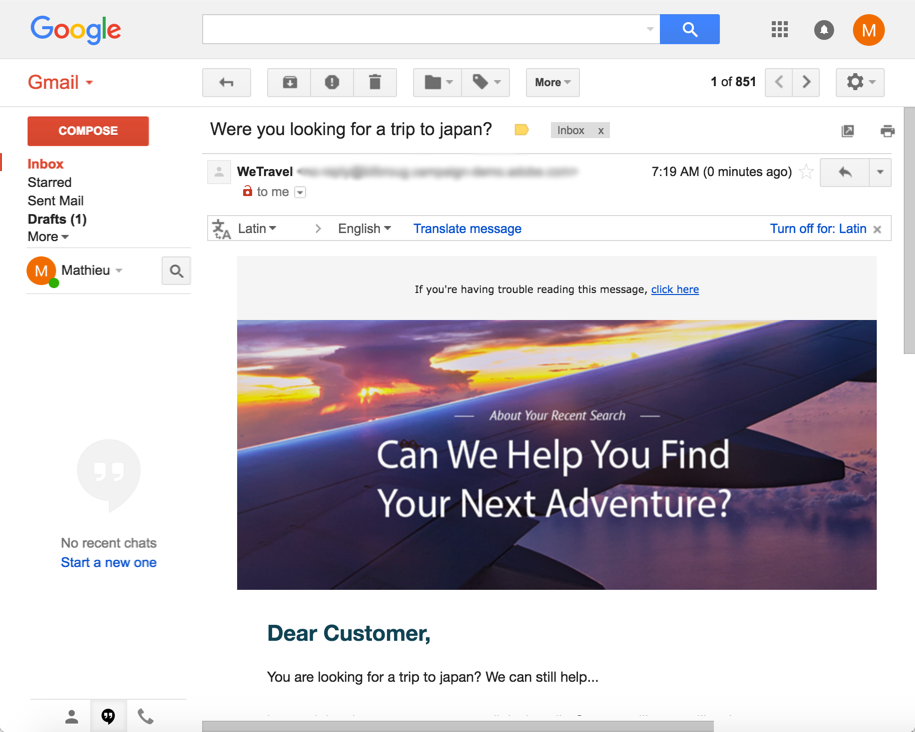

