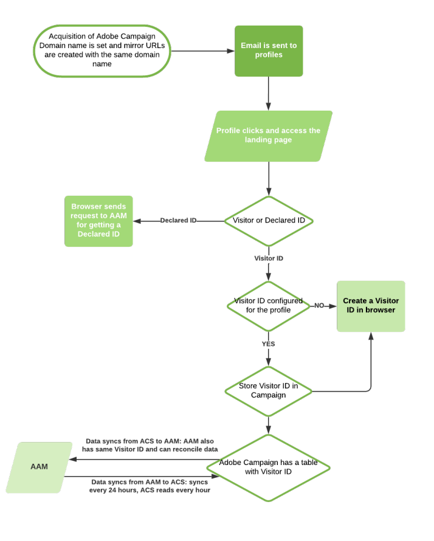

# About Campaign-Audience Manager or People core service integration{#about-campaign-audience-manager-or-people-core-service-integration}

>[!CAUTION]
>
>Depending on the data exchanged, importing audiences in Adobe Campaign may be subject to legal restrictions.

Adobe Campaign allows you to exchange and share audiences/segments with the different Adobe Experience Cloud applications. Integrating **Adobe Campaign** with **People core service** (also known as **Profiles & Audiences core service**) or Adobe Audience Manager allows you to:

* Import audiences/segments from different Adobe Experience Cloud solutions into Adobe Campaign. Audiences can be imported from the **[!UICONTROL Audiences]** menu in Adobe Campaign.
* Export audiences as shared audiences/segments. These audiences can be used in the different Adobe Experience Cloud solutions that you use. Audiences can be exported after targeting activities in a workflow, using the **[!UICONTROL Save audience]** activity.

Integration supports two types of Adobe Experience Cloud IDs:

* **Visitor ID**: this type of ID allows you to reconcile Adobe Experience Cloud visitors with Adobe Campaign profiles. As soon as a connection is enabled via Adobe IMS, Marketing Cloud Visitor ID Service is activated, which replaces the permanent cookie used by Adobe Campaign. This allows you to identify a visitor then link it to a profile.
 A visitor ID is linked to a profile as soon as the profile clicks in an email sent via Adobe Campaign:
  * If the profile already has a visitor ID, the profile's browser data allows Adobe Campaign to recover and automatically link the profile to the visitor ID.
  * If no visitor ID is found, a new ID is created. This visitor ID is stored in the profile tracking logs.

  The ID will then be recognized by the other Adobe Marketing Cloud applications with the same CNAME.

* **Declared ID**: this type of ID allows you to reconcile any type of data with elements from the Adobe Campaign database. It is represented in Adobe Campaign as a predefined reconciliation key. When exchanging data, the Adobe Campaign database identifiers are hashed. These hashed IDs are then compared to the hashed IDs of the Adobe Marketing Cloud audience involved in the import or export.
 This integration supports regular declared IDs, hashed declared IDs and encrypted declared IDs.

  >[!CAUTION]
  >
  >Declared ID will only work with Adobe Audience Manager. Declared ID will not work without it.

  Encryption allows you to share encrypted data in data sources (for example PII) using the declared ID by specifying the encryption algorithm.

  For example, with the ability to decrypt encrypted email addresses or SMS numbers, you can also send triggered messages to your users even if their profile does not exist in the Adobe Campaign database.

The following diagram details how this integration works. Here, AAM stands for Adobe Audience Manager et ACS for Adobe Campaign Standard.

