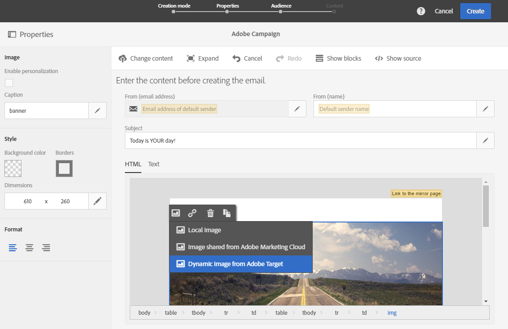
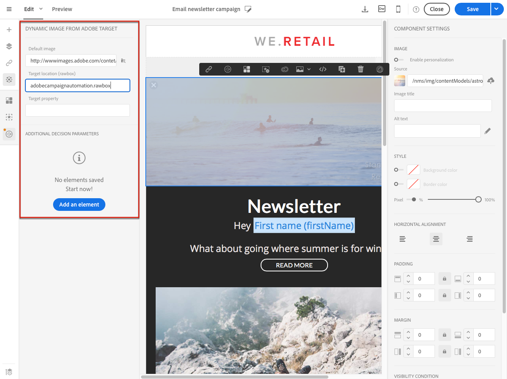

# Adding Target dynamic content{#adding-target-dynamic-content}

Adding Target dynamic content

With Adobe Target integration, dynamic images can be added into a delivery to personalize your content depending of experiences.

While editing an email, you can insert a dynamic image from Adobe Target which will change depending of the recipients.

Before accessing the image in Adobe Campaign, the following tasks must first be performed in Adobe Target:

* Create one or several [redirect offers](https://marketing.adobe.com/resources/help/en_US/tnt/help/t_Creating_a_Redirect_Offer.html), in which you must specify the URL of the image you will be using.
* Create one or several [audiences](https://marketing.adobe.com/resources/help/en_US/target/ov/c_about_segments.html), to define the target of your activity.
* Create a [Form-based experience composer](https://marketing.adobe.com/resources/help/en_US/target/target/t_form_experience_composer.html) activity, in which you have to select a rawbox and specify several experiences, depending on the number of redirect offers created. For each experience, you must select one of the redirect offers created.
* Create segments using information from Adobe Campaign to specify experiences. To use data from Adobe Campaign in the offer's selection rules, you must specify the data in the rawbox in Adobe Target.

1. Create an email delivery.
1. When editing the content of an email or a landing page, go to an image block, then select **Dynamic image from Adobe Target** via the contextual menu.

   

1. Select the image that will appear by default in the email. You can directly specify the image URL or select an image shared via [Assets](../../integrating/using/working-with-campaign-and-assets-core-service.md).

   The integration only supports static images. The rest of the content is not customizable.

1. Enter the name of the rawbox specified in Adobe Target.
1. If you use Enterprise permissions in your settings in Adobe Target, add the corresponding property in this field. Learn more about Target Enterprise permissions in [this page](https://marketing.adobe.com/resources/help/en_US/target/target/properties-overview.html). This field is optional and not required if you don't use Enterprise permissions in Target.
1. In **Additional decision parameters**, specify the mapping between the fields defined in the Adobe Target segments and the Adobe Campaign fields.

   The Adobe Campaign fields used must have been specified in the rawbox. Here, we will define different experiences depending of the recipient's gender.

   

1. Preview your email to see if, when selecting different profiles, the image inserted changes depending on the parameters specified in the Adobe Target activity and in Adobe Campaign.

Your delivery containing the dynamic image can now be send. Its results can be found in Adobe Target.

**Related topics:**

* [Adobe Target Portal](https://marketing.adobe.com/resources/help/en_US/target/a4t/c_campaign_and_target.html)
* [Define email content](../../designing/using/example--email-personalization.md)
* [Personalize Email Images in Real-Time](https://helpx.adobe.com/marketing-cloud/how-to/email-marketing.html) video

