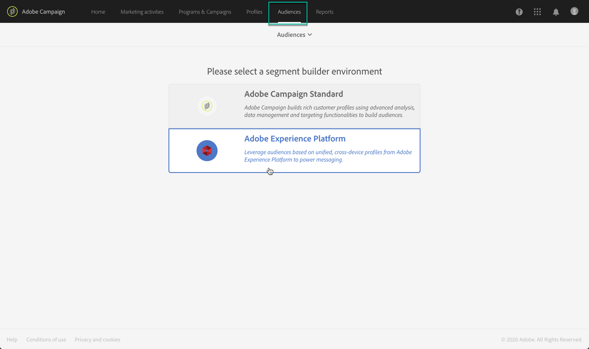
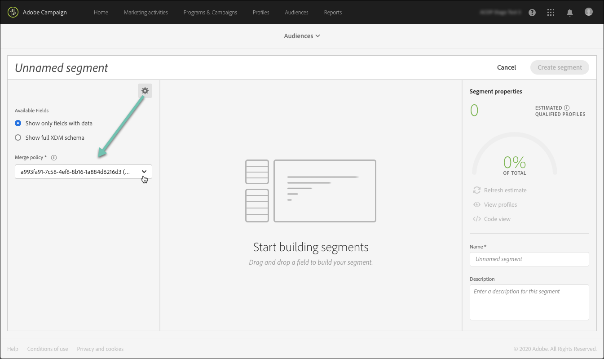

# Managing Adobe Experience Platform audiences {#about-audiences}

>[!IMPORTANT]
>
>Audience Destinations Service is currently in beta, which may be subject to frequent updates without notice. Customers are required to be hosted on Azure (currently in beta for North America only) to access these capabilities. Please reach out to Adobe Customer Care if you would like access.

## Accessing Adobe Experience Platform audiences

To access the Adobe Experience Platform segment builder, navigate to the **[!UICONTROL Audiences]** card on Campaign Standard home page (or the **[!UICONTROL Audiences]** link in the header), and then select the **[!UICONTROL Adobe Experience Platform]** environment.

You will first be directed to the Adobe Experience Platform segment list page, where already existing Adobe Experience Platform segments can be accessed for further editing.

A search bar and filter are available to help you find the desired Adobe Experience Platform segment.

## Creating Adobe Experience Platform audiences

To create an Adobe Experience Platform audience directly in Campaign Standard, follow these steps:

1. From the Adobe Experience Platform segment list page, click the **[!UICONTROL New audience]** button located in the right-hand corner.

    

1. The Segment Builder should now be displayed in your workspace. It allows you to build a segment using data from Adobe Experience Platform that will eventually be used to create your audience.

1. Name the segment in the right pane and enter a description (optional).

    

1. In order to successfully create a segment, you must select a **merge policy** that matches your marketing purpose for this segment.

    In the settings pane, a Platform default merge policy is selected. For more information on merge policies, refer to the dedicated section from the [Segment Builder user guide](https://experienceleague.adobe.com/docs/experience-platform/segmentation/ui/overview.html).

    

1. Define the rules that will identify the profiles to be retrieved in your audience.

    To do this, drag the desired attributes and/or events from the left pane into the workspace, define the corresponding rules then click the **[!UICONTROL Create segment]** button to save the segment (see [Using the Segment Builder](../../integrating/using/aep-using-segment-builder.md)).

    

The audience is now ready to be activated, you can use it as a target for your campaigns (see [Targeting Adobe Experience Platform audiences](../../integrating/using/aep-targeting-audiences.md)).

## Editing audiences

To edit an audience, open it and modify the rules as needed within the Segment Builder interface (see [Using the Segment Builder](../../integrating/using/aep-using-segment-builder.md)).

Once the changes have been completed, click the **[!UICONTROL Save segment]** button to update your audience.

