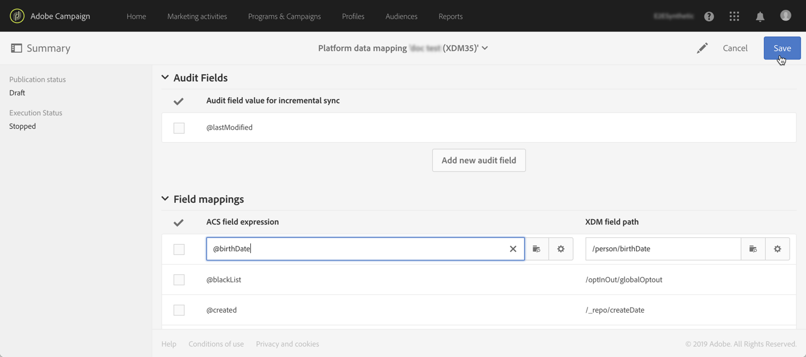

# Mapping definition {#mapping-definition}

>[!IMPORTANT]
>
>Adobe Experience Platform Data Connector is currently in beta, which may be subject to frequent updates without notice. Customers are required to be hosted on Azure (currently in beta for North America only) to access these capabilities. Please reach out to Adobe Customer Care if you would like access.

In this section, you will discover how to map a Campaign Standard field with an Experience Data Model (XDM) field.

To perform this task, the prerequisites are:

* an XDM Schema definition via the interface or by using the REST API associated to XDM
* a Dataset creation based on the XDM schema definition

1. Go to **[!UICONTROL Administration]** > **[!UICONTROL Development]** > **[!UICONTROL Platform]** and choose the **[!UICONTROL Data mappings]** entry.

1. Click on **[!UICONTROL Create]** to start a new XDM mapping.

    

1. Complete the mandatory fields and select:

    * a **targeting dimension**: this is the Campaign Standard schema to map
    * a **dataset**: this is the data package associated to an XDM schema in Adobe Experience Platform.

>[!NOTE]
>
>For a batch to be ingested into Real-time Customer Profile or Identity Service, the dataset has to be [enabled for Real-time Customer Profile](https://experienceleague.adobe.com/docs/experience-platform/rtcdp/intro/get-started.html).
>
>If the dataset you select is already being used in an existing data mapping, a warning appears to inform you that your data may be overwritten on Adobe Experience Platform. This may happen when there are some common recipients in datamappings using a same dataset.

The following screen presents the **[!UICONTROL Field mappings]** section where you can create a new mapping for each field in the Campaign Standard schema.

The **[!UICONTROL Create new field mapping]** button allows you to select the Campaign Standard field and the corresponding field path expression in the XDM schema.

If you are unable to find an Adobe Campaign Standard field, you can use the search field to search for the field. Currently, search only works for fields which are open in hierarchy.

The extended resources defined in Campaign Standard are mapped liked all native fields. They are defined into the _customer/default extension in XDM.

You can customize the XDM extension via the API and define your own extension allowing you a better control on mapping.

See [Schema Registry API tutorial](https://experienceleague.adobe.com/docs/experience-platform/xdm/api/getting-started.html) for more details on XDM API.

To map an enumeration field, you need to use the expression editor to define each enumeration value corresponding to the XDM value. For example, the postalAdressfield needs to be defined as:

If the XDM value is defined as an enumeration in the XDM Schema, you can use the native EXDM function that will automatically replace the **lif** syntax.

To edit a XDM mapping, open it, modify the desired information then save it.

>[!IMPORTANT]
>
>For now, if you edit a value in the **[!UICONTROL Field mappings]** section then click outside of the field, your change does not display in the interface until you click the **[!UICONTROL Save]** button. This behaviour occurs only once, when the edit on **[!UICONTROL Field Mappings]** is the first edit on the page.
