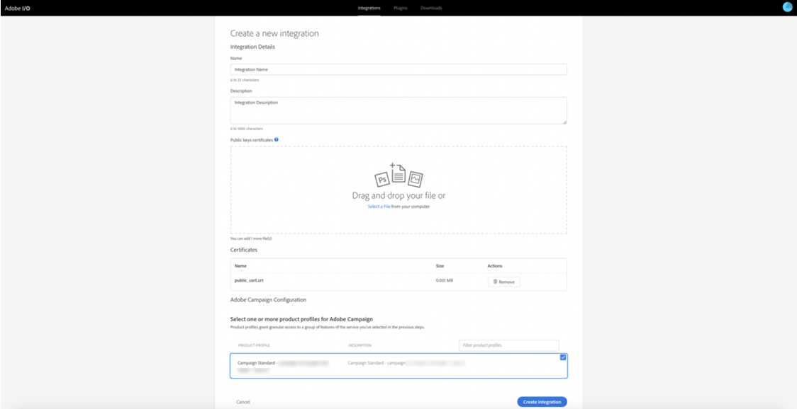
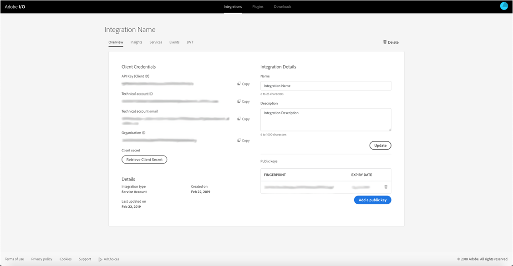

# Configure Adobe IO for Microsoft Dynamics 365 integration

Activate your CRM data on cross-channel communication: learn steps required during pre-integration setup to create a new Adobe IO project and configure it for the Microsoft Dynamics 365 integration..

## Overview

Adobe Campaign Standard - Microsoft Dynamics 365 integration is described in [this page](../../integrating/using/working-with-campaign-standard-and-microsoft-dynamics-365.md).

Before performing the pre-integration setup in this article, it is assumed that you have already been provisioned and have admin access to your organization’s Campaign Standard instance.  If this has not happened, then you will need to get in contact with Adobe Customer Care to complete Campaign provisioning.

>[!CAUTION]
>
>Steps described below need to be performed by an administrator.

## Configuration

You will need to create a new Adobe IO project and configure it for the integration. 

### Create a new project

To achieve this, follow the procedure below:

1. Navigate to [Adobe IO Console](https://console.adobe.io/home#) and select your Adobe IMS Organization ID from the drop-down menu at the right of the screen.

Then click on **[!UICONTROL Create new project]** under **[!UICONTROL Quick Start]**  at the top right. 

>[!NOTE]
>
>If this is your organization’s first integration, the button for **[!UICONTROL New Integration]** may be in the center of the page.

1. Select **[!UICONTROL Access an API]** and click **[!UICONTROL Continue]**.

1. Select _Adobe Campaign_ from the **[!UICONTROL Experience Cloud]** section and click **[!UICONTROL Continue]**.

1. Generate a certificate and key.

**For MacOs and Linux platforms**

Open terminal application and execute below command:

```
openssl req -x509 -sha256 -nodes -days 365 -newkey rsa:2048 -keyout private.key -out certificate_pub.crt
```

**For Windows platforms**

* Download an openssl client to generate public certificates (e.g., [Openssl windows client](https://bintray.com/vszakats/generic/download_file?file_path=openssl-1.1.1-win64-mingw.zip))

* Extract the folder from the zip file

* Open Command Line Prompt and execute below commands. 

Replace `<containing folder path>` below with the path of the extracted folder (e.g., C:\Users\labuser\Downloads\openssl-1.1.1-win64-mingw\openssl-1.1.1-win64-mingw): 

```

set OPENSSL_CONF=<containing folder path>/openssl.cnf
 
cd <containing folder path>/
 
openssl req -x509 -sha256 -nodes -days 365 -newkey rsa:2048 -keyout private.key -out certificate_pub.crt

```

**For all platforms**

Follow the prompts to finish the certificate request:

```

Generating a 2048 bit RSA private key
 
.................+++
 
.......................................+++
 
writing new private key to 'private.key'
 
-----
 
You are about to be asked to enter information that will be incorporated
 
into your certificate request.
 
What you are about to enter is what is called a Distinguished Name or a DN.
 
There are quite a few fields but you can leave some blank
 
For some fields there will be a default value,
 
If you enter '.', the field will be left blank.
 
-----

```

After entering the information, two files will be generated: **[!UICONTROL certificate_pub.crt]** and **[!UICONTROL private.key]**.

* **[!UICONTROL certificate_pub.crt]** will expire in 365 days. You can modify the expiration period by changing the value of days in the openssl command above, but rotating credentials periodically is a good security practice.

* **[!UICONTROL certificate_pub.crt]** will be used in the next screen to complete the integration in Adobe I/O Console.

>[!NOTE]
>
> **[!UICONTROL private.key]** will be used at a later time during pre-integration configuration steps for the integration tool.

1. Go back to Adobe I/O Console, and enter a name and description for the integration. 

1. Upload **[!UICONTROL certificate_pub.crt]**

1. Select the product profile that has in the title:

    * The Organization ID of your Campaign instance
    * **[!UICONTROL Administrators]** 

Example:  Campaign Standard - your-campaign-organizationID - Administrators 

Click on **[!UICONTROL Create Integration]**.



### Set up integration details

1. Select **[!UICONTROL Continue to Integration Details]**

Review the integration details.  You will need to refer back to them when you run through the integration tool pre-configuration setup.



1. Click over to the **[!UICONTROL Services]** tab and add **[!UICONTROL I/O Events]** and **[!UICONTROL I/O Management API]** services.  To add the service, click on the radio button, then **[!UICONTROL Add service]**.  You will do this for each service separately.

When you are done your services should show up top like the picture below. You will not need to complete the section a-on generating a JWT and access token. 

Pre-integration setup in Campaign is now complete.  Proceed to complete [pre-integration setup for Microsoft Dynamics 365](../../integrating/using/configure-microsoft-dynamics-365-for-campaign-integration.md).

**Related Topics** 

* [Adobe IO - Service Account Integration](https://www.adobe.io/authentication/auth-methods.html#!AdobeDocs/adobeio-auth/master/AuthenticationOverview/ServiceAccountIntegration.md)
* [Campaign Standard - API Access Setup](https://docs.campaign.adobe.com/doc/standard/en/api/ACS_API.html#setting-up-api-access)
* [Campaign Standard - Dynamics 365 integration](../../integrating/using/configure-microsoft-dynamics-365-for-campaign-integration.md)