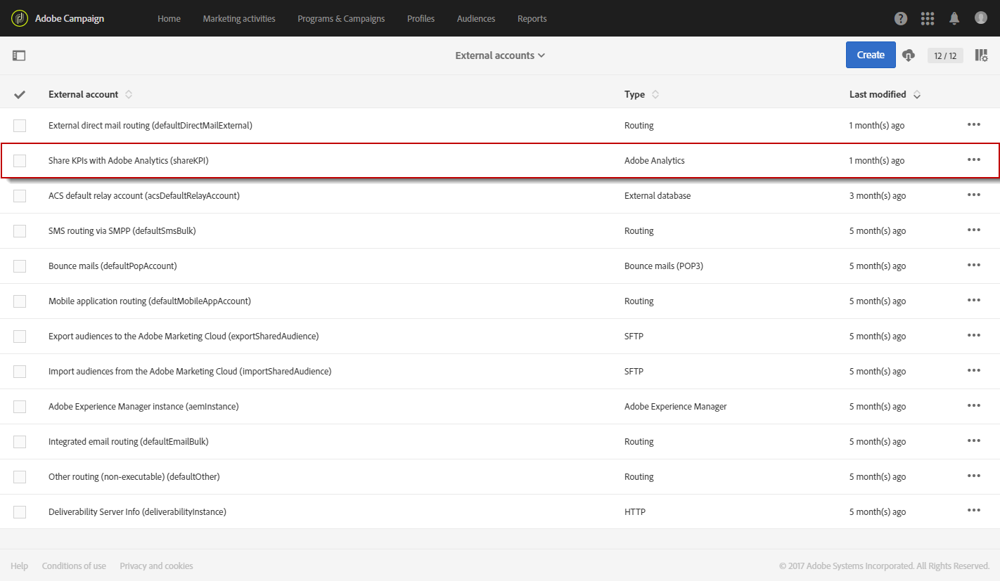
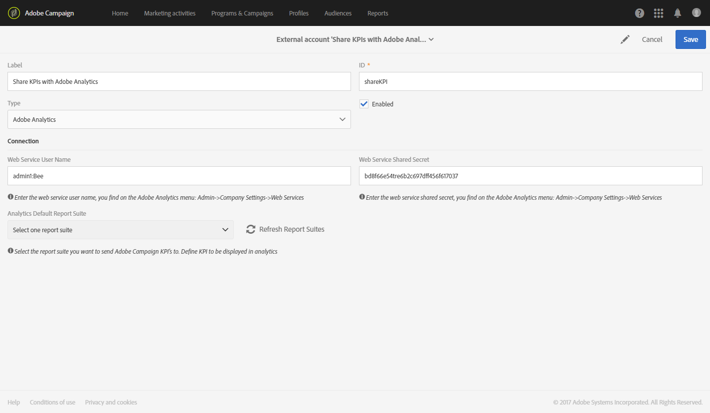
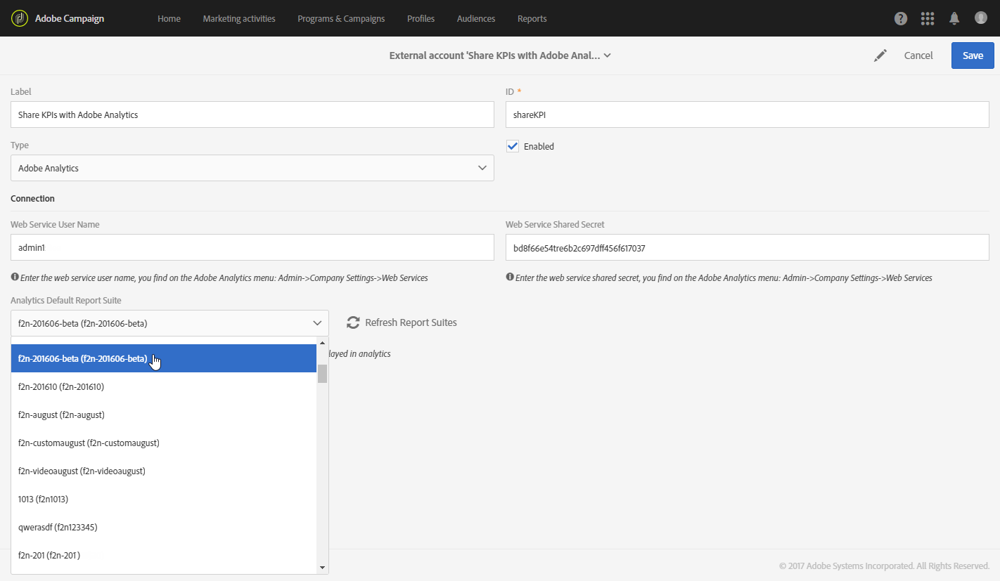
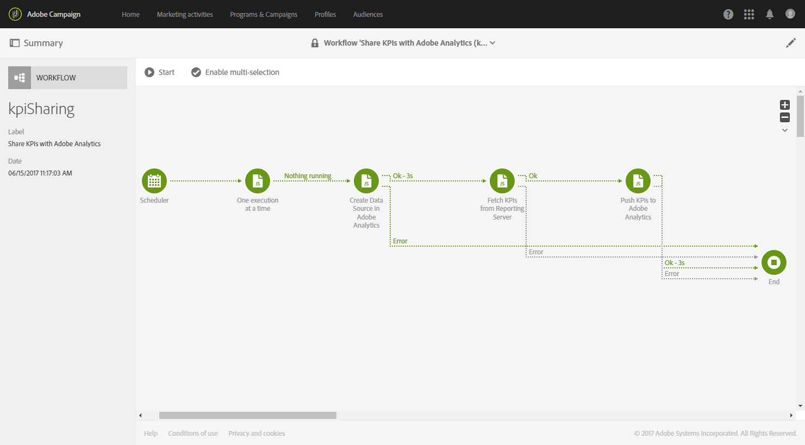

# Configure Campaign-Analytics integration{#configure-campaign-analytics-integration}

Configure Campaign-Analytics integration

This integration allows you to share your Key Performance Indicator data directly from Adobe Campaign to Adobe Analytics Standard or Premium.

To start the integration between Adobe Campaign Standard and Adobe Analytics, you first need to configure the external account linked to Adobe Analytics.

External accounts and technical workflows can only be managed by the functional administrator of the platform.

1. From the advanced menu, via the Adobe Campaign logo, select **Administration > Application settings > External accounts**.
1. Select the **Share KPIs with Adobe Analytics** external account.

   

1. Specify your **Web services user name** and **Web services share secret** in the **Connection** field.

   These parameters can be found in Analytics by selecting **Admin > Company settings > Web services**.

   

1. Click the **Refresh report suites** button.
1. Select in the **Analytics default report suite** drop-down the Adobe Analytics report suite you want to enrich with Adobe Campaign data.

   Your external account is now ready and linked with Adobe Analytics. You can disable it at any time by checking the **Enabled** box.

   

The **Share KPIs with Adobe Analytics** technical workflow will now automatically launch and can be viewed from the advanced menu by selecting **Administration > Application settings > Workflow**. This technical workflow will automatically execute every 15 minutes and will push up to 6 months old data in Adobe Analytics.

Your data are now available in Adobe Analytics.

**Related topics:**

* [External accounts](../../administration/using/external-accounts.md)
* [Technical workflows](../../administration/using/technical-workflows.md)
* [Share KPIs for integrated Campaign reporting](https://helpx.adobe.com/marketing-cloud/how-to/email-marketing.html) video

