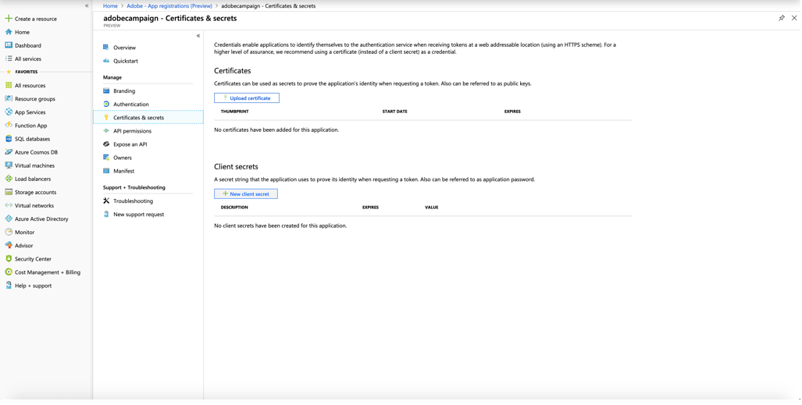
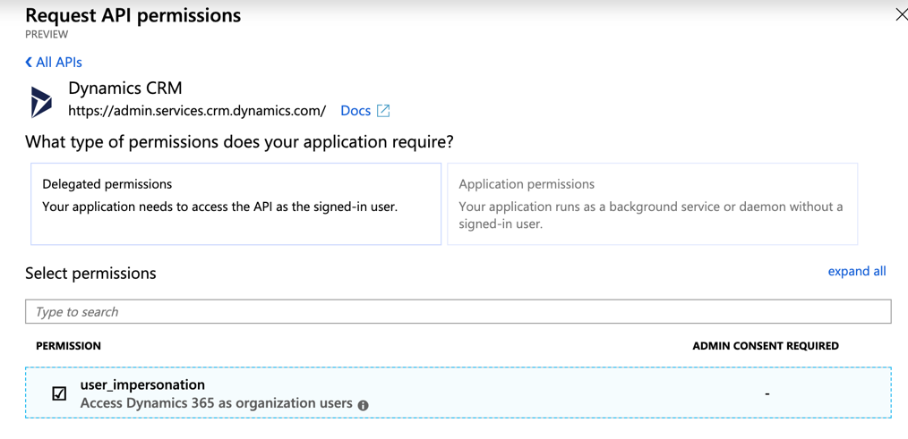

# Configure Microsoft Dynamics 365 for Campaign integration

Learn how to configure Microsoft Dynamics 365 integration and activate your CRM data on cross-channel communication with Adobe Campaign Standard.

## Overview

Adobe Campaign Standard - Microsoft Dynamics 365 integration is described in [this page](../../integrating/using/working-with-campaign-standard-and-microsoft-dynamics-365.md).

Three systems that need to be provisioned for this integration: 

1. Adobe Campaign Standard - [Learn more](../../integrating/using/configure-adobe-io-for-ms-dynamic.md)
1. Microsoft Dynamics 365 for Sales - Described below
1. Unifi - [Learn more](../../integrating/using/configure-unifi-for-microsoft-dynamics-365-integration.md)

Once provisioned, these systems need to be configured by an Administrator.

This article highlights the steps, on the Microsoft Dynamics 365 side, required during post-provisioning to enable a customer to use the Adobe Campaign Standard - Microsoft Dynamics 365 integration. 

## Prerequisites

Before performing the post-provisioning steps in this document, it is assumed that you have already provisioned and have admin access to your organization’s Microsoft Dynamics 365 instance.  If this has not happened, then you will need to get in contact with Microsoft customer support to complete Dynamics 365 provisioning.

## Setting up application and permissions

An OAuth access token allows Unifi to authenticate with your Microsoft Dynamics 365 instance via web APIs in order to post Campaign Standard experience events to the timeline view of the Microsoft Dynamics 365 interface. 

Main steps are outlined in the following video:

>[!VIDEO](https://video.tv.adobe.com/v/27637)

To generate the OAuth access token, follow the steps outlined below.

### Register a new application

1. Under your administrator login, login to portal.azure.com.  

1. Click on **[!UICONTROL Azure Active Directory]** in the left side menu; then click **[!UICONTROL App registrations]** on the sub menu that appears. 

1. Click **[!UICONTROL New registration]** at the top of screen.

    

1. Fill out the app registration screen:

    * Name: adobe campaign
    * Supported account type: **[!UICONTROL Accounts in this organizational directory only]** (default value)

 For more information about creating a new application, refer to [this section](https://docs.microsoft.com/en-us/azure/active-directory/develop/quickstart-register-app).

>[!NOTE]
>
>Azure AD assigns a unique application (client) ID to your app. You will need this ID later on in configuring Dynamics 365, as well as when you perform Unifi Post Provisioning steps.

### Generate client secret

1. From the app overview screen, on the sub menu on the left, click **[!UICONTROL Certificates and Secrets > New client secret]**

    

1. Enter a description, set duration and click **[!UICONTROL OK]**.

Your client secret is now created.  Retain the value for completion of Unifi post-provisioning steps.

>[!CAUTION]
>
>Keep this value as you will need it to complete Unifi post-provisioning step. It cannot be retrieved afterwards.

For more information about generating a client secret, refer to this section.

### Setup permissions

1. From this screen or the app overview screen, click on **[!UICONTROL API permissions]** in the sub menu on the left.  After clicking **[!UICONTROL Add a permission]**,  you need to select **[!UICONTROL Dynamics CRM]** in the menu.

    

1. Then check the box for **[!UICONTROL user_impersonation]**, and click the **[!UICONTROL Add permissions]** button.

    

For more information about permission set up, refer to [this section](https://docs.microsoft.com/en-us/azure/active-directory/develop/quickstart-configure-app-access-web-apis#add-permissions-to-access-web-apis).

### Create the app user

This new user is a generic user. It will be used by the application: any change to Microsoft Dynamics 365 using the API will be done by this user. To create it, follow the steps below:

1. Navigate to your Dynamics 365 instance and log in as Admin.

1. Click on the gear icon in the upper right corner and click on **[!UICONTROL Advanced Settings]**. In the top banner, click on the drop down next to **[!UICONTROL Settings]**, click on **[!UICONTROL Security > Users]**.

1. Click on the drop-down menu go to **[!UICONTROL Application Users]**. Click **[!UICONTROL New]**.

1. Ensure drop down next to user icon says **[!UICONTROL USER:APPLICATION USER]**.

    Fill out the screen for the new user.  Parameters suggestions:

    * **[!UICONTROL User Name]** (email): adobeapi@`<hostname>`, where `<hostname>` is the hostname of your Dynamics 365 instance
    * **[!UICONTROL Application ID]**: ID of the application you registered in Azure AD (this is required)
    * You can leave blank **[!UICONTROL Application ID URI]** and **[!UICONTROL Azure AD Object ID]**
    * **[!UICONTROL Full Name]**: Adobe API
    * **[!UICONTROL Email]**: same as **[!UICONTROL User Name]** (or admin's email if you wish)

    For more information about app user creation, refer to [this section](https://docs.microsoft.com/en-gb/power-platform/admin/create-users-assign-online-security-roles#create-an-application-user).

1. Click on the user icon and upload an Adobe Campaign icon; this is the icon that will be displayed in the Timeline view when new Adobe events appear in Dynamics 365.

<!-- ***getfile*** adobe campaign logo-->

1. Open the user roles list by clicking **[!UICONTROL MANAGE ROLES]** in the top ribbon.

1. Scroll down and select **[!UICONTROL System administrator]** access for this user.

1. Click **[!UICONTROL OK]**.

### Get the tenant ID

Follow the instructions in the following link to find your tenant ID.  You’ll need this ID during post-provisioning in Unifi: [https://docs.microsoft.com/en-us/onedrive/find-your-office-365-tenant-id](https://docs.microsoft.com/en-us/onedrive/find-your-office-365-tenant-id).

## Install Campaign Standard for Microsoft Dynamics 365

To integrate the Dynamics 365 App to your Campaign Standard environment, follow the steps below:

1. Navigate to the following link: [https://appsource.microsoft.com/en-us/marketplace/apps](https://appsource.microsoft.com/en-us/marketplace/apps) and search for _Adobe Campaign for Dynamics 365_ in the search bar.
    Alternatively, you can navigate to this [link](https://appsource.microsoft.com/en-us/product/dynamics-365/adobecampaign.re4snj-a4n7-5t6y-a14br-d5d1b?flightCodes=adobesignhide&tab=Overview).
1. Follow the instructions to install the app for your Dynamics 365 instance.
1. Once installed, navigate to your Dynamics 365 instance and sign in as administrator.
1. Click on the gear icon in the upper right corner and click on **[!UICONTROL Advanced Settings]**. In the top banner, click on the drop down next to **[!UICONTROL Settings]**, click on **[!UICONTROL Processes]** under **[!UICONTROL Process Center]**.
1. Search for **[!UICONTROL Adobe Campaign Email Bounce]** task and click it.
1. On the **[!UICONTROL Administration]** tab, change the owner to the Adobe API application user created earlier by clicking **[!UICONTROL Actions]** from the top ribbon, then select **[!UICONTROL Assign to another User]** option, select **[!UICONTROL Adobe API application user]** from the dropdown to assign.
1. Reactivate the process.
1. Do the same for the **[!UICONTROL Adobe Campaign Email Click]** task. 

>[!NOTE]
>
>If at any time you wish to deactivate these processes, you can do so in this **[!UICONTROL Processes]** screen.

Once this configuration is done, you can set up Unifi configuration. For more on this, refer to this [page](../../integrating/using/working-with-campaign-standard-and-microsoft-dynamics-365.md).

**Related topics** 

* [Campaign Standard - Microsoft Dynamics 365 integration](../../integrating/using/working-with-campaign-standard-and-microsoft-dynamics-365.md)
* [Configure Adobe IO for Microsoft Dynamics 365 integration](../../integrating/using/configure-adobe-io-for-ms-dynamic.md)
* [Configure Unifi for Campaign - Microsoft Dynamics 365 integration](../../integrating/using/configure-unifi-for-microsoft-dynamics-365-integration.md)
