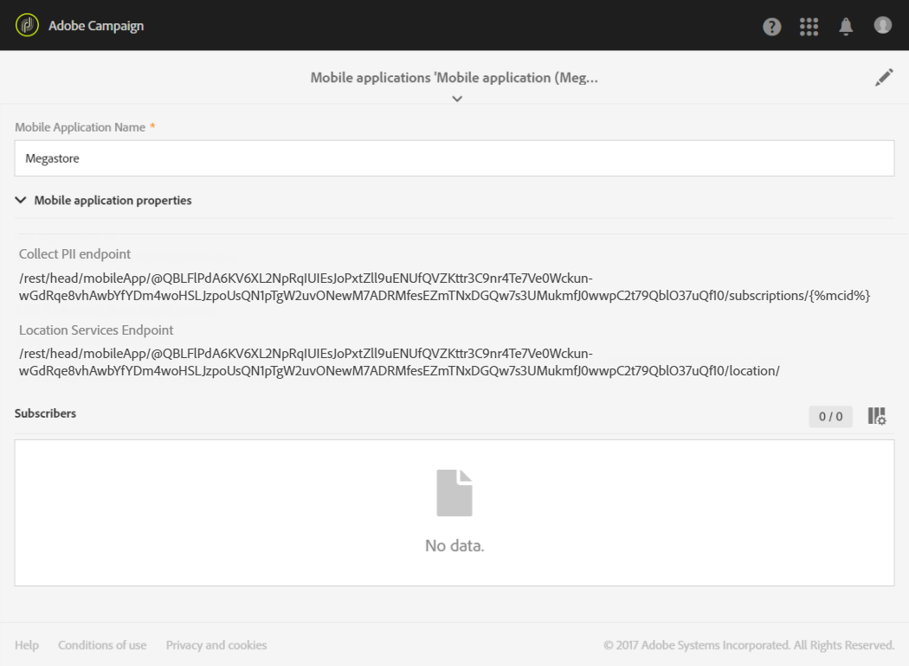
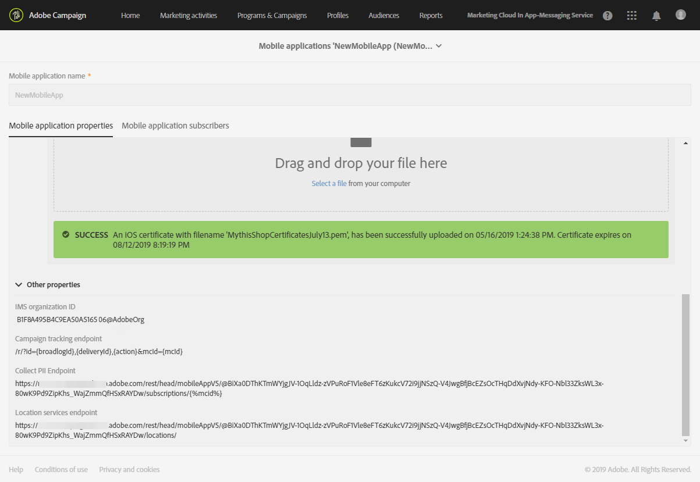

# Configuring Campaign-Points of Interest data integration{#configuring-campaign-points-of-interest-data-integration}

## Configuring Campaign-Points of Interest data integration with SDK V4

The mobile applications used to collect location data must be configured by an **administrator** in the Adobe Campaign interface.

To use the Point of Interest data feature with mobile applications configured with SDK V4, you need to:

1. Have access to Adobe Analytics for Mobile. Check your license agreement or contact your Adobe Account executive for more information.
1. Set up your mobile application in Adobe Campaign. See [Setting up a mobile app in Campaign](../../integrating/using/configuring-campaign-points-of-interest-data-integration.md#setting-up-a-mobile-app-in-campaign).
1. Set up your mobile application in the Adobe Mobile Services interface. This enables you to ensure that data collected by Adobe Mobile Services is sent to Adobe Campaign. See [Configuring a mobile app in Adobe Mobile Services](../../integrating/using/configuring-campaign-points-of-interest-data-integration.md#configuring-a-mobile-app-in-adobe-mobile-services).
1. Perform the mobile application's specific setup:

    * Package the configuration file downloaded from the Adobe Mobile Services interface with the mobile application.
    * Integrate the Experience Cloud Mobile SDK into your mobile application. See [Integrating the SDK into a mobile application](../../integrating/using/configuring-campaign-points-of-interest-data-integration.md#integrating-the-sdk-into-a-mobile-application).

1. Define Points of Interest in the Adobe Mobile Services interface. See [Defining Points of Interest in Adobe Mobile Services](../../integrating/using/configuring-campaign-points-of-interest-data-integration.md#defining-points-of-interest-in-adobe-mobile-services).
1. Define the data that you want to collect from your mobile application's subscribers. See [Collecting subscribers' Points of interest data](../../integrating/using/configuring-campaign-points-of-interest-data-integration.md#collecting-subscribers--points-of-interest-data).
1. Make sure you access the mobile application and the collected location data in Adobe Campaign. See [Accessing mobile apps used to collect location data](../../integrating/using/configuring-campaign-points-of-interest-data-integration.md#accessing-mobile-apps-used-to-collect-location-data) and [Accessing collected location data](../../integrating/using/configuring-campaign-points-of-interest-data-integration.md#accessing-collected-location-data).

### Setting up a V4 mobile app in Adobe Campaign {#setting-up-a-mobile-app-in-campaign}

To be able to collect Points of interest data with Adobe Campaign, you must configure the mobile application which Adobe Campaign will be receiving data from.

1. Click the **[!UICONTROL Adobe Campaign]** logo, in the top left corner, then select **[!UICONTROL Administration]** > **[!UICONTROL Channels]** > **[!UICONTROL Mobile app]**.
1. Click **[!UICONTROL Create]** to set up an application.
1. Enter a name in the **[!UICONTROL Application name]** field and click **[!UICONTROL Create]**.

   Do not fill in the **[!UICONTROL Device-specific settings]** section. This only applies to configuring applications that receive push notifications.

In the **[!UICONTROL Mobile application properties]** section, two URLs are listed: **[!UICONTROL Collect PII endpoint]** and **[!UICONTROL Location Services endpoint]**. They will be used in the Adobe Mobile Services interface. See [Configuring a mobile app in Adobe Mobile Services](../../integrating/using/configuring-campaign-points-of-interest-data-integration.md#configuring-a-mobile-app-in-adobe-mobile-services).

* The **[!UICONTROL Collect PII endpoint]** URL is used to collect the users' Experience Cloud IDs and registration tokens from the mobile application when it is launched. When a user logs into the application using credentials such as email, first name, last name etc., this data is also collected and used to reconcile the user's registration token with an Adobe Campaign profile.
* The **[!UICONTROL Location Services endpoint]** URL is used to collect location data such as a user's latitude, longitude and radius from a Point of Interest.

You can now use these values in Adobe Mobile Services to finish the configuration, as explained in the [Configuring a mobile app in Adobe Mobile Services](../../integrating/using/configuring-campaign-points-of-interest-data-integration.md#configuring-a-mobile-app-in-adobe-mobile-services) section.



### Configuring a V4 mobile app in Adobe Mobile Services {#configuring-a-mobile-app-in-adobe-mobile-services}

To send the data collected by Adobe Mobile Services to Adobe Campaign, you must configure postbacks in the Mobile Services interface.

You will need specific information that you can find in the mobile application parameters set in Adobe Campaign (see [Setting up a mobile app in Campaign](../../integrating/using/configuring-campaign-points-of-interest-data-integration.md#setting-up-a-mobile-app-in-campaign)):

* **[!UICONTROL IMS Organization ID]** 
* **[!UICONTROL Collect PII Endpoint]** 
* **[!UICONTROL Location Services endpoint]**

You must have access to Adobe Analytics to do the following configuration. If you are not an Adobe Analytics user, contact your Adobe Campaign administrator.

1. Log into [mobilemarketing.adobe.com](http://mobilemarketing.adobe.com/).
1. Create the application or select an existing one.
1. Go to the **[!UICONTROL Manage App Settings]** page.
1. In the **Visitor ID Service ** section, check **Enable** and select your organization from the drop-down list. Click **Save**.

   >[!CAUTION]
   >
   >This organization must be the same as the one you use on the Adobe Campaign instance.

1. Click **[!UICONTROL Manage Postbacks]**.
1. Create a postback.

    * Select **[!UICONTROL PII]** as the **[!UICONTROL Postback Type]**.
    * In the **[!UICONTROL URL]** field, copy the **[!UICONTROL Collect PII Endpoint]** URL from the mobile application that you configured in the Adobe Campaign interface, preceded by the server name. See [Setting up a mobile app in Campaign](../../integrating/using/configuring-campaign-points-of-interest-data-integration.md#setting-up-a-mobile-app-in-campaign).
    * Fill in the **[!UICONTROL Post Body]** field as follows:

      For iOS:

      ```    
      {
      "userKey": "{userKey}",
      "pushPlatform":"apns",
      "marketingCloudId":"",
      "cusEmail":"{email}",
      "cusFirstName":"{firstName}",
      "cusLastName":"{lastName}"
      }
      
      ```    
    
      For Android:

      ```    
      {
      "userKey": "{userKey}",
      "pushPlatform":"gcm",
      "marketingCloudId":"",
      "cusEmail":"{email}",
      "cusFirstName":"{firstName}",
      "cusLastName":"{lastName}"
      }
      
      ```

    * Set **Content Type** as **[!UICONTROL application/json]**.
    * In the **Which Data Tags Trigger the Postback?**, select any event, typically **[!UICONTROL Launched]** and **[!UICONTROL exists]**.
    * Click **[!UICONTROL Save & Activate]**.

1. Create a second postback.

    * Select **[!UICONTROL Postback]** as the **[!UICONTROL Postback Type]**.
    * In the **[!UICONTROL URL]** field, copy the **[!UICONTROL Location Services Endpoint]** URL from the mobile application that you configured in the Adobe Campaign interface, preceded by the server name. See [Setting up a mobile app in Campaign](../../integrating/using/configuring-campaign-points-of-interest-data-integration.md#setting-up-a-mobile-app-in-campaign).
    * Fill in the **[!UICONTROL Post Body]** field as follows:

      ```    
      
      {
      "locationData":{
      "distances":"{a.loc.dist}",
      "poiLabel":"{a.loc.poi}",
      "latitude.a":"{a.loc.lat.a}",
      "latitude.b":"{a.loc.lat.b}",
      "latitude.c":"{a.loc.lat.c}",
      "longitude.a":"{a.loc.lon.a}",
      "longitude.b":"{a.loc.lon.b}",
      "longitude.c":"{a.loc.lon.c}",
      "appId":"{a.appid}",
      "marketingCloudId":"{mid}"
      }
      }
      
      ```

    * Set **Content Type** as **[!UICONTROL application/json]**.
    * In the **Which Data Tags Trigger the Postback?**, select **[!UICONTROL campaign.test]** and **[!UICONTROL exists]**.
    * Click **[!UICONTROL Save & Activate]**.

>[!NOTE]
>
>For detailed information on configuring postbacks, refer to the [Adobe Mobile Services documentation](https://marketing.adobe.com/resources/help/en_US/mobile/signals_.html).

### Integrating the SDK into a mobile application {#integrating-the-sdk-into-a-mobile-application}

The Mobile core service’s software development kit (SDK) facilitates the integration of a mobile application into Adobe Campaign.

This step is described in this [page](https://helpx.adobe.com/campaign/kb/configuring-app-sdkv4.html).

### Defining Points of Interest in Adobe Mobile Services {#defining-points-of-interest-in-adobe-mobile-services}

To define the Points of Interest that are used to collect location data:

1. Go to the Adobe Mobile Services interface.
1. Add your application.

   For more information on managing applications in Mobile Services, refer to the [Adobe Mobile Services documentation](https://marketing.adobe.com/resources/help/en_US/mobile/t_new_app.html).

1. Define the Points of Interest.

   For more information on managing Points of Interest, refer to the [Adobe Mobile Services documentation](https://marketing.adobe.com/resources/help/en_US/mobile/t_manage_points.html).

### Collecting subscribers' Points of interest data {#collecting-subscribers--points-of-interest-data}

A specific custom resource enables you to define the data that you want to collect from your applications' subscribers.

This step is described in the [Configuring a mobile application using SDK V4](https://helpx.adobe.com/campaign/kb/configuring-app-sdkv4.html) page.

## Configuring Campaign-Points of Interest data integration with Adobe Experience Platform SDKs

The mobile applications used to collect location data must be configured by an **administrator** in the Adobe Campaign interface.

To be able to use Adobe Experience Platform Location Services with mobile applications configured with Adobe Experience Platform SDK, you need to:

1. Set up your mobile application in Adobe Campaign. See [Setting up a mobile app in Campaign](../../integrating/using/configuring-campaign-points-of-interest-data-integration.md#setting-up-a-mobile-app-in-campaign).

1. Set up your mobile application in Places.

1. Defining your Points of Interest in Places. See [Defining Points of Interest in Adobe Mobile Services](../../integrating/using/configuring-campaign-points-of-interest-data-integration.md#defining-points-of-interest-in-adobe-mobile-services).
1. Define the data that you want to collect from your mobile application's subscribers. See [Collecting subscribers' Points of interest data](../../integrating/using/configuring-campaign-points-of-interest-data-integration.md#collecting-subscribers--points-of-interest-data).
1. Make sure you access the mobile application and the collected location data in Adobe Campaign. See [Accessing mobile apps used to collect location data](../../integrating/using/configuring-campaign-points-of-interest-data-integration.md#accessing-mobile-apps-used-to-collect-location-data) and [Accessing collected location data](../../integrating/using/configuring-campaign-points-of-interest-data-integration.md#accessing-collected-location-data).


## Accessing mobile apps used to collect location data {#accessing-mobile-apps-used-to-collect-location-data}

To access the successfully created applications in Adobe Campaign:

1. Click the **[!UICONTROL Adobe Campaign]** logo, in the top left corner.
1. Select **[!UICONTROL Administration]** > **[!UICONTROL Channels]** > **[!UICONTROL Mobile app (SDK v4)]** or **[!UICONTROL Mobile app (AEP SDK)]** depending on the SDK.
1. Select a mobile application from the list to display its properties.

   

A list of the application's subscribers is also displayed. The subscribers are all of the users who have installed the application on their mobile device. The Adobe Campaign database profiles are identified with a registration token.

## Accessing collected location data {#accessing-collected-location-data}

Once the setup is done, the collected Points of Interest data is listed in the **[!UICONTROL Places]** tab of each profile. To access the list:

1. Select a profile.
1. Click the **[!UICONTROL Edit profile properties]** button on the right.
1. Select the **[!UICONTROL Places]** tab.

   

The collected Points of Interest data for the current profile are listed. Location data are stored in the Adobe Campaign database for six months.

For more information on accessing and editing profiles, see [Profiles](../../audiences/using/about-profiles.md).
