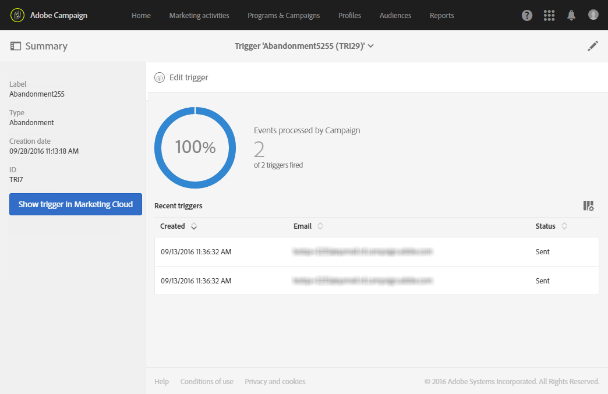

# Configuring Campaign-Triggers integration

Configuring Campaign-Triggers integration

## Activating the functionality

The functionality must be activated in Adobe Campaign by Adobe. Please contact your Adobe account executive or professional services partner.

## Defining aliases

Aliases enable a contact in Analytics to be reconciled with a profile in Campaign. These aliases have to be defined in the Experience Cloud ID service and a matching Shared Data Source has to be defined in Campaign.

To define the Adobe Experience Cloud data sources, select the **Administration** > **Application settings** > **Shared Data Sources** advanced menu.

## AMC Prerequisites

You should make sure to define the behaviors that you want to monitor beforehand in Adobe Experience Cloud (**Triggers** core service). For more on this, refer to the [Adobe Experience Cloud documentation](https://marketing.adobe.com/resources/help/en_US/mcloud/t_create-trigger.html). Note that when you define the trigger, you need to enable the aliases.

For each behavior (cart abandonment, adding/deleting products, session expired, etc.), a new trigger must be added in Adobe Experience Cloud.

## Defining the trigger event

You now have to create a trigger event in Adobe Campaign based on an existing Adobe Experience Cloud trigger.

The steps for putting this into place are:

1. Click the **Adobe Campaign** logo, in the top left corner, then select **Marketing plans** > **Transactional messages** > **Experience Cloud Triggers**.

   

1. Click the **Create** button. The creation wizard that opens displays the list of all of the triggers defined in Adobe Experience Cloud. The **Fired by Analytics** column displays the number of events sent by the Adobe Experience Cloud trigger to Campaign.

   

1. Select the Adobe Experience Cloud trigger that you want to use and click **Next**.
1. Configure the general properties of the trigger. At this step of the wizard, also specify the channel and the targeting dimension to use for the trigger (see [targeting dimensions and resources](../../automating/using/query.md#targeting-dimensions-and-resources)). Then confirm the trigger creation.
1. Click the button to the right of the **Event content and enrichment** field to view the content of the payload. This screen also allows you to enrich the event data with profile data stored in the Adobe Campaign database. The enrichment is performed in the same way as for a standard transactional message. 

   

1. In the **Transactional message validity duration** field, define the duration for which the message will stay valid after the event is sent by Analytics. If a duration of 2 days is defined, the message will no longer be sent after that duration has passed. If you put several messages on hold, this ensures that those messages will not be sent if you resume them after a certain period of time.

   

1. If a propensity scoring is defined in Analytics (see the [Experience Cloud documentation](https://marketing.adobe.com/resources/help/en_US/mcloud/propensity-scoring.html)), you can choose not to send the message if the customer has a high probability of coming back to the website in the near future. The content of the score and the threshold is available in the content of the payload so that you can use those values to personalize the message. To use this option, check the box at the bottom of the screen. The clients with a strong probability of coming back to the site in the near future will not receive a message.
1. Click the **Publish** button to start publishing the trigger event.
1. If you need to make a change in your trigger schema even after publishing your trigger event, click the **Update schema** button to retrieve the latest changes.

   Please note that this action will unpublish your trigger and transactional message, you will be required to republish them afterwards.

   

The **Show Trigger in Experience Cloud** button allows you to view the trigger definition in Adobe Experience Cloud.

Once the event has been published, a transactional template linked to the new event is then automatically created. You then have to modify and publish the template that was just created. For more on this, refer to the [Editing the template](../../start/using/about-templates.md) section.

## Editing the template

Once you have created and published the trigger event, the corresponding transactional template is created automatically. For more on this, refer to the [Defining the trigger event](../../integrating/using/configuring-campaign-triggers-integration.md#defining-the-trigger-event) section.

In order for the event to trigger sending a transactional message, you have to personalize the template, then test it and publish it. These steps are the same as for a standard transactional message. For more on this, refer to the [Transactional template](../../channels/using/event-transactional-messages.md#personalizing-a-transactional-message) section.

>[!NOTE]
>
>If you unpublish the template, it will automatically unpublish the trigger event.

When editing content, you can add a personalization field based on the information sent by the Analytics trigger. If you enrich the event data with Adobe Campaign profile data, you can personalize the message based on this information. To personalize your message, select **Transactional event** > **Event context** and select a field.

## Accessing the reports

To view the dedicated trigger report in Adobe Campaign, open the trigger event that you previously created, and click **Show trigger report**. 

The report shows the number of processed events compared to the number of events sent by Analytics. It also displays a list of all the recent triggers. 

