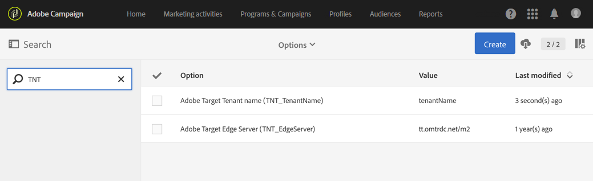

# Configuring the Campaign-Target integration{#configuring-the-campaign-target-integration}

The integration between Adobe Campaign and Adobe Target lets you insert dynamic content in your delivery.

A configuration is first needed in Adobe Campaign to use the integration functionalities with Adobe Target and must be managed by the functional administrator.

The following elements are needed for this procedure:

* An Adobe Experience Cloud tenant
* An Adobe Target tenant
* An Adobe Target rawbox specified to establish the connection with Adobe Campaign

1. From the advanced menu, via the Adobe Campaign logo in the top-left corner, select **[!UICONTROL Administration]** > **[!UICONTROL Application settings]** > **[!UICONTROL Options]**.
1. To configure the server and tenant options for Adobe Target, fill in the following fields accordingly:

    * **[!UICONTROL TNT_TenantName]**: name of the Adobe Target tenant. This value corresponds to the name of the Adobe Target **[!UICONTROL Client]**.
    * **[!UICONTROL TNT_EdgeServer]**: Adobe Target server used for integration. This option is already provided by default. This value corresponds to the Adobe Target **[!UICONTROL Server Domain]**, followed by the **/m2** value. For example: **tt.omtrdc.net/m2**.

   

Your users can now add dynamic images in a delivery with Adobe Target.
