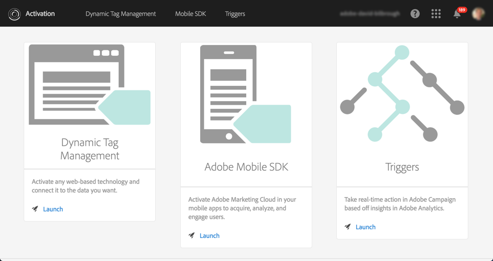
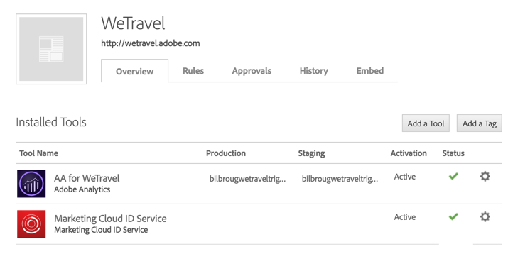
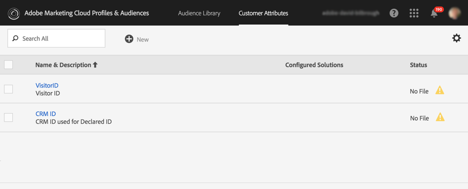
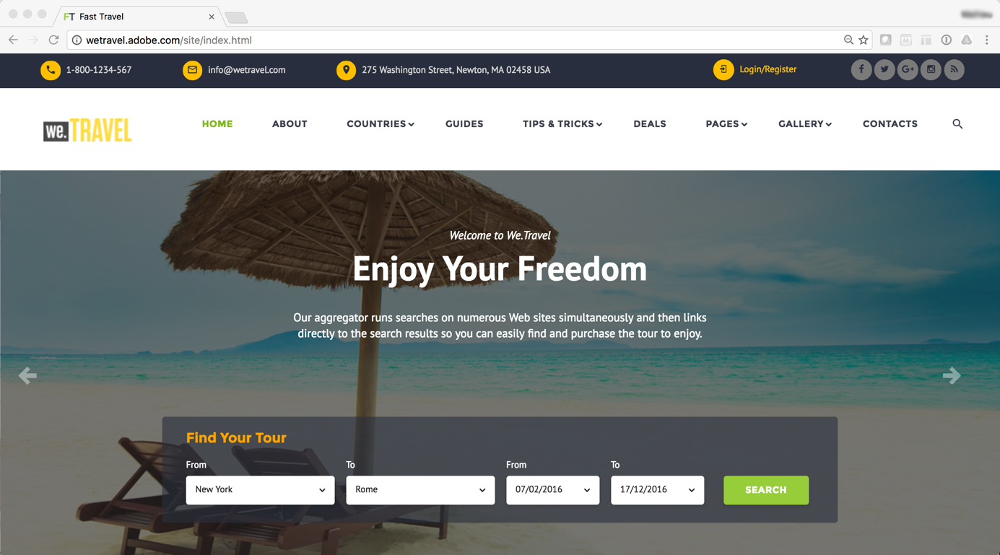
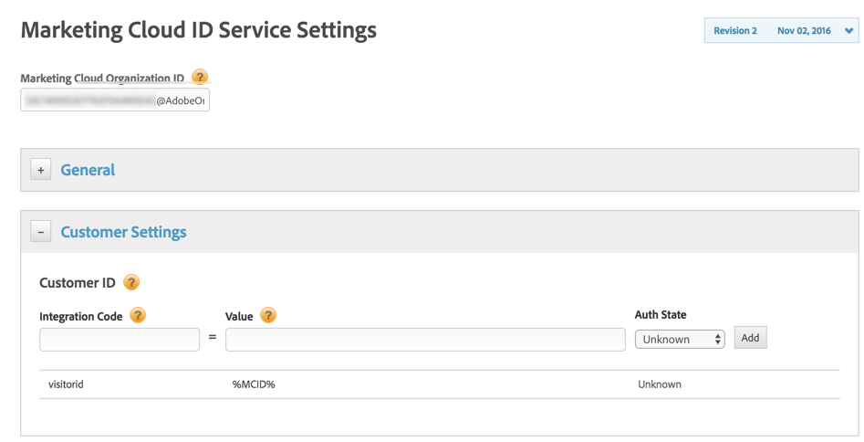
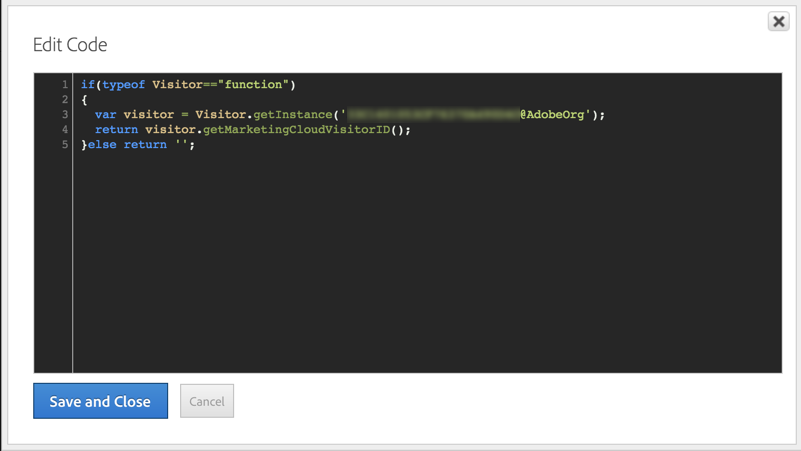
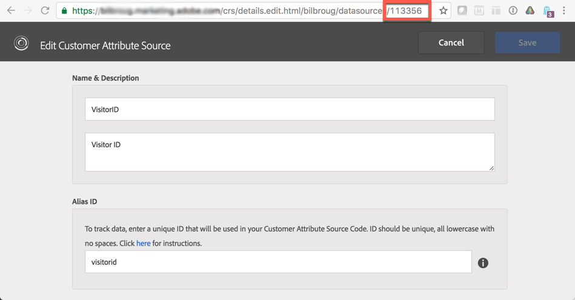
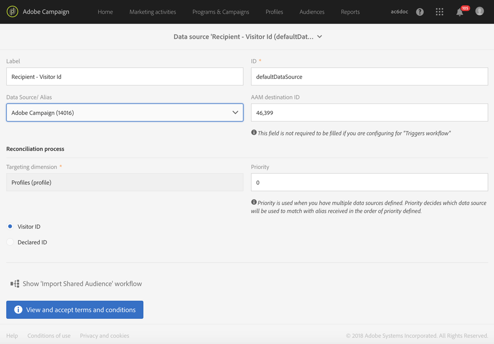

# Configuring Triggers in Experience Cloud{#configuring-triggers-in-experience-cloud}

Configuring Triggers in Experience Cloud

## Activating the functionality {#activating-the-functionality}

The functionality must be activated in Adobe Campaign by Adobe. Please contact your Adobe account executive or professional services partner.

The Adobe team will need the following information to activate triggers:

* Marketing Cloud Company Name
* IMS ORG ID
* Analytics Login Company (can be the same as the Marketing Cloud Company Name)

## Configuring solutions and services {#configuring-solutions-and-services}

In order to use this feature, you need to have access to the following solutions/core services:

* Adobe Campaign
* Adobe Analytics Ultimate, Premium, Foundation, OD, Select, Prime, Mobile Apps, Select, or Standard.
* Experience Cloud Triggers Core Service

  

* Experience Cloud DTM Core Service

  

* Experience Cloud Visitor ID and Experience Cloud People Core Service

  

You also need to have a working website.

>[!CAUTION]
>
>Sub-domain delegation is a deliverability key element. Make sure that the Adobe Campaign emails are sent from the same domain as the one used by the website.

You need to configure [Experience Cloud DTM Core Service](../../integrating/using/configuring-triggers-in-experience-cloud.md#configuring-experience-cloud-dtm-core-service), [Experience Cloud People Core Service](../../integrating/using/configuring-triggers-in-experience-cloud.md#configuring-experience-cloud-people-core-service) and [Campaign](../../integrating/using/configuring-triggers-in-experience-cloud.md#configuring-triggers-and-aliases-in-campaign) to run these use cases.

### Configuring Experience Cloud DTM Core Service {#configuring-experience-cloud-dtm-core-service}

1. In Experience Cloud DTM Core Service (Dynamic Tag Management), activate Experience Cloud ID and Adobe Analytics for your website pages.

   

1. ID reconciliation between the website, Adobe Analytics and Adobe Campaign requires to use aliasing. Create an alias, "visitorid" for example.

   

### Configuring Experience Cloud People Core Service {#configuring-experience-cloud-people-core-service}

The alias previously referenced in DTM needs to be created in the Experience Cloud People Core Service through a Customer Attribute. Make sure you create a new one and reference the same DTM alias in the integration code (for example "visitorid").

>[!NOTE]
>
>We are going to use this Customer Attribute in the Data source in Adobe Campaign (next step).

### Configuring triggers and aliases in Campaign {#configuring-triggers-and-aliases-in-campaign}

1. Make sure you have **[!UICONTROL Experience Cloud triggers]** visible on your Adobe Campaign Standard instance. If you don't, contact the Adobe Campaign administrators.

   

1. Aliases enable a contact in Analytics to be reconciled with a profile in Campaign. You need to match the aliases defined in the Experience Cloud ID service with a Shared Data Source in Campaign. You need to configure the aliases resolution in Adobe Campaign via a Data source ( **[!UICONTROL Administration]** > **[!UICONTROL Application Settings]** > **[!UICONTROL Shared Data Sources]** ). Make sure you choose the correct data source in the **[!UICONTROL Data Source/Alias]** drop-down menu, which is mapped with the same Customer Attribute data source created in previous step.

   

   >[!NOTE]
   >
   >You can reconcile your triggers for both anonymous and logged in users. For anonymous users, the profile should exist in Adobe Campaign and an email has been sent to the user before. For this, Visitor ID configuration is sufficient. However, if you want to reconcile triggers for logged in users, you need to setup Declared ID Data Source. For more on this, refer to [Data Source configuration](../../integrating/using/provisioning-and-configuring-integration-with-audience-manager-or-people-core-service.md#step-2--configure-the-data-sources).

## Creating a trigger in the Experience Cloud interface {#creating-a-trigger-in-the-experience-cloud-interface}

An Adobe Experience Cloud trigger needs to be created so that you can use it in Campaign.

Create a new trigger in Experience Cloud and make sure you select the report suite used on your website. Make sure you choose the right dimension so that the trigger will fire.

Refer to the [Adobe Experience Cloud documentation](https://marketing.adobe.com/resources/help/en_US/mcloud/triggers.html) and watch this [video](https://helpx.adobe.com/marketing-cloud/how-to/email-marketing.html#step-two) .

## Triggers best practices and limitations {#triggers-best-practices-and-limitations}

Here is a list of best practices and limitations for the use of the Campaign - Triggers integration:

* If you have multiple instances of Campaign Standard, then triggers can be received by all instances as long as they are in the same IMS org ID. Analytics also needs to be on same IMS org ID.
* You cannot create a trigger in the Trigger Core Service using events from two different report suites.
* Triggers are based on transactional messages. Transactional messages are used whenever you have to send a message very quickly. You cannot queue transactional messages and then loop them in batch.
* Triggers are not deterministic in nature. When a trigger is generated, it sends all aliases associated with the cookie, so in case of shared browsers such as in retail kiosks, libraries, cyber cafes, or shared devices at home (husband and wife logging in from the same device), it is not possible to map to the right ID. All IDs used to login with the browser are sent to Campaign which sends out a message on the basis of the first reconciliation. If there are multiple "email IDs" eligible for reconciliation, then Campaign does not send an email. There is no way for Campaign to know what the right email ID is unless it is captured and sent by Analytics.
* You cannot store contents of payload in Campaign. Triggers cannot be used to update a profile's data.
* Customer Attributes are not supported in Triggers (meaning, only report suite data can be used to define Triggers business rules).
* Collection of collections are not supported in Campaign.

>[!CAUTION]
>
>Your website must be running on the same domain as the Adobe Campaign server. If not, you cannot use visitor id to reconcile and reach out to users visiting the website anonymously.

