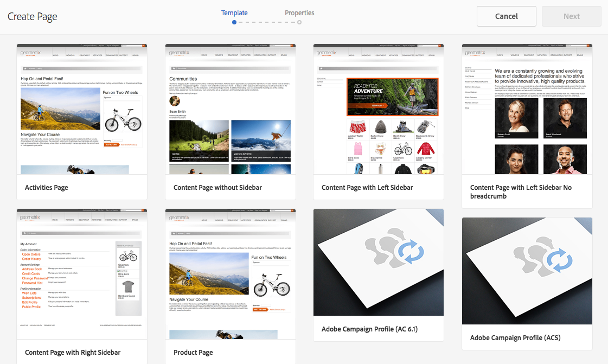
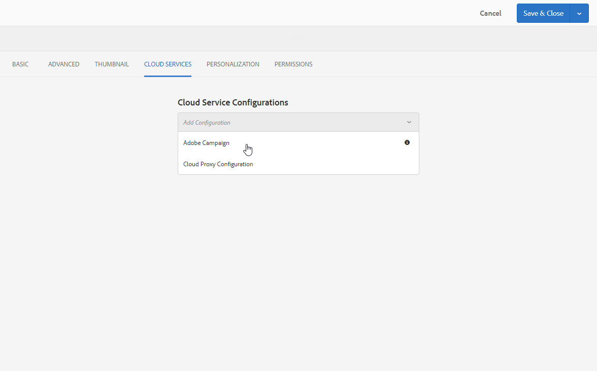

# Creating a Campaign form in Experience Manager {#creating-a-campaign-form-in-experience-manager}

You can create "forms" on your AEM sites and map the fields in a form to the fields in the Adobe Campaign database. This allows you to create and update profiles or manage the subscriptions to a service.

To create an Adobe Campaign form on your AEM site:

1. In your AEM site, create a new page based on the **Adobe Campaign Profile ** template.

   

1. In the page properties, select the **[!UICONTROL Cloud Service]** corresponding to your Adobe Campaign instance.

   

1. Select the form type from the **[!UICONTROL Form Start]** component:

    * **Adobe Campaign: Save profile**
    * **Adobe Campaign: Subscribe to Services**
    * **Adobe Campaign: Unsubscribe from Services**

1. Edit the content of the form by adding different fields and components that you can map to the Adobe Campaign database fields.
1. Test and publish the form to make it accessible on your AEM site.

For more information, refer to the [detailed documentation](https://docs.adobe.com/docs/en/aem/6-2/author/personalization/adobe-campaign/adobe-campaign-forms.html).
