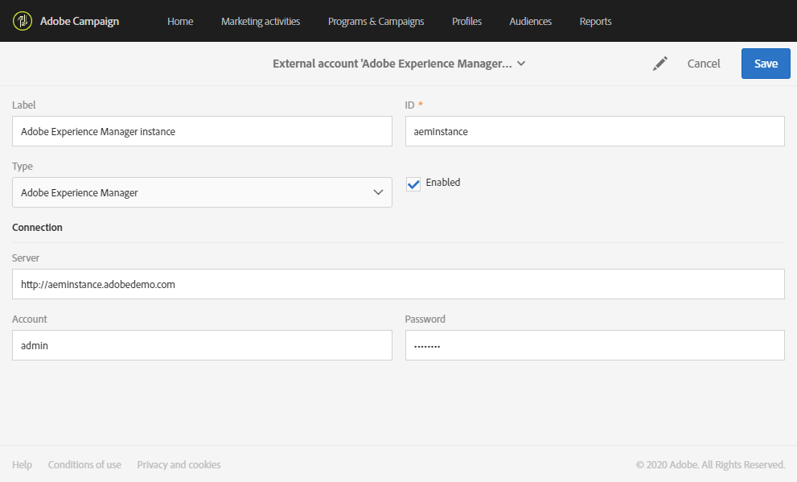
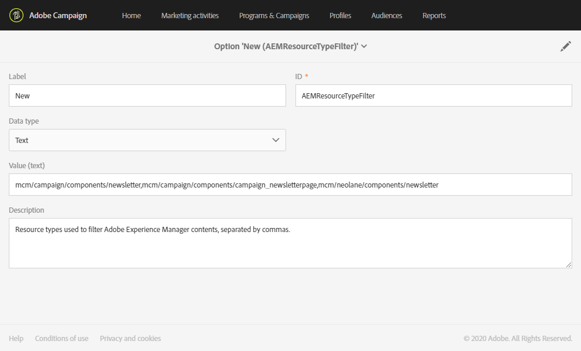
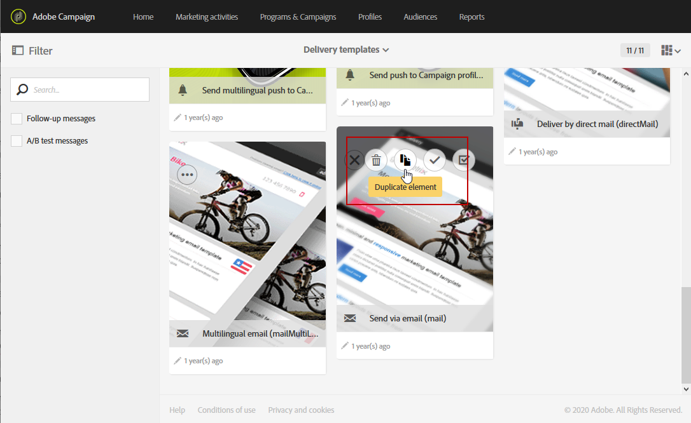
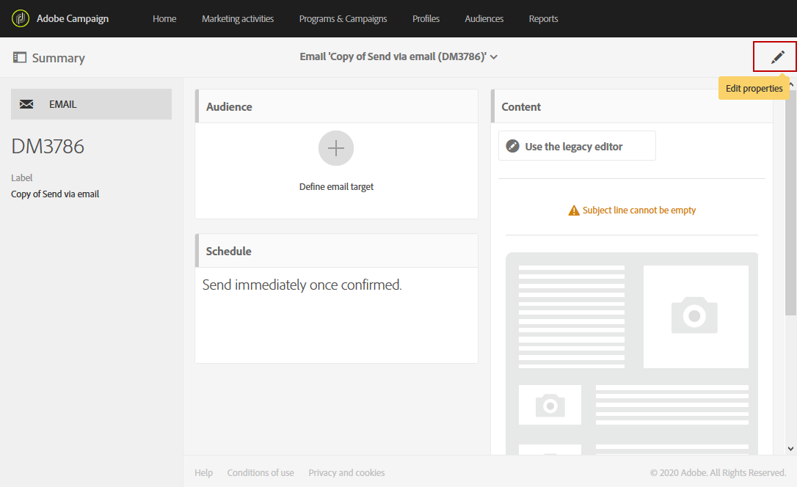
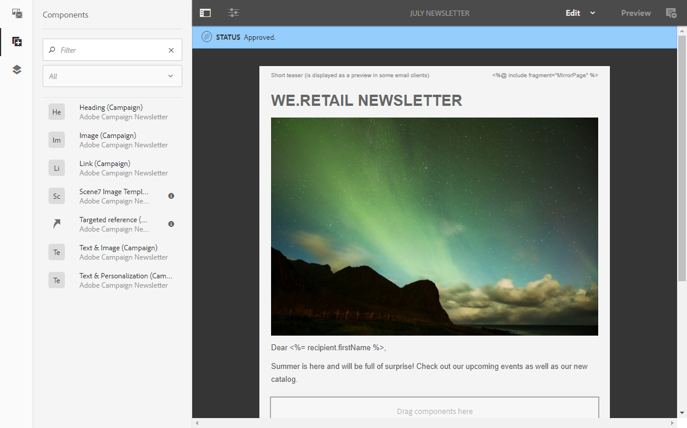

# Creating an email content in Adobe Experience Manager {#creating-email-aem}

This integration between Adobe Campaign Standard and Adobe Experience Manager allows you to use content created in Adobe Experience Manager in your Adobe Campaign emails.

With this use case you will learn how to create and manage email contents in Adobe Experience Manager, then use them for your marketing campaigns by importing them in your emails into Adobe Campaign Standard.

## Prerequisites {#prerequisites}

You should make sure you have the following elements beforehand:

* An Adobe Experience Manager **authoring** instance
* An Adobe Experience Manager **publishing** instance
* An Adobe Campaign instance

## Configuration {#configuration}

## Configuration in Adobe Campaign Standard {#config-acs}

To use these two solutions together, you must configure them to connect to one another.
To configure Adobe Campaign:

1. You first need to configure the **[!UICONTROL Adobe Experience Manager instance]** external account under **[!UICONTROL Administration]** > **[!UICONTROL Application settings]** > **[!UICONTROL External accounts menu]**.

1. Configure the Adobe Experience Manager type external account with your **[!UICONTROL Server]** URL, **[!UICONTROL Account]** and **[!UICONTROL Password]**.

    

1. Check that the **[!UICONTROL AEMResourceTypeFilter]** option has been correctly configured. Access the **[!UICONTROL Options]** menu under **[!UICONTROL Administration]** > **[!UICONTROL Application settings]** > **[!UICONTROL Options]** menu.

1. In the **[!UICONTROL Value (text)]** field, check that the following syntax is correct:

    ```
    mcm/campaign/components/newsletter,mcm/campaign/components/campaign_newsletterpage,mcm/neolane/components/newsletter
    ```

    

1. Then, in the advanced menu under **[!UICONTROL Resources]** > **[!UICONTROL Templates]** > **[!UICONTROL Delivery templates]**, duplicate one of the existing template to create an email template specific to Adobe Experience Manager.

    

1. Click the **[!UICONTROL Edit properties]** icon.

    

1. Under the **[!UICONTROL Content]** drop-down, select **[!UICONTROL Adobe Experience Manager]** in the **[!UICONTROL Content source]** field then your previously created external account in the **[!UICONTROL Adobe Experience Manager account]**.

You now need to configure the integration in Adobe Experience Manager.

## Configuration in Adobe Experience Manager {#config-aem}

1. Configure Adobe Experience Manager. To do this:

    * Configure the replication between the Adobe Experience Manager authoring and publishing instances.
    * Connect Adobe Experience Manager to Adobe Campaign by configuring a dedicated **[!UICONTROL Cloud Service]**.

## Creating an email content in Adobe Experience Manager {#use-case}

To create an email content in Adobe Experience Manager:

1. Create an email content using a template created specifically for Adobe Campaign.
1. In the content properties, select the **[!UICONTROL Cloud Service]** corresponding to your Adobe Campaign instance.
1. Edit the content by inserting text, images, personalization, etc.
1. Validate the content.

For more information, refer to the [detailed documentation](https://docs.adobe.com/content/help/en/experience-manager-65/authoring/aem-adobe-campaign/campaign.html).



To retrieve the content in Adobe Campaign:

1. Create an email based on an Adobe Experience Manager type content template.
1. Link a content created with Adobe Experience Manager using the Adobe Campaign email content definition screen.


