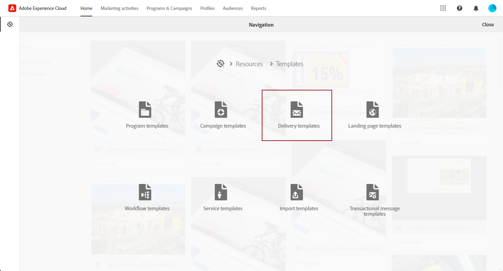
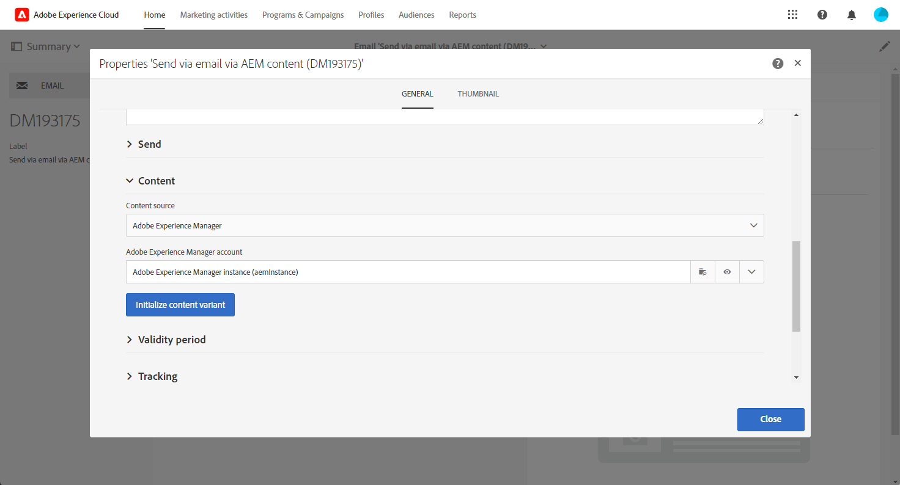
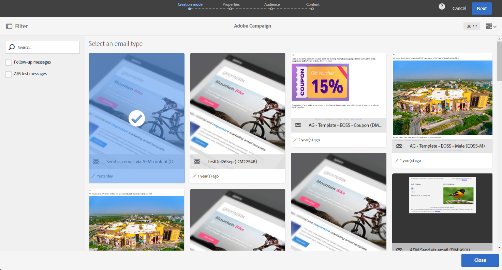
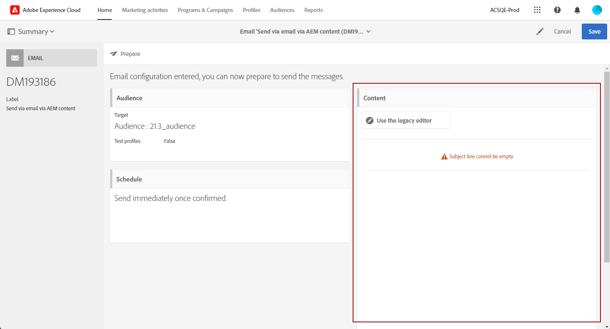
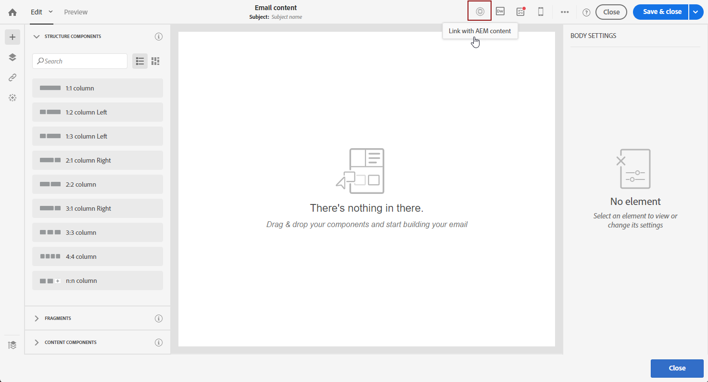

# Importing an Adobe Experience Manager content into an Adobe Campaign email {#creating-email-aem}

Using this document, you will learn how to create and manage email contents in Adobe Experience Manager, then use them for your marketing campaigns by importing them in your emails into Adobe Campaign Standard.

The prerequisites are:

* Access to an AEM instance configured for the integration.
* Access to an Adobe Campaign instance configured for the integration.
* An Adobe Campaign email template configured to receive AEM content.

## Accessing emails in Adobe Experience Manager {#email-content-aem}

Log in to your Adobe Experience Manager authoring instance and browse your site to access the folder containing your email contents.

>[!VIDEO](https://video.tv.adobe.com/v/29996)

## Creating new email content in Adobe Experience Manager {#creating-email-content-aem}

Several templates specific to Adobe Campaign are available. You must use one of these templates as they contain predefined components supported by Adobe Campaign.

By default, two predefined templates allow you to create email contents for Adobe Campaign.

* **[!UICONTROL Adobe Campaign Email]**: this template contains a standard content that you can personalize. You can choose between Adobe Campaign Email (AC6.1) and Adobe Campaign Email (ACS).
* **[!UICONTROL Importer Page]**: this template lets you import a ZIP file containing an HTML file with content that you will then be able to personalize.

1. In Adobe Experience Manager, create a new **[!UICONTROL Page]**.

1. Select the **[!UICONTROL Adobe Campaign Email]** template. Refer to the following video for the detailed steps.

    >[!VIDEO](https://video.tv.adobe.com/v/29997)

1. Open your new email content.

1. In the **[!UICONTROL Page properties]**, set **[!UICONTROL Adobe Campaign]** as the **[!UICONTROL Cloud Service Configuration]**. This enables communication between your content and your Adobe Campaign instance.

    For more information, watch the following video:

    >[!VIDEO](https://video.tv.adobe.com/v/29999)

## Editing and sending an email {#editing-email-aem}

You can edit the email content by adding components and assets. Personalization fields can be used to deliver a more relevant message based on the recipients' data in Adobe Campaign.

To create an email content in Adobe Experience Manager:

1. Edit the subject as well as the **[!UICONTROL Plain text]** version of your email by accessing the **[!UICONTROL Page properties]** > **[!UICONTROL Email]** tab from the sidekick.

1. Add **[!UICONTROL Personalization fields]** through the **[!UICONTROL Text & Personalization]** component. Each component corresponds to a specific usage: inserting images, adding personalization, etc.

    For more information, watch the following video:

    >[!VIDEO](https://video.tv.adobe.com/v/29998)

1. From the **[!UICONTROL Workflow]** tab, select the **[!UICONTROL Approve for Adobe Campaign]** validation workflow. You will not be able to send an email in Adobe Campaign if it uses a content that has not been approved.

To send your email in Adobe Campaign Standard:

1. Once the content and sending parameters are defined, create an email based on an AEM-specific email template in Adobe Campaign Standard. 

    +++ Learn more on AEM-specific template.

    1. From the advanced menu, access **[!UICONTROL Resources]** `>` **[!UICONTROL Templates]** `>` **[!UICONTROL Delivery templates]**.

        

    1. Duplicate or select one of the delivery templates.
    
    1. From the **[!UICONTROL Properties]** of your template, in the **[!UICONTROL Content]** drop-down, select **[!UICONTROL Adobe Experience Manager as Content mode]** then your Adobe Experience Manager account.

        

    +++

    

1. Fill-in the properties of your email and click **[!UICONTROL Create]** to be able to select your AEM content.

1. Access the **[!UICONTROL Content]** block.

    

1. From the **[!UICONTROL Use Adobe Experience Manager content]** menu, click **[!UICONTROL Link AEM content]**. 

    Then, select the content you would like to use in your email.

    

1. Customize your email further by specifying additional parameters such as target audiences and execution schedule through the dashboard. Once configured, you can now send the email delivery. [Learn more](../../sending/using/confirming-the-send.md)

