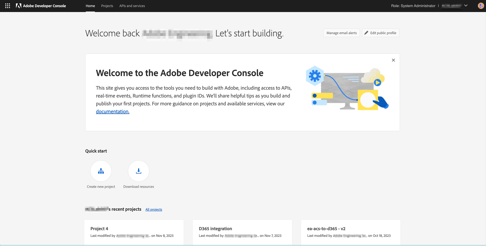
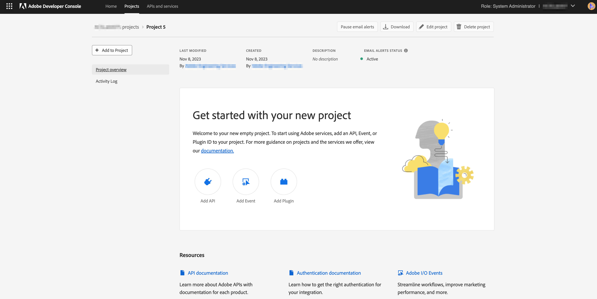
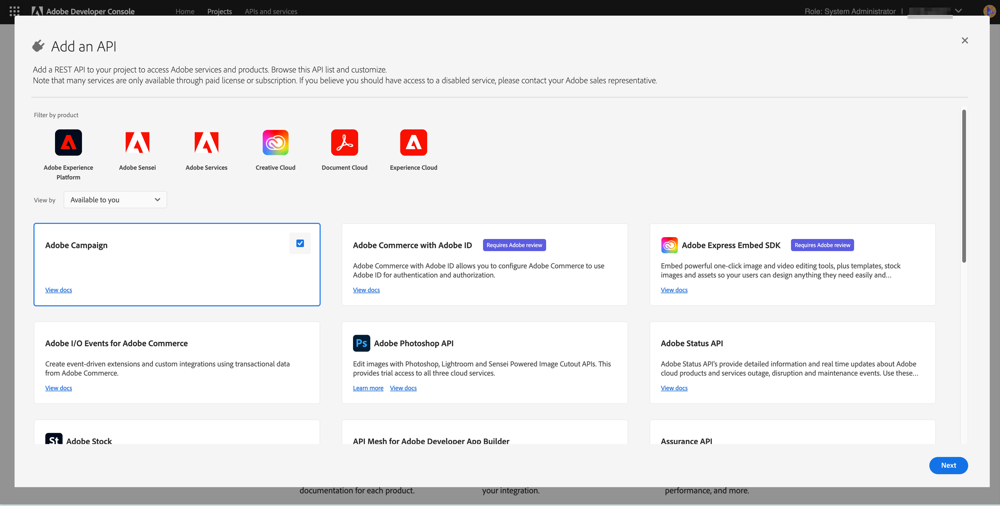
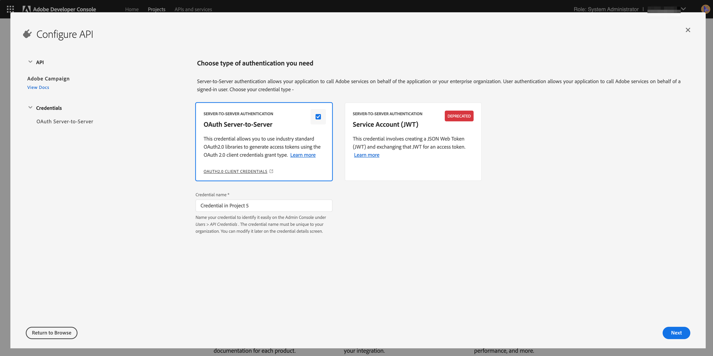
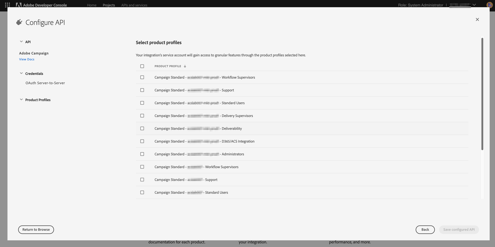
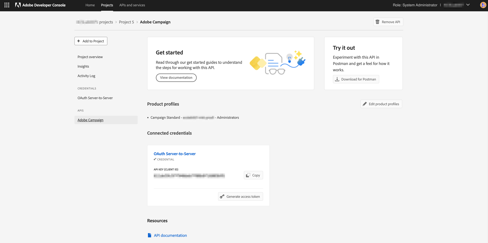
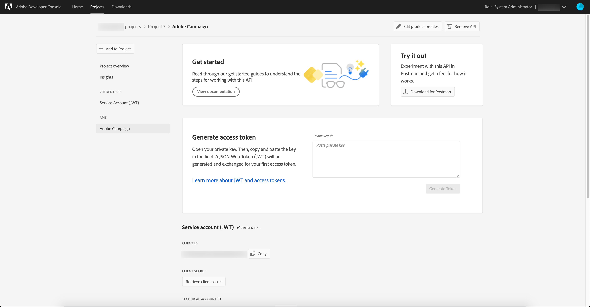

# Adobe Campaign Standard and Adobe Developer Configuration for the Microsoft Dynamics 365 integration

This article will explain how to configure Adobe Campaign Standard and Adobe I/O to give the integration application access to the data.

## Configure Adobe Campaign Standard {#campaign-standard}

### Profile Extensions

Please enable “profile extensions” in Adobe Campaign Standard.   This is needed in order for custom fields in the Profile resource to be synced from Microsoft Dynamics 365.   The steps to enable them are:

1. Go to Settings -> Administration -> Development -> Publishing.
1. Click "Prepare publication" to prepare a publication.
1. After the preparation is finished check "Create the Profiles & Services Ext API" and click "Publish".

## Configure Adobe I/O {#adobe-io}

Adobe I/O allows you to enable API access to Adobe Campaign Standard as well as other Adobe products.   This article will detail how to configure Adobe I/O in order to give the Adobe Campaign Standard integration with Microsoft Dynamics 365 access to synchronize the data.

### Overview

Before performing the pre-integration setup in this article, it is assumed that you have already been provisioned and have admin access to your organization’s Campaign Standard instance.  If this has not happened, then you will need to get in contact with Adobe Customer Care to complete Campaign provisioning.

>[!CAUTION]
>
>Steps described below need to be performed by an administrator.

### Configuration

You will need to create a new Adobe Developer project and configure it for the integration.

#### Create a new project

To achieve this, follow the procedure below:

1. Navigate to [Adobe Developer Console](https://console.adobe.io/home#) and select your Adobe Organization ID from the drop-down menu at the top right of the screen.

1. Then click **[!UICONTROL Create new project]** under **[!UICONTROL Quick Start]**.

    

1. Under **[!UICONTROL Get started with your new project]**, click **[!UICONTROL Add API]**.

    

1. Select the Adobe Campaign API (you may need to scroll towards the bottom) and click **[!UICONTROL Next]**.

    

1. On the next screen you will have the option to upload your own public key or let Adobe Developer generate the key pair for you. These instructions will follow the latter option. If you decide to let Adobe Developer generate the key pair, click on option 1; then click the **[!UICONTROL Generate keypair]** button.

    

1. On the next screen you will be prompted to name and select the download location of the key pair zip file.

Once downloaded, you can unzip the file to reveal the public and private keys. Adobe Developer has already applied the public key to your Adobe Developer project. You will need to retain your private key for later; the private key will be used during the pre-integration setup of the integration tool.

1. Click **[!UICONTROL Next]** to continue

    

1. On the next screen you will select product profiles to associate with this project. Select the product profile that contains in the title: The tenant ID of your Campaign instance - [!UICONTROL Administrators] 

    Example: Campaign Standard - your-campaign-tenantID - Administrators

1. Click **[!UICONTROL Save configured API]**.

    

1. On the next screen you will see the details of your new Adobe Developer project. Click **[!UICONTROL Add to Project]** at the top-left of the screen and select **API** from the drop down.

    

1. On the next screen you will need to select the I/O Events API, then click **[!UICONTROL Next]**.

1. On the next screen click **[!UICONTROL Save the configured API]**.  You will be brought back to the project details screen.

1. Now click **[!UICONTROL Add to Project]** at the top-left of the screen and select **API** from the drop down, as you did previously.

1. On the next screen you will need to select the I/O Management API and click **[!UICONTROL Next]**.

1. On the next screen click **[!UICONTROL Save the configured API]**.

Pre-integration setup in Campaign is now complete.  

**Related Topics** 

* [Configure Adobe Developer for Microsoft Dynamics 365 integration](../../integrating/using/d365-acs-configure-adobe-io.md) is the next step in setting up the integration
* [Integration Self-Service Application Overview](../../integrating/using/d365-acs-self-service-app-quick-start-guide.md) contains the full list of steps to get the integration up-and-running.

* [Adobe Developer - Service Account Integration](https://developer.adobe.com/developer-console/docs/guides/#!AdobeDocs/adobeio-auth/master/AuthenticationOverview/ServiceAccountIntegration.md)
* [Campaign Standard - API Access Setup](../../api/using/setting-up-api-access.md)
* [Campaign Standard - Dynamics 365 integration](../../integrating/using/d365-acs-configure-d365.md)
