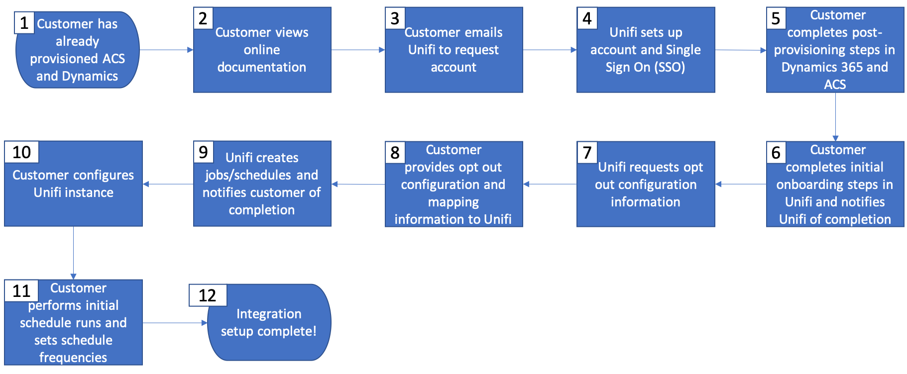

# Get Started with Microsoft Dynamics 365 integration

Activate your CRM data on cross-channel communication: learn how to pass on contacts from Microsoft Dynamics 365 to Adobe Campaign, and share campaign performance data (sends, opens, clicks, and bounces) back from Adobe Campaign to Microsoft Dynamics 365.

This integration requires the following software versions:

* Microsoft Dynamics 365 for Sales Online only, latest version

* Adobe Campaign Standard, latest version

>[!CAUTION]
>
>This capability is not available out of the box as part of the product. The implementation requires Adobe Consulting to be engaged. Please reach out to your Adobe representative to find out more.
>

## Principles

The Adobe Campaign Standard integration with Microsoft Dynamics 365 enables synchronization of all available contact data in the CRM system, making all relevant contact data available for campaign activities.

Conversely, as profiles within Adobe Campaign Standard interact with messages, those data (e.g.: sends, opens, clicks, and bounces) automatically flow into Microsoft Dynamics 365 to keep contact records complete with marketing activity as well.  

The integration also supports enabling [custom entities](../../integrating/using/d365-acs-self-service-app-settings.md) in Dynamics 365 to be synchronized to corresponding **custom resources** in Campaign.

This integration is designed to support four main use cases:

1. Synchronizing contacts from Dynamics 365 to Campaign so they can be targeted in marketing campaigns
1. Synchronizing custom entities from Dynamics 365 to Campaign so they can be used for segmentation and personalization
1. Sending email marketing events (sends, opens, clicks, bounces) from Campaign to Dynamics 365 to display to the sales repository in the Dynamics 365 interface
1. Synchronizing opt-out (e.g., do not email) statuses between Dynamics 365 and Campaign to maintain customer privacy preferences.

Key benefits are:

* Consistent messaging between sales & marketing: the Adobe Campaign Standard integration with Dynamics 365 integration gives both systems access to customer insight and email marketing history allowing all messages to the customer to share the same consistent messaging.

* Holistic view of all prospect and customer data: by integrating Adobe Campaign Standard with Dynamics 365, it is possible to share and access email marketing history on each contact from within the CRM system.

* Activate Dynamics 365 data on any channel: with contact data synchronized to Adobe Campaign, communications can be sent on any online or offline channel with Campaign including mobile push, in-app, email, or direct mail. Campaign "has you covered" regardless of each contacts’ preferred channel.  

>[!CAUTION]
>
>This integration considers Dynamics 365 as the source of truth for contact and custom entity synchronization.  Any changes to synchronized attributes should be done in Dynamics 365, not in Adobe Campaign Standard.  If changes are made in Campaign, they can eventually get overwritten during synchronization.
>

## Key steps to implement the Microsoft Dynamics 365 integration{#request-and-implement-this-integration}

In order to provision this integration, you will need to follow the steps below.

Please follow the flowchart and flowchart details below to request and configure the integration.

Flowchart Details (maps to steps above):

* **Step 1** - It is assumed that you already have, or are in the process of procuring, a license for Microsoft Dynamics 365 for Sales and for Adobe Campaign Standard.
* **Step 2** - The standard integration offering is free to all customers; however, additional costs may apply depending on your requirements. Learn more about [Best practices and limitations](../../integrating/using/d365-acs-notices-and-recommendations.md). A new sales order (SO) will need to be signed in order to take advantage of the integration if it was not included in the original SO.
* **Step 3** - Complete pre-integration steps for Dynamics 365 and Campaign. See [Configure this integration](#configure-this-integration).
* **Step 4** - The Adobe onboarding team will provide you access to the integration application user interface (UI).
* **Step 5** - You will be able to configure your data mappings, replacements, filters, etc. and test your integration from within the integration application UI.
  
    >[!IMPORTANT]
    >
    > If you require the bidirectional or Campaign to Dynamics 365 opt-out configuration, you will need to make the request to your Adobe technical contact for the opt-out workflows to be set up on your Campaign instance. [Learn more](../../integrating/using/d365-acs-notices-and-recommendations.md#opt-out).

### Configure this integration {#configure-this-integration}

Three systems need to be provisioned and configured for this integration:

* **Adobe Campaign Standard**: you need to set up API access and configure a new integration for the integration tool. To achieve this, refer to [this article](../../integrating/using/d365-acs-configure-adobe-io.md).
* **Microsoft Dynamics 365**: you need to create a new app registration and enable an application user to use the integration.  To configure Microsoft Dynamics 365 for this integration, refer to [this article](../../integrating/using/d365-acs-configure-d365.md).
* **Adobe Campaign Standard integration with Microsoft Dynamics 365 Self-Service App**: you will need to follow the steps in [this article](../../integrating/using/d365-acs-self-service-app-control-access.md).

>[!IMPORTANT]
>
>For each system, these steps need to be performed by an **administrator**.
>
>Steps in this documentation will guide you through creating integrations/registrations that involve assigning permissions and/or admin access.  It is your responsibility to ensure these steps comply with your company policies before performing, and to perform them carefully.
>

### Request support

Support tickets can be logged with Adobe Customer Care.

For any issues with integration data flows, make sure to include the following information:

* **Process Owner**: Engineering Architects
* **ES Process ID**: Provided during onboarding process
* **Process Title**: Microsoft Dynamics 365 / Adobe Campaign Standard Integration
* **Issue Description**: Description of the issue

Integration support coverage is currently 24x5 (available Monday through Friday, excluding Adobe holidays and break periods).
