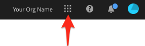
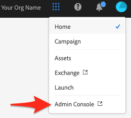
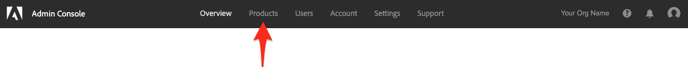
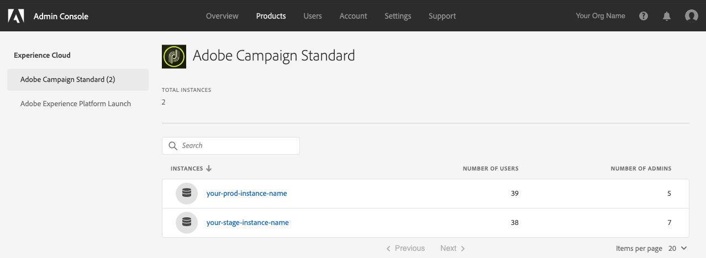
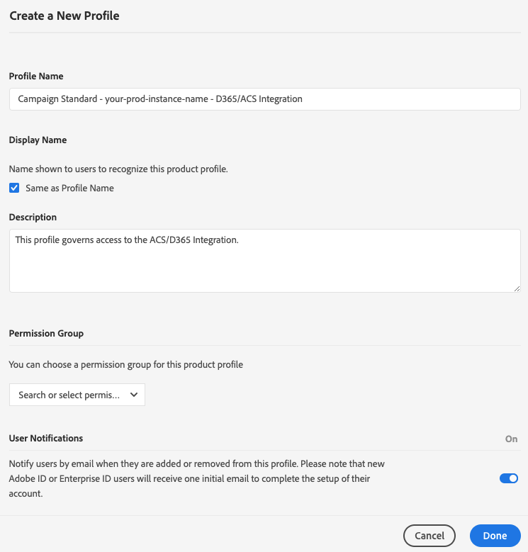
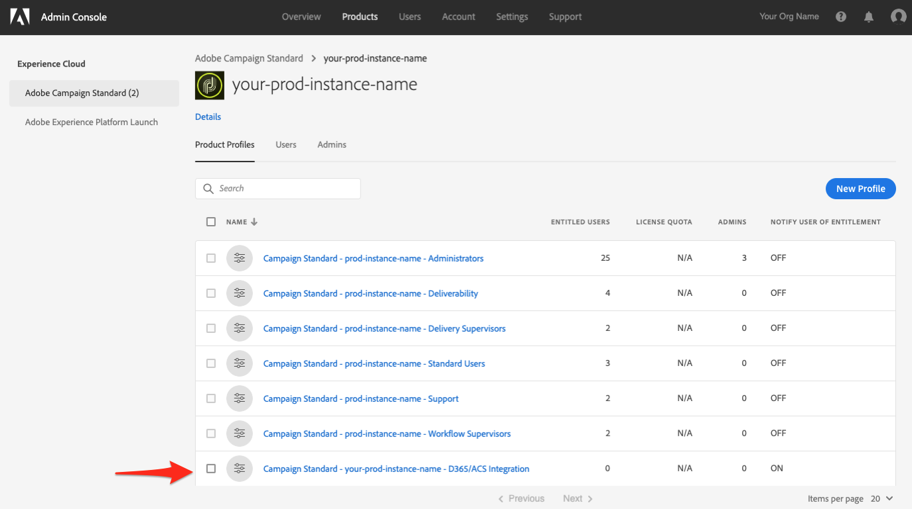
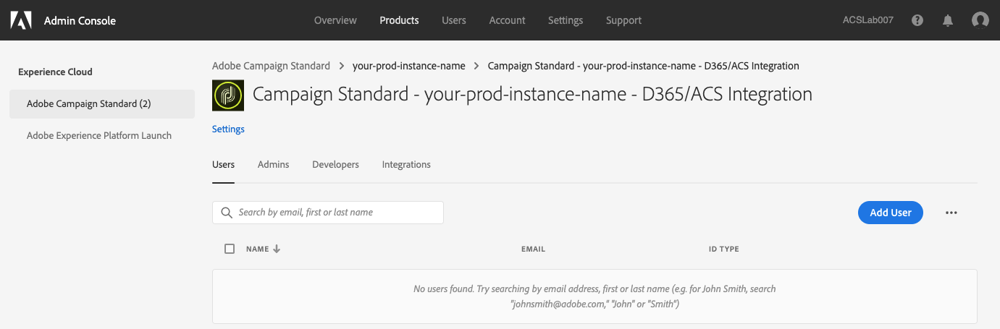
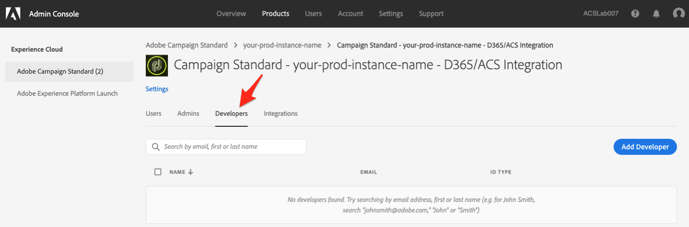

# Getting Access to the Adobe Campaign Standard Integration with Dynamics 365 Self-Service App

This configuration will require you to work with an Experience Cloud (EC) Administrator for you organization.   These are the initial steps required to give you access to the self-service integration application UI.   Once you have access to the UI, then there will be more steps described in this document to allow you to establish connections to your data and configure the flow of data between Campaign and Dynamics 365.

## Initial Enablement

>[!Note]
>
>  You will need to reach out to your Adobe Representative and provide the Adobe Campaign Standard org and instance 
>  names .   An internal ticket will be logged to request that the integration app be enabled for your organization.

## How to get to Adobe Campaign Instances in the Experience Cloud Admin Console {#get-to-instance-page}

The following steps demonstrate how to give Experience Cloud users access to the Adobe Campaign Standard integration with Dynamics 365 self-service app.   Users that have access to your org in the Experience Cloud will not have access to the integration self-service app unless you follow the steps below to grant them access.

    >[!Warning] 
    > 
    > These steps require Admin privilages in the Experience Cloud for your orgnanization.   If you aren't an Admin then you
    > will need to ask an admin in your org to perform these steps.   

1. Browse to https://experience.adobe.com/ and log into the Adobe Experience Cloud
1. Click on the navigation grid in the top-right of your page to expose a navigation menu

   
   
1. Click on the entry "Admin Console" to open a new tab with access to the EC Admin interface
   
   
   * If you don't see an "Admin Console" entry then it means that you do not have Administrator access to the Org. You will need to determine who at your organization has this level of access and have them make these updates.
1. A new tab should have been opened that shows "Admin Console" in the top-left.    Across the top you should see several page name like this
   
   
1. Click on the page named "Products"
   
   
1. The resulting page should look something like this:

   
   * In the page above, "Adobe Campaign Standard" has be selected by clicking on it. If this isn't the default item selected on the left, then click on "Adobe Campaign Standard"
   * The list of products in the left-hand menu can vary from org to org, so don't be concerned it if your list doesn't match what is shown above.   
   * The remaining steps in this section will be performed for each of your ACS instances. Typically, you'll have a stage or dev instance for testing. You'll also have a production (i.e. "prod") instance where do all of your ACS work that is live with your customers.

## Adding a Profile for the Dynamics 365 to Adobe Campaign Integration App {#add-new-profile}  
     
These instructions assume that you're in the "Products" page in the Adobe Experience Cloud Admin Console.   If you don't know how to get to this page, then please review the instructions in the section "How to get to Adobe Campaign Instances in the Experience Cloud Admin Console " above.
     
1. Click on the first instance name that has not yet been configured.

    

   * If this is your first time performing these instructions, then you should click on the top-most instance, as it is assumed that none of your instances have been configured yet.
1. The instance page should look something like this:

   
   * Keep in mind that your page will replace "your-prod-instance-name" with whatever the name of your instance is.
   * We'll be adding a new entry named: 
   
           Campaign Standard - your-prod-instance-name - D365/ACS Integration   
     If you see this entry in the list then you do not need to proceed. Click on "Adobe Campaign Standard" in the left menu and check the remaining ACS instances (repeat the steps starting at step 8).
     
1. Click the "New Profile" button
   * This should open the "Create a New Profile" page.   Steps 10-14 will provide instructions on what values to put     
1. In the "Profile Name" text box, enter "Campaign Standard - your-prod-instance-name - D365/ACS Integration"
   * Make sure to replace "your-prod-instance-name" with the actual name for your instance name.
1. In the "Description" text area, add a description that makes sense to you.   
   * An example description could be: "This profile governs access to the ACS/D365 Integration."        
1. You can leave the "Permission Group" dropdown with the default value.
1. It is strongly recommended that you set "User Notifications" to "On"; however, it is left to your discretion whether or not you want users to be informed when they are added or removed from this profile.
1. If your entries look similar to the following, then click the "Done" button.
   
1. After selecting "Done", you will be taken back to the top-level Adobe Campaign Standard page (see below). You'll want to ensure that you see the newly added D365/ACS Integration profile.
   
   

## Giving Users Access to the Dynamics 365 to Adobe Campaign App {#add-users-to-profile}

These instructions assume that you have opened the "Products" page in the Adobe Experience Cloud Admin Console. If you don't know how to navigate to this page, then please read the instructions provided above.

1. Your page should look similar to the one below.  Click on the Campaign instance to which you want to add a user.

   
   
1. Click on the new profile that you've created (click anywhere on the name 
   "Campaign Standard - your-prod-instance-name - D365/ACS Integration"
   
1. This should open a new page that looks something like this:   
   
1. Click on the "Developers" tab (see below)
   
1. Click on the "Add Developer" button
1. In the text box, type in the name or email address of the user you want to add.  Select the result that matches the user you are attempting to add.
   * If this is the first time the user is getting added to the Org, then there will be some other questions related to the user. Please fill these out
   * Click the "Save" button 
1. Repeat step 5-6 for all the users to whome you want to give access to the self-service integration application UI.
1. When you're done, click on "Adobe Campaign Standard" in the left-hand menu.   This will take you back to the page that lists all of your ACS instances.
1. If you want to add the users to the other Adobe Campaign instances, then repeat steps 1-8.   
   