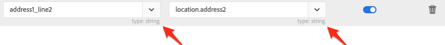

# Synchronize data 

You can synchronize tables from Microsoft Dynamics 365 to Campaign and Campaign marketing metrics to Microsoft Dynamics 365. Synchronization is executed through three dedicated technical workflows: **[!UICONTROL Microsoft Dynamics 365 to Campaign]**, **[!UICONTROL Campaign to Microsoft Dynamics 365]**, **[!UICONTROL Opt-In/Out]**. Refer to this section to [learn more](../../integrating/using/d365-acs-self-service-app-workflows.md).

>[!IMPORTANT]
>You need to stop/start the **[!UICONTROL Microsoft Dynamics 365 to Campaign]** workflow to have your changes taken into account. [Learn more](../../integrating/using/d365-acs-self-service-app-workflows.md)
>

## Map tables from Microsoft Dynamics 365 to Campaign

The **[!UICONTROL Microsoft Dynamics 365 to Campaign]** page shows a list of entities in Microsoft Dynamics 365 and the custom resources in Adobe Campaign they will be synchronized with. You can add new mappings, edit or delete existing mappings. 

Here is a description of each of the columns in this table:

* **[!UICONTROL MICROSOFT DYNAMICS 365 TABLE]**: this column identifies which entity in Microsoft Dynamics 365 will be the source of data for the mapping.

* **[!UICONTROL CAMPAIGN TABLE]**: this column identifies which resource in Adobe Campaign will be the destination of data for the mapping.

* **[!UICONTROL ACTIONS]**: possible actions are listed below: 

  * Click the **[!UICONTROL Edit]** icon to edit this mapping.  
  
  * Use the  **[!UICONTROL Delete]** icon to delete a table mapping.   
  
  * Click the **[!UICONTROL Replay Data]** icon to re-synchronize all the data in the Microsoft Dynamics 365 table. Normally the integration application will only synchronize the data in Microsoft Dynamics 365 that has changed recently.  However, in some cases (e.g., you've made a change or made a mistake) you might want all the data to be re-synchronized.  In these cases, you would click this button and, the next time you stop/start the **[!UICONTROL Microsoft Dynamics 365 to Campaign]** workflow, your data would start to synchronize.
    
    If you click on the **[!UICONTROL Replay Data]** button and the checks are successful, the icon will become disabled: it indicates that the data for this table mapping pair will be re-synchronized with the next execution of the **[!UICONTROL Microsoft Dynamics 365 to Campaign]** workflow.

    You cannot select to replay the data when the following are true:

    * If there are 2,000,000 (or more) items in the Backlog metric associated with the **[!UICONTROL Microsoft Dynamics 365 to Campaign]** workflow (displayed in the **[!UICONTROL Workflows]** page)
    * If there are 2,000,000 or more records in the Microsoft Dynamics 365 Table
  
    The number of records that need to be re-synchronized varies. If you have a large number of records, it can take some time to complete the synchronization process. Refer to the **[!UICONTROL Backlog]** metric in the **[!UICONTROL Workflows]** page as the integration application works to complete the syncing process.
    
    >[!IMPORTANT]
    >
    > It is strongly recommended you stop the integration workflow when publishing changes to either Adobe Campaign Standard or Microsoft Dynamics 365. Applicable changes include: updates to resources/entities (and their associated fields), links, identifier columns, etc. that are currently in use by the integration. 
    >

## Create a new mapping {#add-a-new-mapping}

To create a new mapping, follow the steps below:

1. in the **[!UICONTROL Microsoft Dynamics 365 to Campaign]** page, click the **[!UICONTROL Add New Mapping]** button.
  
1. Use the drop-down lists to select Microsoft Dynamics 365 and Campaign tables to map. 
  Most of the other inputs on the page will be dependent on which tables you choose. 

      
  
    >[!NOTE]
    >You cannot map each table more than once. Therefore, you will notice that the dropdown selections will not include tables that have already been mapped.

1. Click **[!UICONTROL OK]** to confirm: the application will need a brief moment to read in field information associated with the selected tables.

You can then proceed with the mapping configuration. [Learn more](#new-mapping-settings)

>[!IMPORTANT]
>
>You can only choose the tables in this page when you are first adding the mapping. Make sure that you have selected the correct tables before clicking the **[!UICONTROL Save]** button: once saved, the table selection fields will be **read-only**.

### Edit an existing mapping

If you edit an existing mapping then you will see that the table selections are not editable.   

This is by design because the inputs further down in the page are based on the fields associated with these tables. Changing the tables would make all the fields associated with these tables invalid.  If you want to change the table to map to, you will need to return to the previous page, delete the mapping you want to change, and add a new mapping.

### Configure an individual table mapping {#new-mapping-settings}

In this section you will learn how to configure a **single** mapping of one Microsoft Dynamics 365 table to one Adobe Campaign table. 

You can define the following settings: 

* **[!UICONTROL Tables]**: this section lists the name of the Microsoft Dynamics 365 table and the Campaign table to which it will be mapped.   
* **[!UICONTROL Field Mappings]**: learn more in [this section](#field-mappings)
* **[!UICONTROL Field Replacements]**: learn more in [this section](#field-replacements)
* **[!UICONTROL Filters]**: learn more in [this section](#filters)
* **[!UICONTROL Advanced Settings]**: learn more in [this section](#advanced-settings)

### Field Mappings {#field-mappings}

#### Primary Keys

When adding a new Microsoft Dynamics 365 to Campaign table mapping, you need to identify the ID field. 

The Microsoft Dynamics 365 primary key is read-only because the application will detect it. 

For Campaign, you need to select which field will be the unique key. It must be configured as a [CRM ID custom resource](../../developing/using/uc-calling-resource-id-key.md) and must have no duplicates.

>[!NOTE]
>
>You will only be able to choose the ID field on the table when you have selected **[!UICONTROL Add New Mapping]**. If you click the edit button to edit an existing table mapping then the ID field will be read-only.

The primary keys will always be the first field names listed in the **[!UICONTROL Field Mappings]** section. As a reminder, the following icon is listed to the right to remind you that these are the primary keys.

#### Add other field mappings

The **[!UICONTROL Field Mappings]** section allows you to add field mappings other than the Primary Keys. To add a new mapping of a field from Microsoft Dynamics 365 to Adobe Campaign, click the **[!UICONTROL Add new field mapping]** button.

Select Microsoft Dynamics 365 and Campaign fields in the lists:

These lists contain the field names that are associated with the Microsoft Dynamics 365 and Campaign tables you have selected at the top of the page. 

The **[!UICONTROL Apply updates]** switcher allows you to control whether updates to this field will be propagated from Microsoft Dynamics 365 to Campaign:
* If it is switched on , updates to the value(s) in Microsoft Dynamics 365 will be propagated to Adobe Campaign as the updates occur. 

* If you switched off , the value will be propagated when data is initially loaded (or replayed), but incremental updates to the field in Microsoft Dynamics 365 will not be propagated.  

>[!NOTE]
>
>Click on the **[!UICONTROL Apply updates]** column heading to update **all** of the switches to on or off.
>

When you select field values, you will see the data type show up below the drop down menus.   This is something to keep in mind when mapping values from one field to the other.

 

>[!NOTE]
>
> You cannot map multiple Microsoft Dynamics 365 fields to a single Campaign field.

### Field Replacements {#field-replacements}

Use the **[!UICONTROL Add New Field Replacement]** button to define a new field replacement.

Field replacements allow you to identify:

* a Microsoft Dynamics 365 field name (that has been added above in the field mappings section), 
* an existing value (which exists in Microsoft Dynamics 365), and 
* a new value to write to Adobe Campaign

A dropdown list will be provided for picklist, enumeration, and boolean values. A text box will be used for other string and numeric types.

### Filters {#filters}

Use the **[!UICONTROL Add New Filter]** button to select which Microsoft Dynamics 365 records will be propagated to Campaign. You can choose any field associated with a record to add to filters (the field name does not need to be added to the field mappings).

You specify a filter by filling out the following information:

* Microsoft Dynamics 365 field name
* a comparison value, and
* a value (from Microsoft Dynamics 365)
If the field name, comparison, and value evaluates to true for a given record, then the record will be propagated to Adobe Campaign.

You can choose how these filters are evaluated by setting the input labeled **[!UICONTROL Choose the filter comparison operator]**.  If you choose **And**, all of the filters must be true for a record to get propagated to Campaign. If you choose **Or**, the record will get propagated if any of them evaluate to true.

The option **[!UICONTROL Do you want to delete records in Adobe Campaign Standard that will be filtered out from Microsoft Dynamics 365?]** controls whether you want records that have filtered out to be deleted from Campaign. If you select **No** then the records will remain in Adobe Campaign. Select **Yes** to have them deleted by the integration logic.

>[!NOTE]
>
> If no filters are added, all records that have been modified will be propagated to Adobe Campaign.
>

### Advanced Settings {#advanced-settings}

You can set up the following additional options when configuring a mapping:

* Set the **[!UICONTROL Apply deletes in Microsoft Dynamics 365 to Campaign?]** option to **Yes**, if you want to propagate deletions that occur in Microsoft Dynamics 365 to the corresponding field in Adobe Campaign (based on the field name mapping). Select **No** to ignore deletions in Microsoft Dynamics 365.

* Set the **[!UICONTROL Use technical values in Microsoft Dynamics 365 picklists?]** option to **No** if you want to propagate to Campaign the display value associated with a Microsoft Dynamics 365 picklist. Select **Yes** to propagate the technical value.

## Synchronize Campaign marketing events to Microsoft Dynamics 365

The **[!UICONTROL Campaign to Microsoft Dynamics 365]** page allows you to identify which email marketing events will be mapped from Adobe Campaign to Microsoft Dynamics 365. 

The four metrics that you are able to control are: **Sends**, **Clicks**, **Opens**, and **Bounces**. 

 

Select **Yes** to confirm that you do want events of that type to flow to Microsoft Dynamics 365. 

Click [here](../../integrating/using/d365-acs-self-service-app-workflows.md) for more information on these email event flows.

## Opt in/out workflow {#opt-in-out-wf}

The **Opt-In/Out** workflow allows you to identify the flow of the opt in/out information between Microsoft Dynamics 365 and Adobe Campaign. This assumes that the data is associated with the Microsoft Dynamics 365 entity "contact" and the Adobe Campaign resource "profile". 

Learn more about Opt-out management in [this section](../../integrating/using/d365-acs-notices-and-recommendations.md#opt-out).

Remember that you need to click "Save" to save your selections. Also remember that you must stop the **Campaign to Microsoft Dynamics 365** workflow and then click play for the integration to incorporate your changes.

### Opt in/out synchronization direction

Below is the list of available options for synchronizing data:

* **[!UICONTROL Disabled]**: when this option is selected, no opt in/out information will move between Adobe Campaign and Microsoft Dynamics 365.

* **[!UICONTROL Unidirectional (Microsoft Dynamics 365 to Campaign)]**: this option is used to flow opt-in/out from Microsoft Dynamics 365 to Adobe Campaign only. The integration application will not let you configure the flow in this screen; instead, click the **[!UICONTROL Save button]**, and navigate to the **[!UICONTROL Microsoft Dynamics 365 to Campaign]** workflow. In this workflow, you can edit the contacts/profile table mapping to identify how you want your opt-in/out fields to map.

* **[!UICONTROL Unidirectional (Campaign to Microsoft Dynamics 365)]**: this option will make visible the **Mappings** section. These inputs will allow you define which Adobe Campaign fields will map data to what fields in Microsoft Dynamics 365. This means that if you happen to manually update a value in Microsoft Dynamics 365 then its value would be overwritten by the Adobe Campaign value if it happens to change.

* **[!UICONTROL Bidirectional]**: this option will make visible the **Mappings** section. These pairs will identify which fields in Microsoft Dynamics 365 and Adobe Campaign will map to each other. [Learn more](../../integrating/using/d365-acs-notices-and-recommendations.md).

### Mappings

This section only applies when the Opt-in/out synchronization direction field is set to **[!UICONTROL Unidirectional (Campaign to Microsoft Dynamics 365)]** or **[!UICONTROL Bidirectional]**. You can define which fields in Microsoft Dynamics 365 map to what inputs in Adobe Campaign.

The Microsoft Dynamics 365 field names include all of those that are of type **boolean**.

The Adobe Campaign field names are a fixed set of values specific to opt-in/out. The Adobe Campaign field names are a fixed set of values specific to opt-in/out. **The set of values in this list cannot be changed**.
