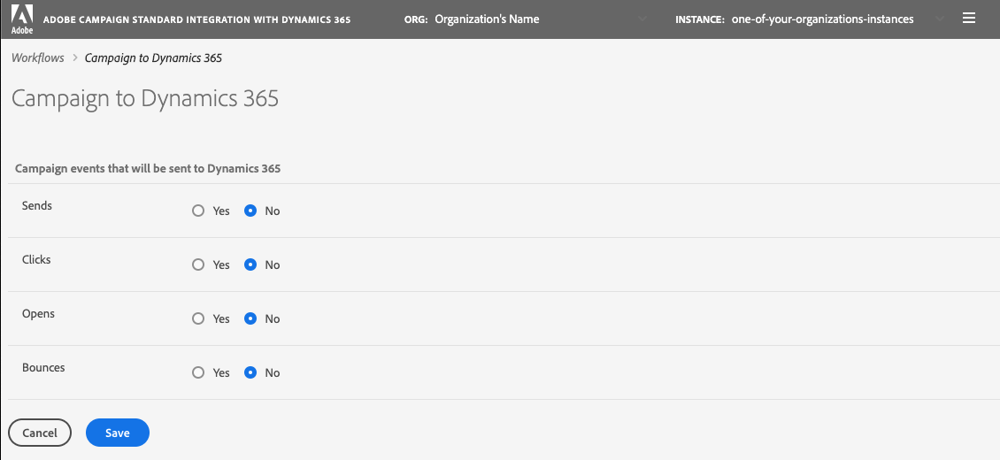

# Egress Workflow

This page allows you to identify which email marketing events will be mapped from Adobe Campaign to Microsoft Dynamics 365.  By selecting "Yes", you confirm that you do want events of that type to flow to Dynamics 365.   Conversely, "No" means that events of that type will not be communicated to Dynamics 365.   

The four actions that you are able to control are:  Sends, Clicks, Opens, and Bounces.  Click  [here](using-the-campaign-standard-and-microsoft-dynamics-365-integration#email-marketing-event-flow) for more information on these email event flows.

 

Remember that you need to click "Save" to save your selections.   Also remember that you must stop the "Campaign to Dynamics 365"  workflow and then click play for the integration to incorporate your changes.
  