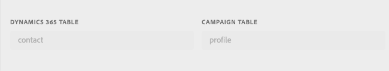
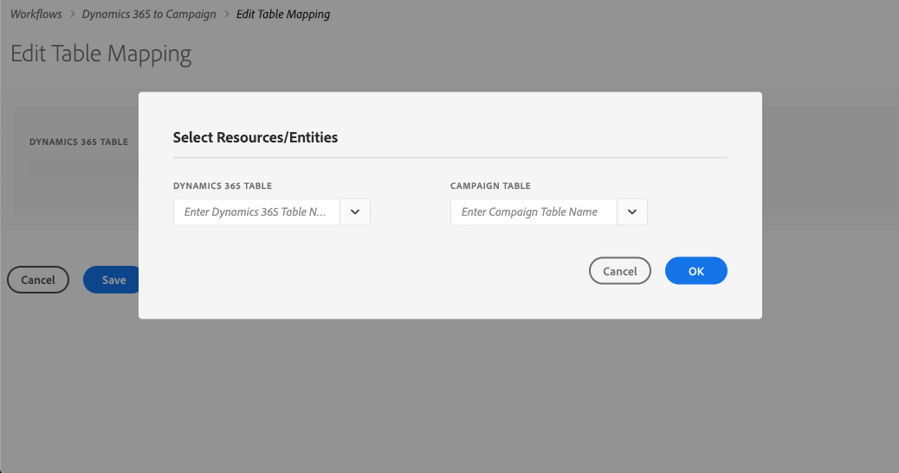
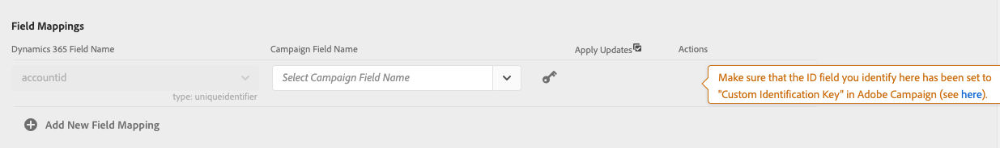
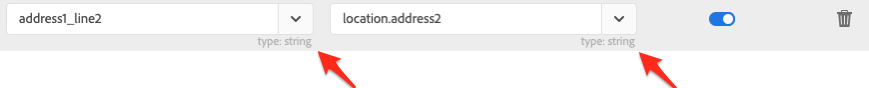

# Editing Table Mapping

The "Dynamics 365 to Campaign" workflow (a.k.a Ingress) is a list of mappings of Dynamics 365 tales to Campaign tables. This page will explain how to configure a **single**  mapping of one Dynamics 365 table to one Campaign table.   If you want to better understand the page that lists **all** of the table mappings that have been configured, click [here](../../integrating/using/d365-acs-self-service-app-ingress-list.md) to get more information about this other page.

The "Edit Table Mapping" page is split into five sections:
* [Tables](#tables)
* [Field Mappings](#mappings)
* [Field Replacements](#field-replacements)
* [Filters](#filters)
* [Advanced Settings](#advanced-settings)

Remember that you must click "Save" to save your updates.    Also remember that after you've saved your updates that you must return to the "Workflows" page and stop/start the "Dynamics 365 to Campaign" workflow for the changes to be  incorporated into the integration logic.

## Tables {#tables}

This section lists the name of the Dynamics 365 table and the Campaign table to which it will be mapped.   

### Editing Existing Mapping

If you edit an existing mapping then you will see that the table selections are not editable (see below).   

This is by design because the inputs further down in the page are based on the fields associated with these tables.   Changing the tables would make all the fields associated with these tables invalid.    If you want to change the table to map to, you will need to return to the previous page, delete the mapping you want to change, and add a new mapping.

### Adding a New Mapping

If you chose "Add a new Mapping" on the "Dynamics 365 to Campaign" screen you will be shown a screen that will  allow you choose which tables you want to map.    Click [here](../../integrating/using/d365-acs-self-service-app-ingress-list.md) to see more information about the "Dynamics 365 to Campaign" screen and how you can add a new mapping.

The first thing you should see when adding a new mapping is something similar to the following:

This modal window will require you to choose the Dynamics 365 and Campaign tables before you can proceed.   The reason why you have to pick a table is due to the fact that most of the other inputs on the page will be dependent on which tables you choose.   If you click the "Cancel" button in the modal then you will be returned to the previous page  because you cannot proceed without making a selection.  

Once you have chosen a Dynamics 365 and Campaign tables,  click the "OK" button to proceed.  The application will need a brief moment to read in field information associated with the tables you've selected.

    >[!NOTE]
    >
    > IMPORTANT: You can only choose the tables in this page when you're first adding the mapping.   Once you click 
    > the "Save" button, the table selection fields will be read-only.  You will not have the option to edit them.   
    > Therefore, make sure that you have selected the correct tables before you click the "Save" button.   

    >[!NOTE]
    >
    > The integration will only allow you to map FROM a Dynamics 365 table once, and you can only map TO a Campaign 
    > table once.    Therefore, you will notice that the dropdown selections will not include tables that you've already
    > mapped.

## Field Mappings {#mappings}

### Primary Keys

If you're adding a new Dynamics 365 to Campaign table mapping, then you will be asked to identify the ID field (similar to below).    The Dynamics 365 field is read only because the integration will recognize which field is the primary key.  You will have an opportunity to select which field will serve as the unique key in Campaign.   It is important that you choose a field that cannot have any duplicates and that field is configured properly in Campaign.    A link to the page [Configuring the resource's data structure](../../using/developing/adding-or-extending-a-resource/configuring-the-resource-s-data-structure.html?lang=en#developing) is provided to give you more information on how to configure this field in Campaign.

    >[!NOTE]
    >
    > You will only be able to choose the ID field on the table when you've selected "Add a New Mapping" in the 
    > "Dynanics 365 to Campaign" page.    If you click the edit button to edit an existing table mapping then the ID
    > field will be read only.

The primary keys will always be the first field names listed in the "Field Mappings" section.   As a reminder, the following icon is listed to the right to remind you that these are the primary keys.

### Add New Field Mapping

The Field Mappings sections allows you to add other field mappings other than the Primary Keys addressed in the section directly above this one.    To add a new mapping of a field from Dynamics 365 to Adobe Campaign, click the "Add New Field Mapping" button (shown below).

Once you click this, then a new set of inputs will be added that look like this:

The Dynamics 365 inputs will contain a list of field names that are associated with the Dynamics 365 table you have 
selected at the top of the page.   Similarly, the Campaign input will contain a list of field names associated with the
Campaign table selected above.   

The switch in the "Apply Updates" column allows you to control whether updates to this field will be propagated from Dynamics 365 to Campaign.   If it is switched on (), updates to the value(s) in Dynamics 365 will be propagated to Adobe Campaign as the updates occur.   If you deselect the button (), the value will be propagated when data is initially loaded (or replayed), but incremental updates to the field in Dynamics 365 will not be propagated.  If you click on the "Apply Updates" column heading (), it will show you a dialog that will give you the ability to update **all** of the switches to on or off.
    
The button  allows you to delete a single field mapping.

When you select field values, you will see the data type show up below the drop down menus (see below).   This is 
something to keep in mind when mapping values from one field to the other.

    

    >[!NOTE]
    > You cannot map multiple Dynamics 365 fields to a single Campaign field.

## Field Replacements {#field-replacements}

Field replacements allow you to identify 
* a Dynamics 365 field name (that has been added above in the field mappings section), 
* an existing value (that exists in Dynamics 365), and 
* new value that you want written to Adobe Campaign

A dropdown list will be provided for picklist, enumeration, and boolean values.   A text box will be used for other string and numeric types.

You can add a new field replacement by clicking on this button:  

You can then delete a single replacement by clicking on this button: 

## Filters {#filters}

You can add filters that will determine which Dynamics 365 records will be propagated to Campaign.  You can choose any field associated with a record to add to filters (the field name does not need to be added to the field mappings).

You can add a new filter by clicking on this button:  .

You can then delete a single filter by clicking on this button: 

You specify a filter by filling out the following information:
* Dynamics 365 field name
* a comparison value, and
* a value (from Dynamics 365)
If the field name, comparison, and value evaluates to true for a given record, then the record will be propagated to Adobe Campaign.   

You can choose how these filters are evaluated by setting the input labeled "Choose the filter comparison operator".  If you choose "And", all of the filters must be true for a record to get propagated to Campaign.   If you choose "Or", the record will get propagated if any of them evaluate to true.

The input "Do you want to delete records in ACS that will be filtered out from Dynamics 365?" controls whether you want records that have filtered out to be deleted from Campaign.   If you select "No" then the records will remain in Adobe Campaign.   However, if you click "yes", then they will be deleted by the integration logic.

    >[!NOTE]
    >
    > If no filters are added, all records that have been modified will be propagated to Adobe Campaign. 

## Advanced Settings {#advanced-settings}

If the "Apply deletes in Dynamics 365 to Campaign?" input is "Yes" then deletions that occur in Dynamics 365 will cause  the integration logic to delete the corresponding field in Adobe Campaign to get deleted (based on the field name mapping).   If you, however, select "No" then deletions in Dynamics 365 will be ignored.

Setting the "Use technical values in Dynamics 365 picklists?" input to "No" then display value associated with a  Dynamics 365 picklist will be propagated to Campaign.   If "Yes" is selected, the technical value associated with the picklist will be propagated to Campaign.

