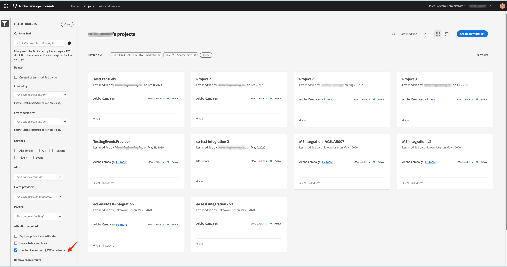
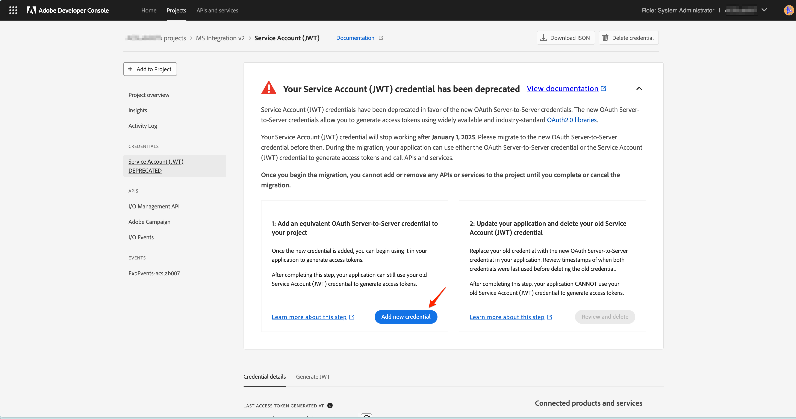
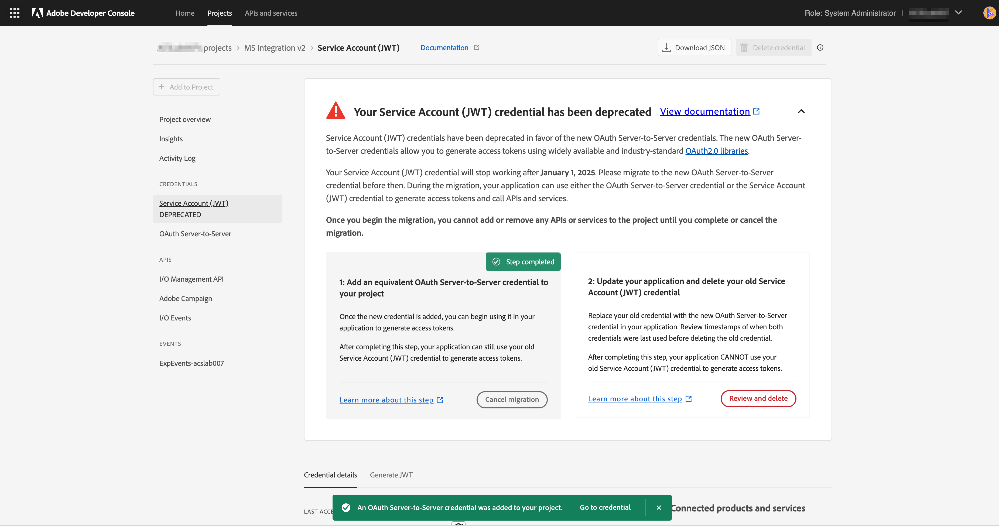
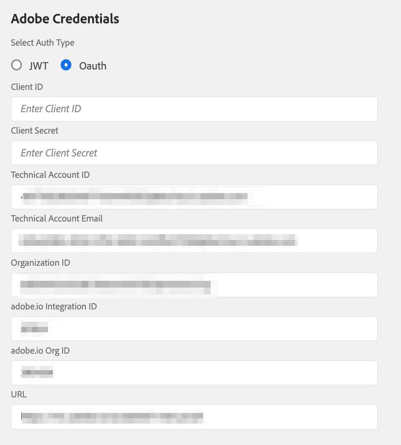
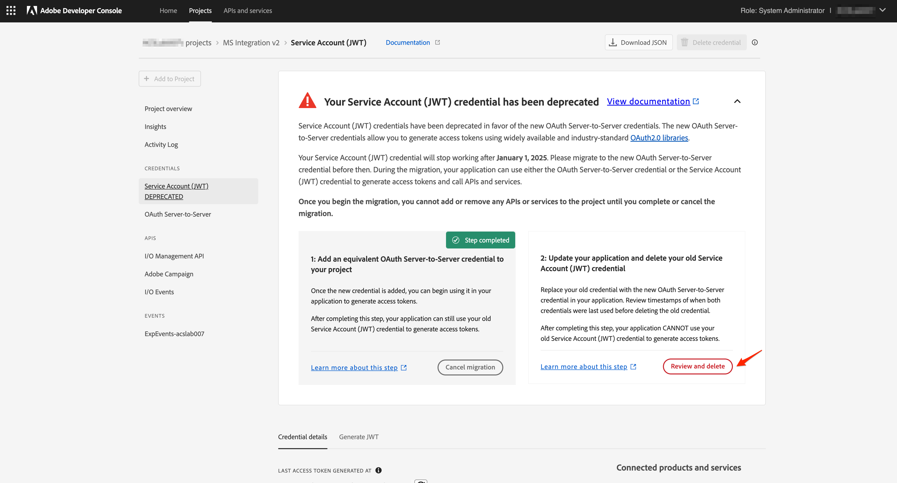
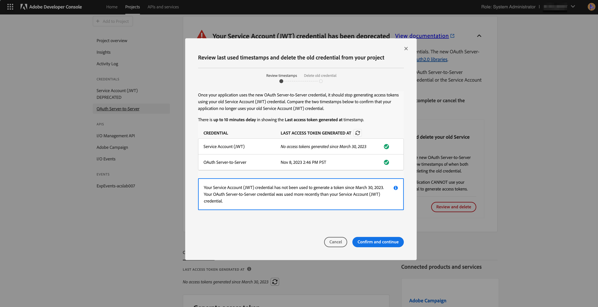
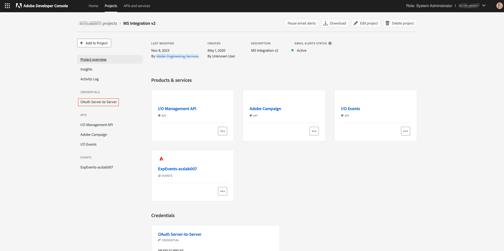

# Migrate Credentials from JWT to OAuth Server-to-Server

The Service Account (JWT) credential has been deprecated in favor of the new OAuth Server-to-Server credential. The new credential makes it easier for you to maintain Adobe applications. It also removes the need to rotate certificates periodically and works out-of-the-box using standard OAuth2 libraries. 

While the Service Account (JWT) credentials have been marked as deprecated, they will continue to work until Jan 1, 2025. Therefore you must migrate your  integration to use the new OAuth Server-to-Server credential before Jan 1, 2025. Please check [deprecation timelines](https://developer.adobe.com/developer-console/docs/guides/authentication/ServerToServerAuthentication/migration/#deperecation-timelines) for more information 

## Steps to Migrate Credentials from JWT to OAuth Server-to-Server

The migration to the OAuth Server-to-Server credential is a simple process that enables a zero downtime migration for your application. You can follow the steps below to you migrate the credentials.

1. Log in to the [Adobe Developer Console](https://developer.adobe.com/console)
2. From the filtering menu on the left side, select the option Has Service Account (JWT) credential. This way displays all the projects that have a Service Account (JWT) credential. From the list of projects, click on the project that you intend to migrate. 

    

3. Open the Service Account (JWT) credential tab from the left side navigation and view the migration card. On the migration card, click the button **Add new credential** to add equivalent OAuth Server-to-Server credential. Adding an OAuth Server-to-Server credential to your project will start the migration. 
   
4. The new credential **OAuth Server-to-Server** will be added to the left side navigation.
   * Click Cancel Migration if you want to cancel the migration.
   * Do not click the Review and Delete button until verifying if the new credential OAuth Server-to-Server is working. 
      
   
5. Update the credentials in Microsoft Dynamics 365 to Adobe Campaign Standard app
   * Log in to the integration app and navigate to the Settings page.
   * Select OAuth as the authentication type.
   * Since the new OAuth Server-to-Server credential uses the same credentials as the old Service Account (JWT) credential, most of the fields will already be filled in.
   * Enter the client ID and client secret. These can be found in the project in Adobe Developer Console.
   * Click Save to save the settings.
      

6. Verify if the new credentials are working 
   * Log in to the integration app and navigate to the Workflows page.
   * Stop the active workflows. Wait until the workflows are stopped.
   * Start the workflows. Wait until the workflows are in RUNNING state.
   * Monitor the workflows for a few minutes to ensure that the workflows are working correctly. You can also check the data in Adobe Campaign Standard and Microsoft Dynamics 365 to ensure that the data is being synced correctly.

7. Delete the JWT Credential to complete the migration
   * Log in to the [Adobe Developer Console](https://developer.adobe.com/console)
   * Click on the projects and select the project that you migrated.
   * Click on the Service Account (JWT) credential tab from the left side navigation.
   * Click on Review and Delete button.
    
   * Review the timestamp of the last access or last used menu to verify if integration app is generating access tokens using the new OAuth credential or still using the old JWT credential. 
    
   * Once it is verified that the integration app is using the new OAuth credential and not using JWT credential any more, proceed to deleting the old credential by clicking on the **Confirm and continue** button thus completing the migration.
    
