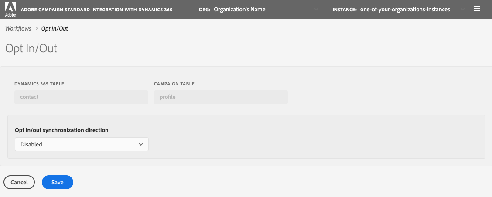

# Opt in/out Workflow

This workflow allows you to identify the flow of the opt in/out information between Dynamics 365 and Adobe Campaign. This assumes that the data is associated with the Microsoft Dynamics 365 entity "contact" and the Adobe Campaign resource "profile". Make sure you understand the concepts in the [Opt-out](../../integrating/using/using-the-campaign-standard-and-microsoft-dynamics-365-integration#opt-out-flow) section of this page before  you attempt to configure Opt in/out in the self-service app.

Remember that you need to click "Save" to save your selections. Also remember that you must stop the "Campaign to Dynamics 365" workflow and then click play for the integration to incorporate your changes.

## Opt in/out synchronization direction

* *Disabled*: When this is selected, no opt in/out information will move between Adobe Campaign and Dynamics 365.

* *Unidirectional (Dynamics 365 to Campaign)*: This selection is used when you want Opt in/out data to flow from Dynamics 365 to Adobe Campaign only. The integration application will not let you configure the flow in this screen; instead, click the "Save" button, and navigate to the  "Dynamics 365 to Adobe Campaign" workflow. In this workflow, you can edit the contacts/profile table mapping to identify how you want your Opt in/out fields to map.

* *Unidirectional (Campaign to Dynamics 365)*: This selection will make visible the "Mappings" section.   These inputs will allow you define which Adobe Campaign fields will map data to what fields in Dynamics 365.   This means that if you happen to manually update a value in Dynamics 365 then its value would be overwritten by the Adobe Campaign value if it happens to change.

* *Bidirectional*:  This selection will make visible a section named "Mappings".   These pairs will identify which fields in Dynamics 365 and Adobe Campaign will map to each other. Visit the page  [Manage data between Campaign and Dynamics 365](../../integrating/using/d365-acs-notices-and-recommendations.md) for more information about how Bidirectional Opt in/out works.

## Mappings

This section only applies when the "Opt in/out synchronization direction" input has the selection "Unidirectional  (Campaign to Dynamics 365)" or "Bidirectional".   You can define which fields in Dynamics 365 map to what inputs in Adobe Campaign.

The Microsoft Dynamics 365 field names include all of those that are of type "boolean".

The Adobe Campaign field names are a fixed set of values specific to Opt in/out. Note: the set of values in this list cannot be changed.
