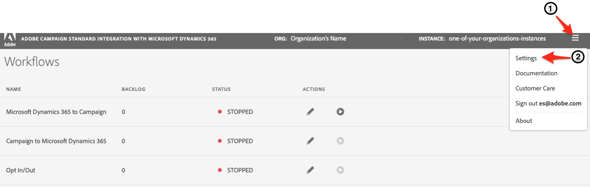

# Quick Start Guide

This will be a quick start guide to get to the integration application UI, configure the credentials, and start the first workflow.

## Pre-requisites

* make sure that Dynamics 365 has been configured (click [here](integrating/using/d365-acs-configure-d365.md) to configure)

* make sure that adobe.io has been configured (click [here](integrating/using/d365-acs-configure-adobe-io.md) to configure)

* make sure your user has been given access to the integration application UI in the Experience Cloud (click [here](integrating/using/d365-acs-self-service-app-control-access.md) for instructions configure)

* make sure you understand the [Concepts and Restrictions](integrating/using/d365-acs-self-service-app-overview.md#concepts-and-restrictions) associated with the integrations app 

## How to access the integration application UI

Open a browser and browse to the connector associated with your region:

* [Asia Pacific](http://d365-acs-ap.ea.adobe.com/)
* [Europe, Middle East, or Africa (EMEA)](http://d365-acs-em.ea.adobe.com/)
* [Americas](http://d365-acs-na.ea.adobe.com/)

>[!NOTE]
>
> We suggest that you bookmark this link for future use.

## Privacy Request Acknowledgement

When browsing to the self-service UI for the first time, you will be presented with the privacy acknowledgement below.   You will need to acknowledge that you understand your role in performing privacy requests in Campaign and Microsoft Dynamics 365 separately before you can continue.

* This integration is designed to transfer end user data (including, but not limited to, personal information, if it is contained in your end user data), between Microsoft Dynamics 365 and AdobeCampaign Standard. As a data controller, your company is responsible for complying with any privacy laws and regulations applicable to your collection and use of personal data.

* The integration does not issue any data subject privacy (e.g., GDPR) deletes or handle any other privacy requests (with the exception of opt-out). When processing privacy requests, you should do so in both Microsfot Dynamics 365 and Campaign (via the Adobe Experience Platform Privacy Service), independently.

* Please review and bookmark the integration&apos;s public documentation section on privacy to learn more about [managing privacy requests](https://docs.adobe.com/content/help/en/campaign-standard/using/integrating-with-adobe-cloud/campaign-and-microsoft-dynamics-365/notices-and-recommendations-for-acs-and-ms-dynamics.html#privacy) and other important privacy topics related to the integration.

* In addition, below are links to help guide you in implementing access and/or delete privacy related requests in each system (please bookmark for later use):

  * [Microsoft Dynamics 365](https://docs.microsoft.com/en-us/dynamics365/get-started/gdpr/)

  * [Adobe Campaign Standard](https://www.adobe.io/apis/experiencecloud/gdpr/docs.html)

## Setting up your credentials

When you browse to the UI for the first time, then you should see a page with a header that looks like this:    

>[!NOTE]
>
> It's normal to get alerts that mention that it's "unable to connect" to Adobe Campaign Standard or Dynamics 365 if the app settings have not yet been configured.

Please verify that the "ORG" and "INSTANCE" selections are the ones you plan to configure.  If not, then click on bring up a dropdown list and select the correct org and instance.   

>[!WARNING]
>
> If you are configuring the connector for the first time and/or you are new to this process, then we **strongly** urge you to select the "stage" or "dev" instance. You'll want to make sure to verify that your configuration works well before attempting the setup in production.

If you have the correct org and instance, then click on the "hamburger" menu to expose a drop down menu. Then click "Settings..." in the drop down menu to visit the page where you enter your credentials for Dynamics 365 and Campaign (see below).

In the Settings page, fill out the following sections: 

* Microsoft Dynamics 365 Credentials
* Adobe Credentials
  
Go [here](d365-acs-self-service-app-settings.md) to find more detailed information about where to find the information  for each input.   When you are done, click the "Save" button at the bottom.   It is recommended that you save incrementally s you track down and enter all of the credential information.  This will prevent loss of data if you have internet connectivity issues.

## Verifying Your ingress configuration

Assuming that you have completed the pre-requisites above and have correctly add all your credentials, let's now navigate to the "Workflows" page.   This is the default page shown when you first enter the Integration app.  If you following the steps above, then this is the page you should have returned to when you clicked "Save" on the credentials. page.

In the Workflows page, click the pencil icon associated with the "Dynamics 365 to Campaign" workflow to edit its configuration.

You should now see the "Dynamics 365 to Campaign" page (shown below).   This will show the list of the table mappings that you have configured.   It will default you to a contact/profile mapping out-of-the-box.   All other custom entities will need to be configured separately.   For now, we will just focus on the contact/profile mapping.

In the "Edit Table Mapping" page, check the Mappings section to ensure that fields from Dynamics 365 are being mapped to the correct field in Campaign.   If you need to add any other mappings, do so now, as well as any replacements or filters.    Please view the detailed documentation [here](integrating/using/d365-acs-self-service-app-ingress-individual-mapping.md) for more information on how to configure this page.

When you are done, click the "Save" button.    As mentioned before, you are encouraged to save often as you modify your configuration.

After returning to the "Dynamics 365 to Campaign" page, you'll need to decide if you want to add more mappings to this list or if you're satisfied with running the connector with just the contact/profile mapping configured.   If you want to learn more about adding new mappings, then click [here](integrating/using/d365-acs-self-service-app-ingress-list.md) for more information.   If you are satisfied with just the contact/profile mapping then click the "Return" button to return to the "Workflows" page.

If you feel that your configuration is correct then you could now click the "Play" button next to the "Dynamics 365 to Campaign" workflow in order to start the integration and the flow of data.  Again, we **strongly** recommend that you first run this in your Stage or Dev environments before running in Production.   Please check that the stage/dev intance is selected in the header.

When you click the "play" button (see below), the process that starts the connector will be initiated (note: this can take a few minutes).

Once running, you should be able to test by adding or modifying entries in Dynamics 365 and observing those changes in Adobe Campaign within a few minutes.   If at any time you need to stop this process, then simply press the same button to stop it (it's a toggle button that allows you to switch from start to stop).

If at any time you need to stop this data flow, then simply press the play/stop button to stop it (it's a toggle button that allows you to switch from start to stop).

This was just a quick start guide to get you up-and-running as quick as possible.   You are now encouraged to visit the  other documentation pages related to the  integration to gain a full understanding of how it works and how to configure it in the integration application UI. 

 