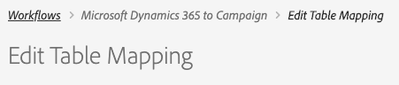

# Get started with the self-service integration app {#gs-self-service-app}

The Adobe Campaign Standard integration with Microsoft Dynamics 365 self-service integration application gives you the ability to configure data flows, control whether or not they are running, and in which environment. You must, however, complete some prerequisites before you begin using the self-service integration application.

## Concepts and restrictions {#concepts-and-restrictions}

Before starting with the integration tool, you need to understand the concepts and guardrails associated with the integration and take some initial steps to gain access. 

Learn more in these sections:

* [Get Started with Microsoft Dynamics 365 integration](../../integrating/using/d365-acs-get-started.md)
* [Integration best practices and limitations](../../integrating/using/d365-acs-notices-and-recommendations.md)
* [Learn key steps to implement this integration](../../integrating/using/d365-acs-get-started.md#request-and-implement-this-integration)
* [Use the Microsoft Dynamics 365 integration](../../integrating/using/d365-acs-using-the-integration.md)

## Prerequisites {#self-service-app-prerequisites}

You need to configure Microsoft Dynamics 365 and Adobe Campaign Standard so that the integration app has access to your data. This will take some time to configure in Dynamics 365, Adobe Campaign Standard, and Adobe I/O; however, once they are configured, you'll be able to control the integration through the self-service integration application's user interface. 

Learn more in these sections:

* [Configure Microsoft Dynamics 365 for Campaign integration](../../integrating/using/d365-acs-configure-d365.md)
* [Configure Adobe I/O](../../integrating/using/d365-acs-configure-adobe-io.md)
* [Map Campaign custom resources and Microsoft Dynamics 365 custom entities](../../integrating/using/d365-acs-notices-and-recommendations.md)

## Key steps to configure the self-service integration app {#self-service-app-configuration-steps}

You can then start with the integration tool. Follow the steps blow:

1. [Get access to the integration app](../../integrating/using/d365-acs-self-service-app-control-access.md)
1. [Configure the integration app for your usage](../../integrating/using/d365-acs-self-service-app-settings.md)
1. [Implement data synchronization](../../integrating/using/d365-acs-self-service-app-data-sync.md)
1. [Configure synchronization workflows](../../integrating/using/d365-acs-self-service-app-workflows.md)

## Link to the integration app {#self-service-app-link}

Open a browser and browse to the connector associated with your region:

* [Asia Pacific](http://d365-acs-ap.ea.adobe.com/)
* [Europe, Middle East, or Africa (EMEA)](http://d365-acs-em.ea.adobe.com/)
* [Americas](http://d365-acs-na.ea.adobe.com/)

## Privacy request acknowledgement {#self-service-app-acknowledgement}

When browsing to the self-service UI for the first time, you will be presented with the privacy acknowledgement. You need to acknowledge that you understand your role in performing privacy requests in Campaign and Microsoft Dynamics 365 separately before you can continue.
Learn more about your privacy responsibilities and about how to manage privacy requests in [this section](../../integrating/using/d365-acs-notices-and-recommendations.md#acs-msdyn-manage-privacy).

## Setting up your credentials {#self-service-app-credentials}

When you browse to the UI for the first time, then you should see a page with a header that looks like this:    

>[!NOTE]
>
> It's normal to get alerts that mention that it's "unable to connect" to Adobe Campaign Standard or Microsoft Dynamics 365 if the app settings have not yet been configured.

Please verify that the "ORG" and "INSTANCE" selections are the ones you plan to configure.  If not, then click on the dropdown list and select the correct org and instance.   

>[!IMPORTANT]
>
> If you are configuring the connector for the first time and/or you are new to this process, then we **strongly** urge you to select the "stage" or "dev" instance. You'll want to make sure to verify that your configuration works well before attempting the setup in production.

If you have the correct org and instance, then click on the "hamburger" menu to expose a drop down menu. Then click **[!UICONTROL Settings...]** in the drop down menu to visit the page where you enter your credentials for Microsoft Dynamics 365 and Campaign (see below).

In the **[!UICONTROL Settings]** page, fill out the following sections: 

* Microsoft Dynamics 365 Credentials
* Adobe Credentials
  
Go [here](../../integrating/using/d365-acs-self-service-app-settings.md) to find more detailed information about where to find the information  for each input. When you are done, click the **[!UICONTROL Save]** button at the bottom.

## Check the initial configuration {#self-service-app-initial-config}

Assuming that you have completed the pre-requisites above and have correctly add all your credentials, let's now navigate to the **[!UICONTROL Workflows]** page. Learn more about the integration app workflows in [this page](../../integrating/using/d365-acs-self-service-app-workflows.md).

In the  **[!UICONTROL Workflows]** page, click the pencil icon associated with the **[!UICONTROL Microsoft Dynamics 365 to Campaign]** workflow to edit its configuration.

In the **[!UICONTROL Microsoft Dynamics 365 to Campaign]** page, you can access the list of the table mappings that you have configured.  It will default you to a contact/profile mapping out-of-the-box. All other custom entities will need to be configured separately. 

In the **[!UICONTROL Edit Table Mapping]** page, check the **[!UICONTROL Mappings]** section to ensure that fields from Microsoft Dynamics 365 are being mapped to the correct field in Campaign. If you need to add any other mappings, do so now, as well as any replacements or filters. [Learn more](../../integrating/using/d365-acs-self-service-app-data-sync.md).

If you want to add new mappings, refer to [this section](../../integrating/using/d365-acs-self-service-app-data-sync.md#add-a-new-mapping) for more information.

Once your configuration is correct, click the **[!UICONTROL Play]** button next to the **[!UICONTROL Microsoft Dynamics 365 to Campaign]** workflow in order to start the integration and the flow of data.  

>[!IMPORTANT]
>
>We **strongly** recommend that you first run this in your Stage or Dev environments before running in Production. Please check that the stage/dev instance is selected in the header.
>

Once running, you should be able to test by adding or modifying entries in Microsoft Dynamics 365 and observing those changes in Adobe Campaign within a few minutes. If at any time you need to stop this process, then simply press the same button to stop it. [Learn more](../../integrating/using/d365-acs-self-service-app-workflows.md#workflow-status)

 
## Integration app workspace {#self-service-app-workspace}

### App header {#app-header}

The header within the self-service app allows you define which org and instance you are currently viewing and/or configuring.

Select the **ORG** and the **INSTANCE** you want to view/edit. These fields appear read-only, however, they become editable when you put your mouse cursor over it.

A dropdown menu will be displayed when you click the button with the three horizontal lines  on the right hand side of the header.

The entries in the drop-down menu are:

* **Settings**: Selecting this option will send you to a screen that allows you to specify API credentials for Microsoft Dynamics 365 and Adobe Campaign, as well as other general settings for the application.

* **Documentation**: This option is a link to the Adobe Campaign Documentation specific to this integration

* **Customer Care**: This is a link to Experience Cloud documentation related to opening a Customer Care ticket 

* **Sign out**: This will sign you out of the application and allow you to sign back in as another user.  

* **About**: This displays a dialog that contains information about the application, including copyright information.

### Breadcrumbs {#app-breadcrumbs}

Breadcrumbs appear at the top of some screens as you navigate the app.

**Example:**

Below is an example from the **[!UICONTROL Edit Table Mapping]** screen that is showing the breadcrumbs and the page title. In this case, you can click on the **[!UICONTROL Workflows]** or **[!UICONTROL Microsoft Dynamics 365 to Campaign]** text to go to one of the previous screens. **[!UICONTROL Edit Table Mapping]** in the breadcrumbs is not clickable in this case because it is the current screen.

### Common buttons {#app-buttons}

The following icons are used in multiple pages in the self-service app.

 - Add a new item to a list.

 - Edit something that already exists

 - Delete an item from a list of items
