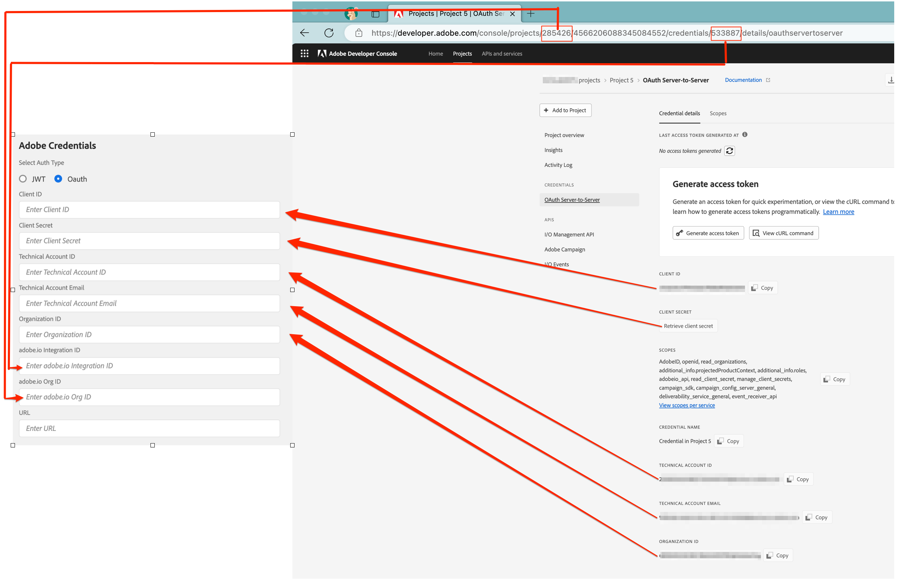

# Connect systems with the integration app

## Add credentials to the integration app

The **[!UICONTROL Settings]** screen allows you to specify Microsoft Dynamics 365 and Adobe API credentials. You can also configure settings related to the Adobe Campaign SFTP instance.

### Microsoft Dynamics 365 Credentials

The Microsoft Dynamics 365 Credentials give the integration application permission to pull your data from Microsoft Dynamics 365.  You must first follow the steps on the screen [Configure Microsoft Dynamics 365 for Campaign integration](../../integrating/using/d365-acs-configure-d365.md) in order to generate the values that will be pasted into this screen. The inputs described below will reference this screen.

* **[!UICONTROL Client ID]**: Learn how to reference your Client ID in [this section](../../integrating/using/d365-acs-configure-d365.md#register-a-new-app) 

* **[!UICONTROL Client Secret]**: Learn how to generate your Client Secret in [this section](../../integrating/using/d365-acs-configure-d365.md#generate-a-client-secret)
   
* **[!UICONTROL Tenant]**: Learn how to find your Tenant ID in [this section](../../integrating/using/d365-acs-configure-d365.md#get-the-tenant-id)

* **[!UICONTROL URL]**: The url will have the format `https://&lt;servername&gt;.api.crm.dynamics.com/

### Adobe API Credentials

The Adobe Campaign credentials are generated using [Adobe I/O](https://www.adobe.io/). You will need to visit the screen [Configure Adobe I/O](../../integrating/using/d365-acs-configure-adobe-io.md) and follow the instructions there before you will be able to fill out the inputs in this section.

The following image will explain in detail the mapping between Adobe I/O and the settings screen inputs.

* *Private Key*: the process to to define this starts by clicking the "Generate public/private keypair" button. This will create a zip file that you must download. Once you download it then unzip the file which will result in two files named certificate_pub.crt and private.key. Make sure to put the private.key in a secure place and do not share it. Open the private.key file in a text editor. Copy the entire value in the text editor (ctrl-A then ctrl-C on a PC, or  cmd-A then cmd-C on a Mac). This should include the lines with "BEGIN PRIVATE KEY" and "END PRIVATE KEY" in their entirety. Paste this entire, multi-line text into the "Private Key" input in the Settings screen.

* *URL*: This value will fit the pattern https\://mc.adobe.io/&lt;campaign-instance-name&gt;. The header of the integration app includes both the "Org" and "Instance". The "campaign-instance-name" portion of the url would simply be the name found in this instance value.

## Adobe Campaign SFTP settings {#ac-smtp-settings}

These settings are optional. You need to define them if you plan on using your Adobe Campaign SFTP instance to output logs from the connector. This will be helpful if you experience issues when the integration is running and you need to debug why the output does not meet your expectations.  

The other reason to setup the SFTP server would be if you plan on running the opt-in/out workflow and there is a flow of data from Adobe Campaign to Microsoft Dynamics 365, either **[!UICONTROL Unidirectional (Campaign to Microsoft Dynamics 365)]** or **[!UICONTROL Bidirectional]**.

>[!IMPORTANT]
>
>You are responsible for the information you access and download from the SFTP folders. If the information contains personal data, you are responsible for complying with any applicable privacy laws and regulations. [Learn more](../../integrating/using/d365-acs-notices-and-recommendations.md#acs-msdyn-manage-privacy).
>

To define Campaign SFTP settings for the Microsoft Dynamics 365 integration, access the following section:

You need to specify:

* **SFTP Host**: this field will contain &lt;campaign-instance-name&gt;.campaign.adobe.com. The header of the integration app includes both the **Org** and **Instance**. The "campaign-instance-name" portion of the url would simply be the name found in this instance value.
  
* **SFTP User**: If you have the SFTP user, add it here. Else, refer to [this section](#ac-control-panel-settings). As part of the process, you will be shown the username.

* **SFTP Key**: If you have an SSH Key, add it here. Else, refer to [this section](#ac-control-panel-settings).

* The **IP Ranges** will be needed to be included in your Adobe Campaign SFTP configuration. These will need to be allowlisted in order for the integration to make use of the SFTP endpoint.  

* The **Do you want to export logs to your Adobe Campaign SFTP?** allows you to determine if the integration will output logging information to the SFTP endpoint. This can be used to help with debugging if Adobe Campaign or Microsoft Dynamics 365 is not showing the information you are expecting.

## SFTP setup in Adobe Campaign {#ac-control-panel-settings}

Discover SFTP management with [Campaign Control Panel](https://experienceleague.adobe.com/docs/control-panel/using/control-panel-home.html?lang=en) in these sections:

* [About SFTP management](https://experienceleague.adobe.com/docs/control-panel/using/sftp-management/about-sftp-management.html?lang=en#sftp-management)

* [SFTP storage management](https://experienceleague.adobe.com/docs/control-panel/using/sftp-management/key-management.html?lang=en#installing-ssh-key)

* [Add IP ranges](https://experienceleague.adobe.com/docs/control-panel/using/sftp-management/ip-range-allow-listing.html?lang=en#sftp-management)

* [Manage keys](https://experienceleague.adobe.com/docs/control-panel/using/sftp-management/key-management.html?lang=en#sftp-management)

* [Log on to your SFTP server](https://experienceleague.adobe.com/docs/control-panel/using/sftp-management/logging-into-sftp-server.html?lang=en#sftp-management)

Once configuration is done, log into the SFTP server with the private key and create the directory "d365_loads/exports".

[Visit this page](https://experienceleague.adobe.com/docs/campaign-standard-learn/control-panel/sftp-management/monitoring-server-capacity.html?lang=en#sftp-management) for information about the Adobe Campaign Standard SFTP server.
