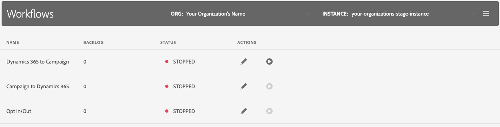

# Campaign - Microsoft Dynamics integration workflows

The **[!UICONTROL Workflows]** page lists the technical workflows and their status. 

The integration application comes with three workflows:

**Dynamics 365 to Adobe Campaign**
* Send *contacts* from Dynamics 365 into Campaign
* *Custom entities*: Bring in custom tables from Dynamics 365 to Campaign. [Learn more](../../integrating/using/d365-acs-using-the-integration.md#data-flows)
* This is also known as **Ingress** (referring to the ingress of data from Dynamics 365 to Adobe Campaign Standard)

**Adobe Campaign to Dynamics 365**
* Email marketing events from Adobe Campaign Sandard are sent to Dynmics 365 (email send, open, click, bounce). [Learn more](../../integrating/using/d365-acs-using-the-integration.md#email-marketing-event-flow)
* This is also known as **Egress** (referring to the egress of data from Adobe Campaign Standard to Dynamics 365)

**Opt-In/Out**
Opt-out statuses (e.g., denyList) can be synchronized from Dynamics 365 to Campaign or from Campaign to Dynamics 365. The data can also by synchronized bidirectionally (i.e. data flows in both directions). [Learn more](../../integrating/using/d365-acs-self-service-app-data-sync.md#opt-in-out-wf).

>[!IMPORTANT]
>
> It is strongly recommended that you stop the **Dynamics 365 to Adobe Campaign** workflow before publishing changes to either Adobe Campaign Standard or Microsoft Dynamics 365. These changes include updates to resources/entities (and their associated fields), links, identifier columns, etc… that are currently in use by the integration. Failure to do so could lead to data loss and/or the workflow stopping unexpectedly.

## Workflow backlog

This integration application first reads in data and then writes data to the destination. The **[!UICONTROL Backlog]** column indicates the number of records that have been queued and are waiting to be written. This value is expected to grow when you run have a large amount of data to process (e.g., you are running the integration for the first time, you are replaying the data, etc.). 

>[!NOTE]
>If your Dynamics 365 and/or Campaign records are not updating, you should first check to see if there is a large number of records waiting to be written to the destination.

## Workflow status {#workflow-status}

The **[!UICONTROL Status]** column indicates the state of the background processes associated with the workflow. Possible values are:

* **RUNNING**: The process is currently running and your data should be synchronized.
* **STOPPED**: The process is not currently running, so you should not expect your data should be synchronized.
* **STARTING**: You have requested that the workflow processes to start. The application has not yet started to synchronize the data associated with this workflow, but you can expect it will after a few minutes (when it will then show the status of **RUNNING**) 
* **FAILED**: The workflow processes were running but they encountered error(s) and they could not recover from these. 

## Available actions

Possible actions are listed below.

* **Edit**: Clicking the pencil icon will send you to another page that will allow you to make updates to the workflow. Keep in mind that any changes you make will NOT take effect until you stop the workflow and then restart it.
  
* **Start**: A Start button requests that a stopped workflow be started. This button will only appear when the processes associated with the workflow are currently stopped. The processes will first change to "STARTING" and then to "RUNNING". The data associated with the workflow will not start synching until the workflow is in a "RUNNING" state.

  The start button is a toggle. If the workflow processes have been started already, the button will change to a **Stop** button. 

* **Stop**: A **Stop** button requests that a running workflow be stopped. This button will only appear when the processes associated with the workflow are currently running.
    
It's important to understand that when you edit a workflow, your updates are NOT immediately incorporated into the running processes' rules. It's not until you stop the workflow and then click the **Start** button that your updates are incorporated into the running processes (once the process returns to a **RUNNING** state). A warning indication is added to the **Stop** button to let you know when you've (a) made updates to workflow, but (b) have not done a Stop/Start of this workflow. When changes have occurred to the workflow that require it be stop/started, it will look like the following:

  

