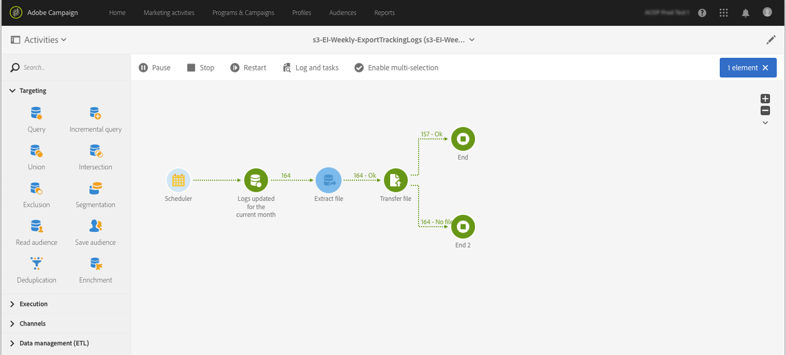
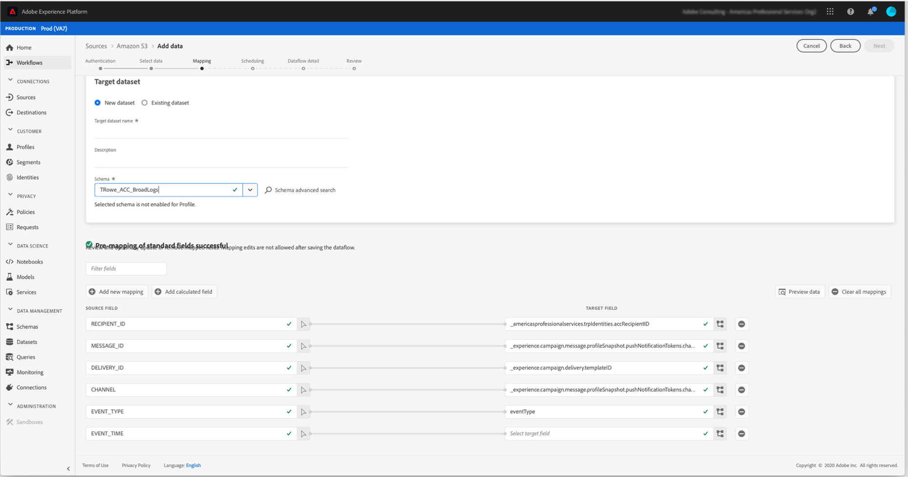

# Export data from Campaign to Adobe Experience Platform {#sources}

To export Campaign Standard data to Adobe Real-time Customer Data Platform (RTCDP), you first need to build a workflow in Campaign Standard to export the data you want to share to your S3 or Azure blob storage location.

Once the workflow has been configured and data sent to your storage location, you need to connect your S3 or Azure blob storage location as a **Source** in Adobe experience Platform.

## Create an export workflow in Campaign Standard

To export data from Campaign Standard to your S3 or Azure Blob storage location, you need to build a workflow to target the data you want to export and send it to your storage location.

To do this, you need to add and configure:

* An **[!UICONTROL Extract file]** activity to extract the targeted data into a CSV file. For more on how to configure this activity, refer to [this section](../../automating/using/extract-file.md).

   

* A **[!UICONTROL Transfer file]** activity to transfer the CSV file to your storage location. For more on how to configure this activity, refer to [this section](../../automating/using/transfer-file.md).

   

As an example, the workflow below extracts logs on a regular basis into a CSV file. It then transfers the file to a storage location.

   

Examples of data management workflows are available in the [workflows use cases](../../automating/using/about-workflow-use-cases.md#management) section.

Related topics:

* [Data management activities](../../automating/using/about-data-management-activities.md)
* [About data import and export](../../automating/using/about-data-import-and-export.md)

## Connect your storage location as a Source

The main steps to connect your S3 or Azure blob storage location as a **Source** in Adobe experience Platform are listed below. Detailed information on each of these steps is available in the [Source connectors documentation](https://experienceleague.adobe.com/docs/experience-platform/sources/home.html).

1. In Adobe Experience platform **[!UICONTROL Sources]** menu, create a connection to your storage location. 

    The storage location can be Amazon S3, SFTP with Password, SFTP with SSH Key, or Azure Blob connections. The preferred method to send data to Adobe Campaign is through Amazon S3 or Azure Blob:

    * [Create a Amazon S3 source connection](https://experienceleague.adobe.com/docs/experience-platform/sources/ui-tutorials/create/cloud-storage/s3.html)
    * [Azure Blob connector](https://experienceleague.adobe.com/docs/experience-platform/sources/connectors/cloud-storage/blob.html)

   

1. Configure a dataflow for a cloud storage batch connection. A dataflow is a scheduled task that retrieves and ingests data from the storage location to an Adobe Experience Platform dataset.
    
    This steps allows you to configure the data ingestion from your storage location, including data selection and the mapping of the CSV fields to an XDM schema.

    Detailed information is available in [this page](https://experienceleague.adobe.com/docs/experience-platform/sources/ui-tutorials/dataflow/cloud-storage.html).

   
