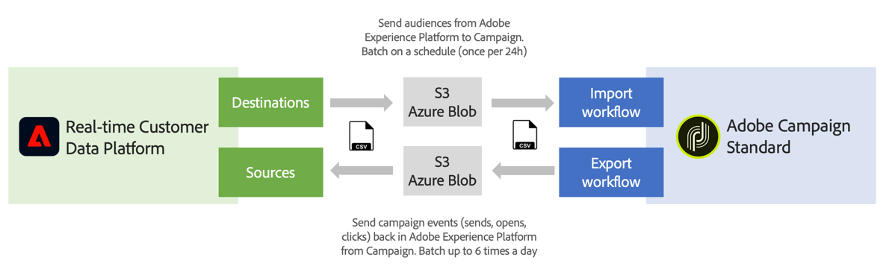

# Get started with Sources and Destinations {#rtcdp}

## About Sources and Destinations

With Adobe Experience Platform, you can share data between Campaign Standard and Adobe Real-time Customer Data Platform (RTCDP). This allows you to target Adobe Experience Platform audiences in your Campaign workflows, then send back to Adobe Real-time Customer Data Platform data related to these audiences like sends, opens, and clicks.

* With **Destinations**, ingest audiences from Adobe Experience Platform into Campaign Standard. This allows you to activate your known and unknown data for your marketing campaigns.
* With **Sources**, export Campaign Standard data (e.g. sends, opens, clicks) into Adobe Experience Platform. This allows you to centralize data you collect from disparate sources into one single place, and use the insights gained from it to do more.

>[!IMPORTANT]
>
>Please keep in mind the SFTP storage limits, database storage limits, and active profile limits as per your Adobe Campaign contract while performing this integration.

For a more detailed overview of Adobe Real-time Customer Data Platform, Destinations and Sources, refer to these pages:

* [Adobe Real-time Customer Data Platform](https://experienceleague.adobe.com/docs/experience-platform/rtcdp/overview.html)
* [Destinations documentation](https://experienceleague.adobe.com/docs/experience-platform/destinations/home.html)
* [Sources documentation](https://experienceleague.adobe.com/docs/experience-platform/sources/home.html)

## Connect Campaign Standard with Adobe Experience Platform

To be able to share data between Adobe Experience Platform and Campaign Standard, you first need to connect Adobe Campaign as a **Destination**, and connect your AWS S3 or Azure blob storage location as a **Source** in Adobe experience Platform.

Once the connectors have been configured, you can set up a data import or export into Campaign Standard using workflows.

 

For more details on how to setup these import and export processes, refer to these sections:

* [Ingest Adobe Experience Platform audiences into Campaign](../../integrating/using/ingest-aep-data.md)
* [Export data from Campaign to Adobe Experience Platform](../../integrating/using/export-campaign-data.md)
