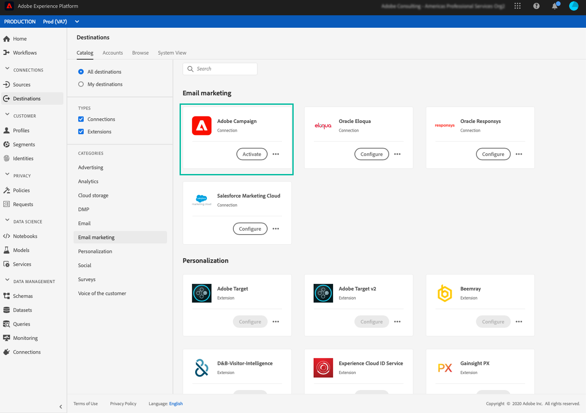
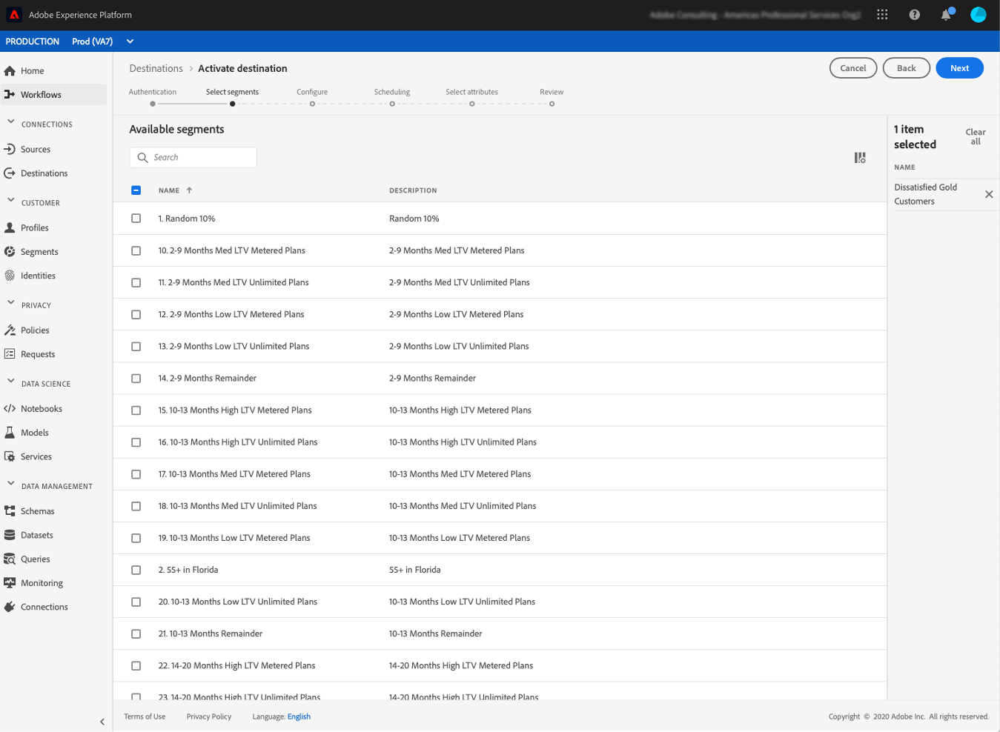
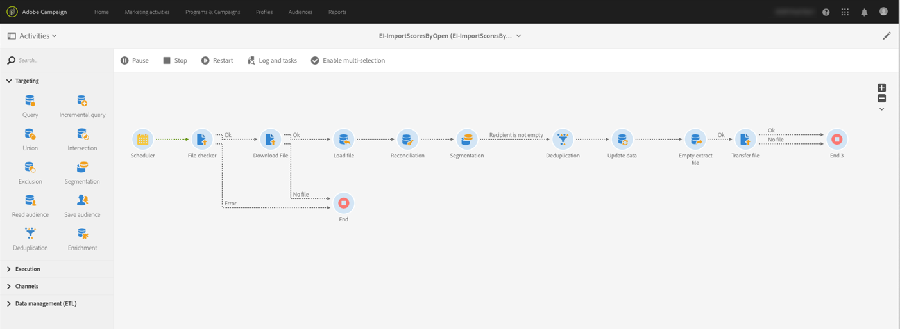

# Ingest Adobe Experience Platform segments into Campaign {#destinations}

To ingest Adobe Experience Platform into Campaign and use them in your workflows, you first need to connect Adobe Campaign as an Adobe Experience Platform **Destination** and configure it with the segment to export.

Once the Destination has been configured, you need to build a dedicated workflow in Campaign Standard to ingest the segment.

## Connect Adobe Campaign as a Destination

The main steps to connect and configure an Adobe Experience Platform Destination to Adobe Campaign are listed below. Detailed information on each of these steps is available in the [Destinations documentation](https://experienceleague.adobe.com/docs/experience-platform/destinations/catalog/email-marketing/adobe-campaign.html).

1. In Adobe Experience platform **[!UICONTROL Destinations]** menu, configure a connection with Adobe Campaign by authenticating and selecting a storage location for the exported segments.

    >[!NOTE]
    >
    >The storage location can be Amazon S3, SFTP with Password, SFTP with SSH Key, or Azure Blob connections. The preferred method to send data to Adobe Campaign is through Amazon S3 or Azure Blob.

   

1. Activate the segments to export. This step allows you to select the segment to export and to specify additional XDM fields to include.

    >[!NOTE]
    >
    >When ingesting the segment, you are exporting all its members, together with the XDM schema fields specified when configuring the Destination.

   

1. After the Destination has been configured, Adobe Experience Platform creates a tab-delimited .txt or .csv file in the storage location that you provided. This operation is scheduled and performed once per 24h.

You can now configure a Campaign Standard workflow to ingest the segment into Campaign.

## Create an import workflow in Campaign Standard

Once Campaign Standard has been configured as a Destination, you need to build a dedicated workflow to import from your storage location the file that has been exported by Adobe Experience Platform.

To do this, you need to add and configure a **[!UICONTROL Transfer file]** activity to download the exported file from your storage location. For more on how to configure this activity, refer to [this section](../../automating/using/transfer-file.md).

   

You can then build your workflow according to your needs (update the database using the segment data, send a cross-channel deliveries to the segment, etc.)

As an example, the workflow below downloads the file from your storage location on a regular basis. It updates Campaign database with the segment data, then transfer the emptied file back to the storage location.

   

Examples of data management workflows are available in the [workflows use cases](../../automating/using/about-workflow-use-cases.md#management) section.

Related topics:

* [Data management activities](../../automating/using/about-data-management-activities.md)
* [About data import and export](../../automating/using/about-data-import-and-export.md)
