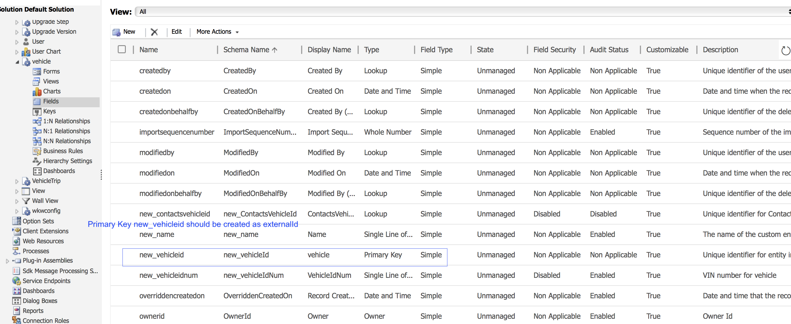

# Map Campaign custom resources and Dynamics 365 Custom entities

Learn how to map custom resources and Custom entities in the context of the integration between Adobe Campaign Standard and Microsoft Dynamics 365. 

## Prerequisites

The new version of the [Microsoft Dynamics 365-Adobe Campaign Standard integration](../../integrating/using/working-with-campaign-standard-and-microsoft-dynamics-365.md) brings support for custom entities.  This allows for custom entities in Dynamics 365 to be replicated over to corresponding custom resources in Campaign.

Once replicated, the new data in the custom resources can be used for several purposes, including segmentation and personalization.

>[!CAUTION]
>
>If any Campaign custom resource record contains personal information, applicable to a customer’s use of Campaign, such record should be linked to a corresponding Campaign profile record (either directly or through another custom resource) so that a privacy related delete on the profile record can also delete the linked custom resource record containing personal information; the linking and deletion options between the entities must be configured to enable this cascade-like removal of the linked records. Personal information should not be entered into a custom resource that is not linked to the profile.

A more comprehensive overview of Campaign custom resources can be found [at this link](../../developing/using/key-steps-to-add-a-resource.md).

In order to set up the integration for custom entities, reach out to [adobe-support@unifisoftware.com](mailto:adobe-support@unifisoftware.com) to request this be done.  Unifi will require the names of the custom entity tables in both systems, as well as the desired attribute mappings.  Unifi will then create the corresponding jobs and schedules.

An example use case of custom entity support can be seen in the [Use Case section](../../integrating/using/map-campaign-custom-resources-and-dynamics-365-custom-entities.md#UC).

>[!CAUTION]
>
>* Custom resources published before Campaign Standard 19.4 version will **need to be republished** in order to be used with the integration.
>* Creating and modifying Campaign Standard custom resources are sensitive operations which must be performed by expert users only.

## Use case

### Beginning state

Customer has custom entity vehicle predefined in Dynamics 365 and a corresponding custom resource vehicle predefined in Campaign Standard.  Customer has provided custom entity mapping details to Unifi, and Unifi has set up the jobs and schedules for the Vehicle custom resource, in Unifi.

|    | Microsoft Dynamics 365  | Adobe Campaign Standard  | Notes  |
|---|---|---|---|
| Top level entity  | Contact  | Profile  | Standard, out-of-the-box entities  |
| Linked entity | Vehicle - new custom entity  |  Vehicle - new custom resource | New custom entities  |
| Link type  | Parental Linking to Contact with N:1  | Similar to Dynamics 365 - see Campaign section below for details  |   |

### Configuration in Dynamics 365

This customer's custom entities in Dynamics 365 can be viewed in the Sales Dashboard by clicking on the drop down next to Dynamics 365.  This customer's custom entities are group together under **[!UICONTROL Extensions]**.

Vehicle data can be viewed by clicking on the **[!UICONTROL vehicle]** custom entity.  See the list of vehicles below.

The relationship of the **[!UICONTROL vehicle]** entity to the **[!UICONTROL Contact]** entity can be seen below. **[!UICONTROL Parental]** has been chosen for the **[!UICONTROL Type of Behavior]**.

### Configuration in Campaign Standard

In Campaign, the customer's custom resources can be viewed by clicking **[!UICONTROL Adobe Campaign]** in the upper left corner, then selecting **[!UICONTROL Client data]**.

### Map custom resources and custom entities

The **[!UICONTROL vehicle]** custom resource should have been previously predefined by the customer and should show show up in Client data; however, we'll walk through the steps of creating this **[!UICONTROL vehicle]** custom resource below.

Click on **[!UICONTROL Adobe Campaign]** in the upper left corner, then click on **[!UICONTROL Administration > Development > Custom Resources]**.

1. Click on **[!UICONTROL Custom Resources]**.
1. Click the **[!UICONTROL Create]** button.  This will open a pop-up window.  
1. Select **[!UICONTROL Create a new resource]** and enter **[!UICONTROL Vehicle]** as the label and ID.  
1. Click **[!UICONTROL Create]**.

Campaign will then display data structures and link page.  You can see that several fields have been added.

* Vehicle ID is the unique identifier for the **[!UICONTROL Vehicle]** entity; its ID must be exactly **[!UICONTROL externalId]**, as shown below, for the integration to work.
* Associated Profile is the ID of the profile the Vehicle record is linked to; when this is linked, it will be linked to the **[!UICONTROL externalId]** field of the Profile table.
* VIN and Vehicle name are fields to capture information about the vehicle.

>[!CAUTION]
>
>Each custom resource must have a unique field with an ID of externalId (exactly).  This field will map to the ID field of the custom resource in Dynamics 365 (see below).

### Define the identification keys

The next step is to define the identification keys.  First, create the identification keys, as seen below.

In the Key definition screen, make sure to select the **[!UICONTROL externalId]** field.

>[!CAUTION]
>
>Each custom resource must have an identification key with a Path of "externalId" (exactly).

### Define the filter

The next step is to specify the filter definition.

Under **[!UICONTROL Filter Definition]**, click **[!UICONTROL Add an element]**.  
Give the label and ID the name **[!UICONTROL ExternalId]**. 
Click **[!UICONTROL Add]**.

Now, click edit on the newly added filter element and configure the filter per the image below.  If you enter **[!UICONTROL externalId]** in the **[!UICONTROL Parameters]** field and click the plus sign, **[!UICONTROL externalId_parameter]** will appear.  Select this as the parameter.

### Define the link

Next we will specify the linking of the custom resource.  In this case, we chose to link from the **[!UICONTROL Vehicles]** custom entity (source) to the profiles entity (target) using a **[!UICONTROL 1 cardinality simple link]**.

(../assets/DefineTheLink.png)

1. In the **[!UICONTROL Link definitions]** screen, choose the delete option: **[!UICONTROL Deleting the target record implies deleting records referenced by the link]**. We choose this option so that when a profile is deleted, any **[!UICONTROL Vehicle]** records linked to that profile are deleted as well.  
1. In **[!UICONTROL Join Definitions]**, select **[!UICONTROL Define specific join conditions]**.
1. Then click **[!UICONTROL Add an element]**.

For the join definition, we enter the values below. 

Note that the **[!UICONTROL @externalId]** entry is the externalId field of the profile table and the **[!UICONTROL ProfileExternalId]** entry is the ID of the corresponding field in the vehicles custom resource.  When a profile record's externalId value is entered into the **[!UICONTROL ProfileExternalId]** field of a vehicle record, the two records will be linked together. 

Confirm changes and save the custom entity.

### Publish and check for updates

The final step is to publish the custom resource. 

1. Click on **[!UICONTROL Adobe Campaign]** in the upper left corner, click on **[!UICONTROL Administration > Development > Publishing]**.
1. Keep the default option: **[!UICONTROL Determine modifications since the last publication]**.
1. Click **[!UICONTROL Prepare Publication]** and wait for it to complete.

Then click **[!UICONTROL Publish]** and wait for it to complete.

### Unifi ingress schedule

Assuming that the customer has already populated the vehicle custom entity in Dynamics 365 and Unifi has set up their vehicle custom entity jobs and schedules with, the customer should be able to kick off the ingress schedule for the vehicle entity.

After completion of the ingress job, the vehicle data can now be seen in the newly populated **[!UICONTROL Vehicle]** custom resource in Campaign.

**Related Topics**

* Working with Adobe Campaign Standard - Microsoft Dynamics 365
* Key steps to add a custom resource in Campaign
