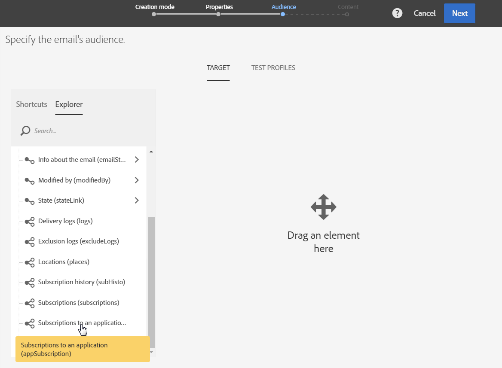
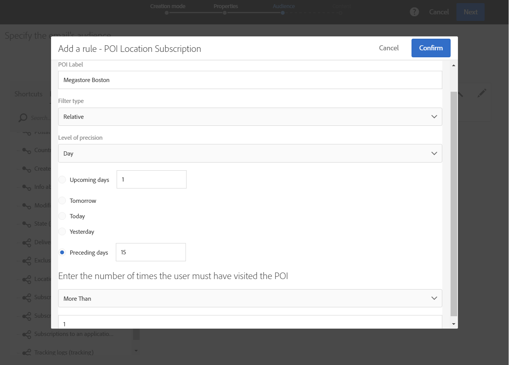
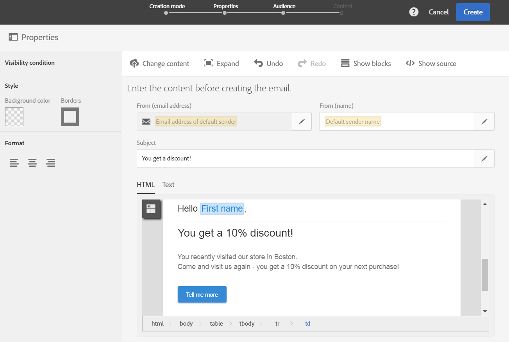

# Personalizing Campaign messages with Point of Interest data{#personalizing-campaign-messages-with-point-of-interest-data}

Personalizing Campaign messages with Point of Interest data

In Adobe Campaign, you can use the Points of Interest data collected from your mobile application's subscribers to send them personalized marketing messages, such as an email.

You can only react on Point of Interest data with standard deliveries. [Transactional messages](../../channels/using/about-transactional-messaging.md) cannot use location data.

The earliest you can react is about 10 minutes.

In this case, you decide to send an email to all subscribers who have visited your Boston store within the last two weeks.

1. Create an email marketing activity.
1. When defining the delivery's audience, drag and drop the **Subscriptions to an application** element into the workspace.

   

   Managing audiences is detailed in the [Defining audiences](../../audiences/using/creating-audiences.md) section.

1. In the **Add a rule - Profile/Subscriptions to an application** window, drag and drop the **POI Location Subscription** element into the workspace.

   

1. In the **Add a rule - POI Location Subscription** window, enter the label of the Point of Interest that you want to use.

   

1. In the **Filter type** field, select **Relative**.
1. Check the **Preceding days** option and enter **15** in the corresponding field.
1. Define the number of times the user must have visited the Point of Interest.
1. Click **Confirm** to save your audience.

   

1. Add content to your email.

   

1. Confirm creating the activity to view the email's dashboard.
1. Send your message.

The email with the 10% discount offer will be sent to subscribers who:

* Visited your Boston store at least once within the last two weeks.
* Had your mobile application in the foreground at least once during the visit.

**Related topics:**

* [Creating an email](../../channels/using/creating-an-email.md)
* [Defining content](../../designing/using/example--email-personalization.md)
* [Sending messages](../../sending/using/confirming-the-send.md)

