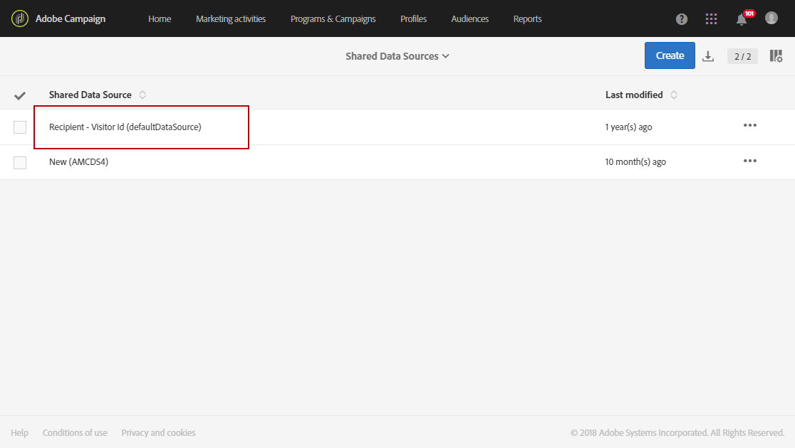
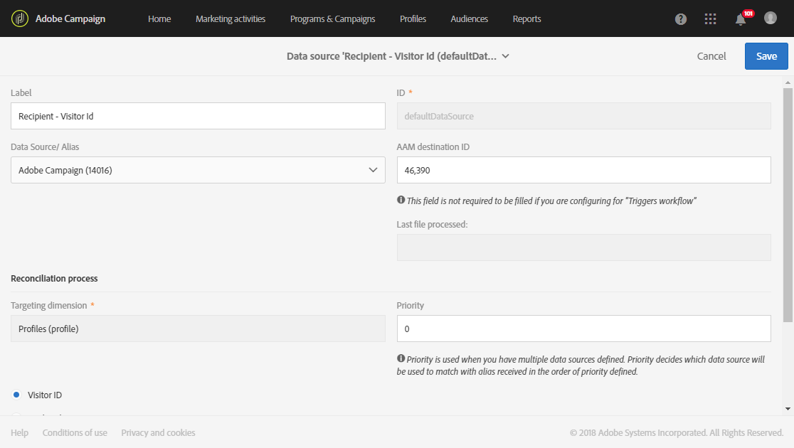

# Provisioning and configuring integration with Audience Manager or People core service{#provisioning-and-configuring-integration-with-audience-manager-or-people-core-service}

The provisioning and configuring of Audience Manager and People core in Adobe Campaign take two steps: [Submitting request to Adobe](../../integrating/using/provisioning-and-configuring-integration-with-audience-manager-or-people-core-service.md#submitting-request-to-adobe) then [Configuring the integration in Adobe Campaign](../../integrating/using/provisioning-and-configuring-integration-with-audience-manager-or-people-core-service.md#configuring-the-integration-in-adobe-campaign).

## Submitting request to Adobe {#submitting-request-to-adobe}

Audience Manager (AAM) or People core service integration lets you import and export audiences or segments in Adobe Campaign.

This integration must first be configured. To request provisioning of this integration, write an email to [Digital-Request@adobe.com](mailto:Digital-Request@adobe.com) with the following information:

<table> 
 <tbody> 
  <tr> 
   <td> <strong>Request Type:</strong>  </td> 
   <td> Configure AAM/People core service-Campaign Integration </td> 
  </tr> 
  <tr> 
   <td> <strong>Organization Name:</strong>  </td> 
   <td> Your organization name </td> 
  </tr> 
  <tr> 
   <td> <strong>IMS Org ID</strong>  </td> 
   <td> Your IMS Org ID* </td> 
  </tr> 
  <tr> 
   <td> <strong>Environment:</strong>  </td> 
   <td> Example: Production </td> 
  </tr> 
  <tr> 
   <td> <strong>AAM or People Service</strong>  </td> 
   <td> Example: Adobe Audience Manager </td> 
  </tr> 
  <tr> 
   <td> <strong>Declared ID or Visitor ID</strong>  </td> 
   <td> Example: Declared ID </td> 
  </tr> 
  <tr> 
   <td> <strong>Additional Information</strong>  </td> 
   <td> Any useful information or comment that you may have </td> 
  </tr> 
 </tbody> 
</table>

&#42; You can find your IMS Org ID on the Experience Cloud, in the **Administration** menu. It is also provided when you first connect to the Adobe Experience Cloud.

## Configuring the integration in Adobe Campaign {#configuring-the-integration-in-adobe-campaign}

After submitting this request, Adobe will proceed to the provisioning of the integration for you and contact you to provide details and information that you have to finalize the configuration:

* [Step 1: Configure or check the external accounts in Adobe Campaign](../../integrating/using/provisioning-and-configuring-integration-with-audience-manager-or-people-core-service.md#step-1--configure-or-check-the-external-accounts-in-adobe-campaign)
* [Step 2: Configure the Data Sources](../../integrating/using/provisioning-and-configuring-integration-with-audience-manager-or-people-core-service.md#step-2--configure-the-data-sources)
* [Step 3: Configure Campaign Tracking server](../../integrating/using/provisioning-and-configuring-integration-with-audience-manager-or-people-core-service.md#step-3--configure-campaign-tracking-server)
* [Step 4: Configure the Visitor ID Service](../../integrating/using/provisioning-and-configuring-integration-with-audience-manager-or-people-core-service.md#step-4--configure-the-visitor-id-service)

### Step 1: Configure or check the external accounts in Adobe Campaign {#step-1--configure-or-check-the-external-accounts-in-adobe-campaign}

We first need to configure or check the external accounts in Adobe Campaign. These accounts should have been configured by Adobe and the necessary information should have been communicated to you.

To do so:

1. From the advanced menu, select **Administration > Application settings > External accounts**.

   Select one of the following external accounts available for this integration: 

   

1. Enter **[!UICONTROL Receiver server]** in following format 
1. Enter the **[!UICONTROL AWS Access Key ID]**, **[!UICONTROL Secret Access Key]** and **[!UICONTROL AWS Region]**.

Your external accounts are now configured for this integration.

### Step 2: Configure the Data Sources {#step-2--configure-the-data-sources}

The two following data sources are created inside Audience manager: Adobe Campaign (MID) and Adobe Campaign (DeclaredId). At the same time, these two data sources are available in Adobe Campaign:

* **[!UICONTROL Recipient - Visitor ID (Defaultdatasources)]**: This is an out-of-the-box data source configured by default for Visitor ID. Segments created from Campaign will be part of this data source.
* **Declared ID** data source: This data source needs to be created and mapped with the **[!UICONTROL DeclaredId]** data source definition from Audience Manager.

Please note that in the case of multiple websites with different domains, Adobe Campaign does not support reconciliation based on ECID.

To configure the **[!UICONTROL Recipient - Visitor ID (Defaultdatasources)]** data source:

1. In **[!UICONTROL Administration]** > **[!UICONTROL Application settings]** > **[!UICONTROL Shared Data Sources]**, select **[!UICONTROL Recipient - Visitor ID (Defaultdatasources)]**.

   

1. Choose **[!UICONTROL Adobe Campaign]** in the **[!UICONTROL Data Source/ Alias]** drop-down.
1. Enter the **[!UICONTROL AAM Destination ID]** provided by Adobe.

   

1. In the **[!UICONTROL Reconciliation process]** category, we advise you not to change the reconciliation criteria and always use the **[!UICONTROL Visitor ID]**.
1. Click **[!UICONTROL Save]**.

To create the **[!UICONTROL Declared ID]** data source:

1. In **[!UICONTROL Administration]** > **[!UICONTROL Application settings]** > **[!UICONTROL Shared Data Sources]**, click the **[!UICONTROL Create]** button.
1. Edit the **[!UICONTROL Label]** of your data source.
1. In the **[!UICONTROL Data Source/ Alias]** drop-down, choose the Data Source corresponding to the **[!UICONTROL DeclaredID]** data source from Audience Manager. 
1. Configure your data source by entering the **[!UICONTROL Data Source / Alias]** and **[!UICONTROL AAM Destination ID]** provided by Adobe.
1. Set the **[!UICONTROL Reconciliation process]** as needed.
1. Click **[!UICONTROL Save]**.

>[!NOTE]
>
>The **[!UICONTROL AAM Destination ID]** field is not required if you are configuring the shared data source for the [Campaign-Triggers integration](../../integrating/using/configuring-triggers-in-experience-cloud.md). **[!UICONTROL Priority]** is only needed when configuring the Triggers - Campaign integration. Priority decides which Data Source will be configured first. Priority can be any number such as 1 or 100. The higher the priority, the higher the preference during reconciliation.

### Step 3: Configure Campaign Tracking server {#step-3--configure-campaign-tracking-server}

For the configuration of the integration with People Core service or Audience manager, we also need to configure Campaign Tracking server.

Here, you need to make sure the Campaign Tracking Server is registered on the domain (CNAME). You can find more information about domain name delegation in [this article](https://docs.campaign.adobe.com/doc/AC/en/technicalResources/Technotes/AdobeCampaign_Deliverability_Sub_Domain_Delegation.pdf).

### Step 4: Configure the Visitor ID Service {#step-4--configure-the-visitor-id-service}

In the case that your Visitor ID service has never been configured on your web properties or websites, refer to the following [document](https://marketing.adobe.com/resources/help/en_US/mcvid/mcvid-setup-aam-analytics.html) to learn how to configure your service or the following [video](https://helpx.adobe.com/marketing-cloud/how-to/email-marketing.html#step-two).

Your configuration and provisioning are finalized, the integration can now be used to import and export audiences or segments.
