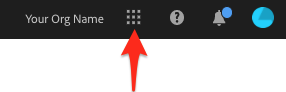
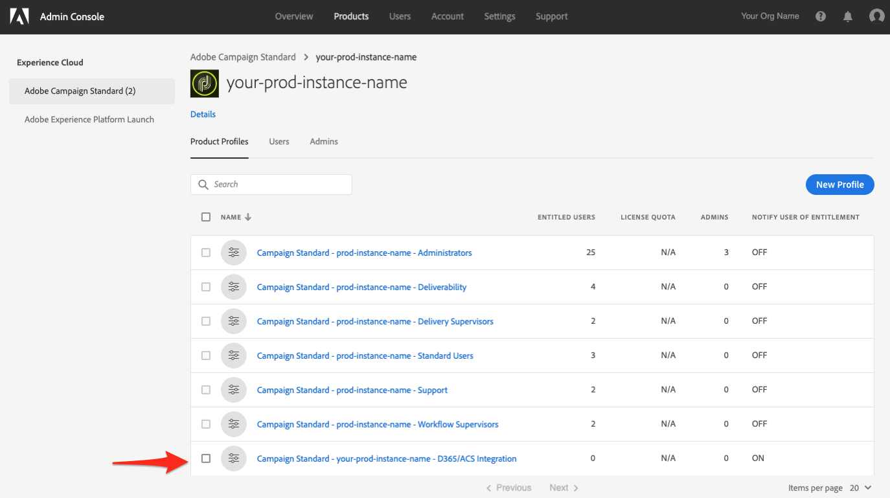
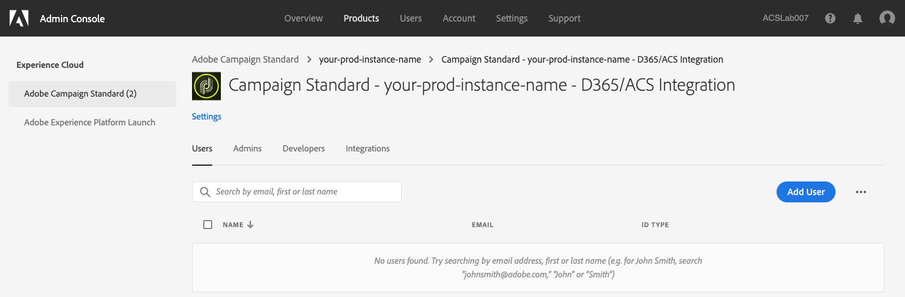

# Getting Access to the Dynamics 365 to Adobe Campaign Integration App

This configuration will require you to work with an Experience Cloud (EC) Administrator for you organization.   These 
are the initial steps required to give you access to the D365/Integration.   Once you have access to the integration, 
then there will be more steps described in this document to allow you establish connections to your data and configure 
the flow of data between the two products.

## Initial Enablement???? 

   Reach out to Adobe consultant (or Client Care?...NAM?...CP?) and provide instance names and orgs.   A ticket will 
   need to be logged to EA to allow those instance names for that org.

   This should be internally requested (JIRA ticket through CC) to the EA Team and shouldn't require EA interaction 
   with the client   

## How to get to Adobe Campaign Instances in the Experience Cloud Admin Console {#get-to-instance-page}

1. Browse to https://experience.adobe.com/ and log into the Adobe Experience Cloud
1. Click on the navigation grid in the top-right of your page to expose a navigation menu

   
   
1. Click on the entry "Admin Console" to open a new tab with access to the EC Admin interface
   
   
   * If you don't see an "Admin Console" entry then it means that you do not have Administrator access to the Org.   
     You will need to determine who does have this level of access and have them make these updates.   There should be 
     a person within your organization that has Administrator access (you shouldn't need to contact Adobe regarding 
     this)
1. A new tab should have been opened that shows "Admin Console" in the top-left.    Across the top you should see 
   several page name like this
   
   
1. Click on the page named "Products"
   
   
1. The resulting page should look something like this:

   
   * In the page above, "Adobe Campaign Standard" has be selected by clicking on it.   If this isn't the default item 
     selected on the left, then click on "Adobe Campaign Standard"
   * The list of products in the left-hand menu can vary from org to org, so don't worry about it if your list doesn't 
     match what is shown above.   
   * The remaining steps in this section will be performing similar steps for each of your ACS instances.   These 
     represent multiple instances of ACS that have been configured for org.   Typically, you'll have a stage or dev 
     instance for testing.    You'll also have a production (i.e. "prod") instance where do all of your ACS work that 
     is live with customers.

## Adding a Profile for the Dynamics 365 to Adobe Campaign Integration App {#add-new-profile}  
     
These instructions assume that you're in the "Products" page in the Adobe Experience Cloud Admin Console.   If you 
don't know how to get to this page, then please read the instructions in the first section in this page.
     
1. Click on the first instance name that has not yet been configured.

    

   * if this is your first time performing these instructions, then you should click on the top-most instance because 
     it is assumed that none of your instances have been configured yet.
1. The instance page should look something like this:

   
   * Keep in mind that your page will replace "your-prod-instance-name" with whatever the name of your instance is.
   * We'll be adding a new entry named: 
   
           Campaign Standard - your-prod-instance-name - D365/ACS Integration   
     If you see this entry in the list then you do not need to proceed.   Click on "Adobe Campaign Standard" in the left 
     menu and check the remaining ACS instances (repeat the steps starting at step 8).
     
1. Click the "New Profile" button
   * This should open the "Create a New Profile" page.   Steps 10-14 will provide instructions on what values to put     
1. In the "Profile Name" textbox, input this value "Campaign Standard - your-prod-instance-name - D365/ACS Integration"
   * Make sure to replace "your-prod-instance-name" with the actual name for your instance name.
1. In the "Description" text area add a description that makes sense to you.   
   * An example description could be this:  "This profile governs access to the ACS/D365 Integration.  "        
1. You can leave the "Permission Group" dropdown with the default value.
1. We'd strongly suggest that you ensure "User Notifications" are "on", however, it's up to you if you want users to 
   know if they are added or removed from this profile.
1. If your entries look similar to the following, then click the "Done" button.
   
1. You should now have been returned to the top-level ACS page which should look something like the following.   You'll 
   want to ensure that you see the D365/ACS Integration that you just added.
   
   

## Giving Users Access to the Dynamics 365 to Adobe Campaign App {#add-users-to-profile}

These instructions assume that you're in the "Products" page in the Adobe Experience Cloud Admin Console.   If you 
don't know how to get to this page, then please read the instructions in the first section in this page.

1. Your page should look similar to the one below.  Click on the Campaign instance to which you want to add a user.

   
   
1. Click on the new profile that you've created (click anywhere on the name 
   "Campaign Standard - your-prod-instance-name - D365/ACS Integration"
   
1. This should open a new page that looks something like this:   
   
1. Click on the "Developers" tab (see below)
   
1. Click on the "Add Developer" button
1. In the textbox, type in the name or email address fo the user you want to add.  When their name is found, then 
   select(s) should appear below the textbox for you to select.   Pick the one that matches the user you are attempting 
   to add.
   * If this is the first time the user is getting added to the Org, then there will be some other questions related to 
     the user.   Please fill these out
   * Click the "Save" button when you've completed filling out the user values.
1. Repeat step 5-6 for all the users you want to give access to the D365/ACS Integration.
1. When you're done click on "Adobe Campaign Standard" in the left-hand menu.   This will take you back to the page 
   that lists all of your ACS instances.
1. If you want to add the users to the other Adobe Campaign instances, then repeat steps 1-8.   
   