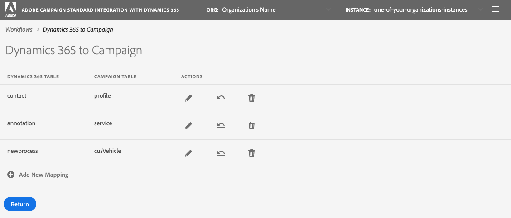

#Dynamics 365 to Campaign

The Dynamics 365 to Campaign page shows a list of tables in Dynamics 365 and with which tables in Adobe Campaign that 
they will by syncronized.   The contact-to-profile table mapping will be added out-of-the box and should continue to 
be displayed unless you delete it.   You will have the opportunity to add new mappings, delete existing mappings, and
edit existing mappings. 

There is a table in this page that lists each of the mappings.   It details which tables are associated with the 
mapping and will give you the ability to make changes to each one.   Here is a description of each of the columns in 
this table:

* Dyanamics 365 Table

  This column identifies which table in Dynamics 365 will be the source of data for the mapping.

* Campaign Table

   This column identifies which table in Adobe Campaign will be the destination of data for the mapping.

* Actions

  - <u>Edit</u>: Clicking on this button will take you to a page that will allow you to edit this mapping.   Remember 
    that your updates will not be recognized by the integration app until you return to the Workflows page and 
    stop/start the "Dynamics 365 to Campaign" workflow.
  
  - <u>Replay Data</u>: This button will allow you to re-synchronize (a.k.a replay) all the data in the Dynamics 365
    table.   Normally the integration app will only synchronize the data in Dynamics 365 that has changed recently.
    However, in some cases (you've made a change or made a mistake) you might want all the data to be 
    syncronized.  In these cases, you would click this button and the next time you stop/start the "Dynamics 365 to
    Campaign" workflow (in the Workflows page), your data would start to synchronize.  
    
    You cannot deselect the "replay data" button once you have selected it.   Consequently, the replay data buttons 
    will be disabled.   These buttons will not be re-enabled until the next time you return to the Workflows page and 
    you stop/start the workflow.  
    
    >[!NOTE]
    >
    > The number of records that need to be re-synchronizing varies.    You will need to keep in mind that if you have
    > a large number of records then it can take time to complete the synchronization process.   This means that you 
    > can expect delays in the data updates as all of this data gets written to Adobe Campaign.   You can utilize the
    > "Backlog" metric in the Workflows page as the integration app works to complete the syncing process.

    >[!NOTE]
    >
    > You cannot select to replay the data when the following are true:
    > * If there are 2,000,000 (or more) items in the Backlog metric associated with the "Dynamics 365 to Campaign"
    >   workflow (displayed in the Workflows page)
    > * If there are 2,000,000 or more records in the Dynamics 365 Table.
  
  - <u>Delete</u>:   
    
    This allows you to delete a table mapping.   Remember that this deletion will not be recognized by the integration
    app until you return to the Workflows page and stop/start the "Dynamics 365 to Campaign" workflow. 

Under the table that lists the table mappings that have been configured is a "Add New Mapping" button.   This will
take you to a page that will allow you to specify a mapping from a Dynamics 365 to an Adobe Campaign table.

>[!NOTE]
>
> You will only only have an opportunity to select a Dynamics 365 table once and an Adobe Campaign once.    You cannot
> map more than one Dynamics 365 tables to a single Adobe Campaign table, nor can you map a single Dynamics 365 table
> to multiple Adobe Campaign tables. 

