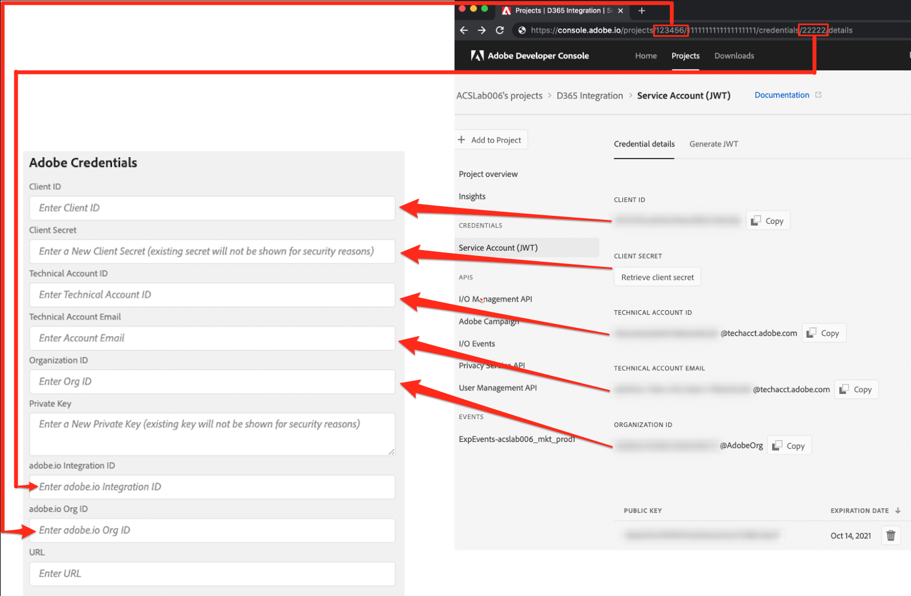

#Settings Page

The Settings page that allows you to specify Dynamics 365 and Adobe API credentials.   There are also inputs to add 
specifics related to the Adobe Campaign SFTP instance.

## Microsoft Dynamics 365 Credentials

The Microsoft Dynamics 365 Credentials give the integration app permission to pull your data from Microsoft 
Dynamics 365.  You must first follow the steps on the page 
"[Configure Dynamics 365 for Campaign integration](integrating/using/configure-microsoft-dynamics-365-for-campaign-integration.md)" 
in order to generate the values that will be pasted into this page.   The inputs described below will reference this page.

* <u>Client ID</u>: Reference the section "Register a new application" in the page referenced above in order to 
   determine your Client ID.  

* <u>Client Secret</u>: Reference the section "Generate client secret" in the page referenced above in order to get 
   your client secret.
   
* <u>Tenant</u>: Reference the section "Get the tenant ID" in the page above to determine how to find your Tenant.

* <u>URL</u>: The url will have the format https://<i>&lt;servername&gt;</i>.api.crm.dynamics.com/.   
  NOTE: ADD INFO ON HOW TO LOCATE THE SERVERNAME FOR PROD AND STAGE

## Adobe Credentials

The Adobe Campaign credentials are generated in using adobe.io.  You will need to visit the page 
[Configure Adobe I/O](integrating/using/configure-adobe-io-for-ms-dynamic.md) and follow the instructions there before
you will be able to fill out the inputs in this section.

The following image will explain in detail the mapping between adobe.io and the settings page input.
 

* <u>Private Key</u>: the process to to define this starts by clicking the "Generate public/private keypair" button.   This 
will create a zip file that you must download.   Once you download it then unzip the file which will result in two files
named certificate_pub.crt and private.key.   Make sure to put the private.key is a secure place and don't share it.
Open the private.key file in a text editor.  Copy the entire value in the text editor (ctrl-A then ctrl-C on a PC, or 
cmd-A then cmd-C on a Mac).   This should include the lines with "BEGIN PRIVATE KEY" and "END PRIVATE KEY" in their
entirety.   Paste this entire, multi-line text into the "Private Key" input in the Settings page.

* <u>URL</u>: This value will fit the pattern https\://mc.adobe.io/<i>&lt;campaign-instance-name&gt;</i>.   The header
  of the integration app includes both the "Org" and "Instance".   The "campaign-instance-name" portion of the url
  would simply be the name found in this instance value.
  

## Optional Adobe Campaign SFTP Settings

As the title implies, this section only needs to be defined if you plan on using the Adobe Campaign SFTP instance.
One reason to use the SFTP instance is if you ever want to output logs from the connector.  This will be helpful if 
you experience issues when the integration is running and you need to debug why the output does not meet your 
expectations.   The other reason to setup the SFTP server would be if you plan on running the Opt in/out workflow and
there is a flow of data from Adobe Campaign to Dynamics 365 (either "Unidirectional Adobe Campaign to Dynamics 365" or
"Bidirectional").

* <u>SFTP Host</u>: This will look like this:  <i>&lt;campaign-instance-name&gt;</i>.campaign.adobe.com.   The header
  of the integration app includes both the "Org" and "Instance".   The "campaign-instance-name" portion of the url
  would simply be the name found in this instance value.
  
* <u>SFTP User</u>: TBD (need to include or reference instructions)

* <u>SFTP Key</u>: TBD (need to include or reference instructions)

QUESTIONS: 
* ARE WE GOING TO SUPPLY OR IP RANGES FOR THEM TO USE WITH SFTP SETUP?
* CAN WE DEFINE (SFTP) "SFTP HOST" (ADOBE.IO) "URL" BASED ONT HE CURRENTLY SELECTED INSTANCE NAME?  

