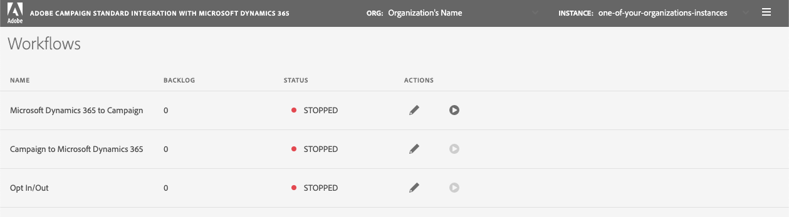

# Workflows

The Workflows page in the integration app lists the three workflows available, gives you the ability to edit them, as 
well as the ability to start and stop the process.   This documentation will explain how this page works, however, it 
assumes that you understand the basics of these workflows.   If you don't fully understand these, then it would be a 
good idea to visit the [Data Flows](using-the-campaign-standard-and-microsoft-dynamics-365-integration.md#data-flows) 
section in the "Use the Microsoft Dynamics 365 integration documentation page.

The Workflows page list the three workflows with the fo:
* Dynamics 365 to Campaign (a.k.a. "Ingress")
* Campaign to Dynamics 365 (a.k.a. "Egress")
* Opt In/Out

Here is a description of what the values mean under each of the columns in the "Workflows" page:

* Name
  
  - Dynamics 365 to Campaign (a.k.a. "Ingress")
  - Campaign to Dynamics 365 (a.k.a. "Egress")
  - Opt In/Out

* Backlog

  This integration app first reads in the data before it is then "written" to the destination.  The "Backlog" value 
  indicates the number of records that have been queued and are waiting to get written.   This value is expected to grow 
  when you run the integration for the first time or when you "replay" the data.   If you feel that your updates (from 
  the data source) are not visible in the destination, then this is the first place you should look to see if there are 
  a large number of records waiting to get written to the destination.   

* Status

  This is an indicator letting you know the state of the background processes associated with the workflow.  Here are
  the possible values for the status:
  - <u>RUNNING</u>:
    The process is currently running and your data should be synchronized.
    
  - <u>STOPPED</u>:
    The process is not currently running, so you should not expect your data should be synchronized.
     
  - <u>STARTING</u>:
    You have requested that the workflow processes to start.    They are 
  
  - <u>FAILED</u>:
    The workflow processes were running but they encountered error(s) and they could not recover from these. 

* Actions
  
  Actions refer to actions that you can take on the workflow.    You have the option to 
  
  - <u>Edit</u>: Clicking the pencil icon will send you to another page that will allow you to make updates to the 
    workflow.   Keep in mind that any changes you make will NOT take effect until you stop the worflow and then restart
    it.
  
  - <u>Stop/Start</u>: The start/stop button is a toggle.   If the workflow processes are currently stopped, then it's
    a Start button request that the workflow be started.   However, if the workflow processes are running, then this 
    button makes a request to stop the processes. 
