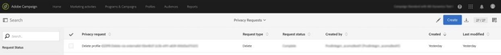
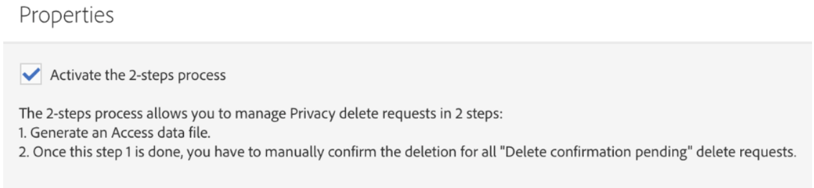
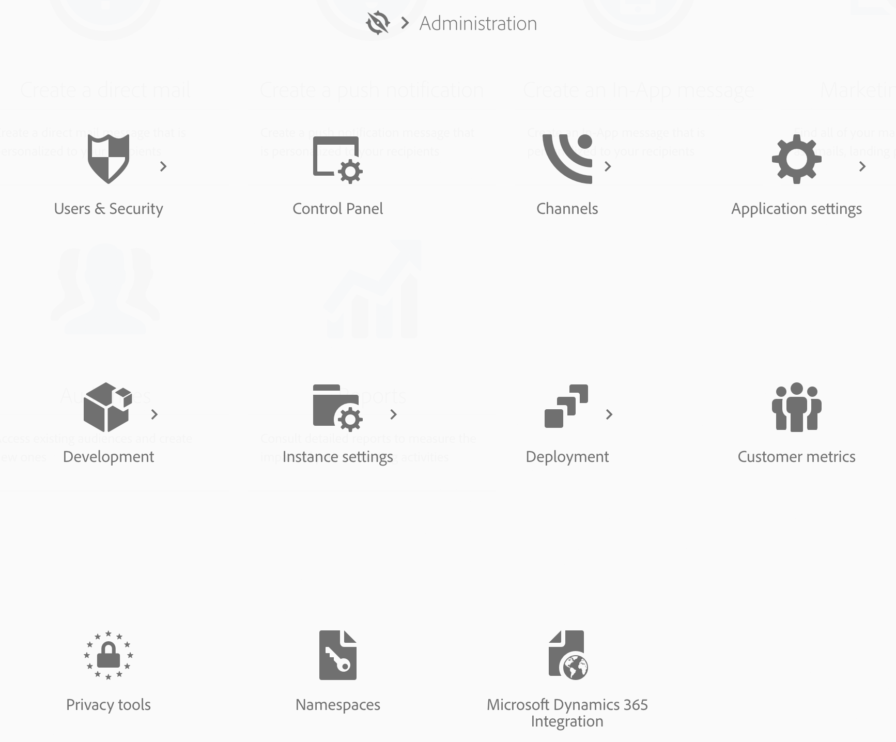
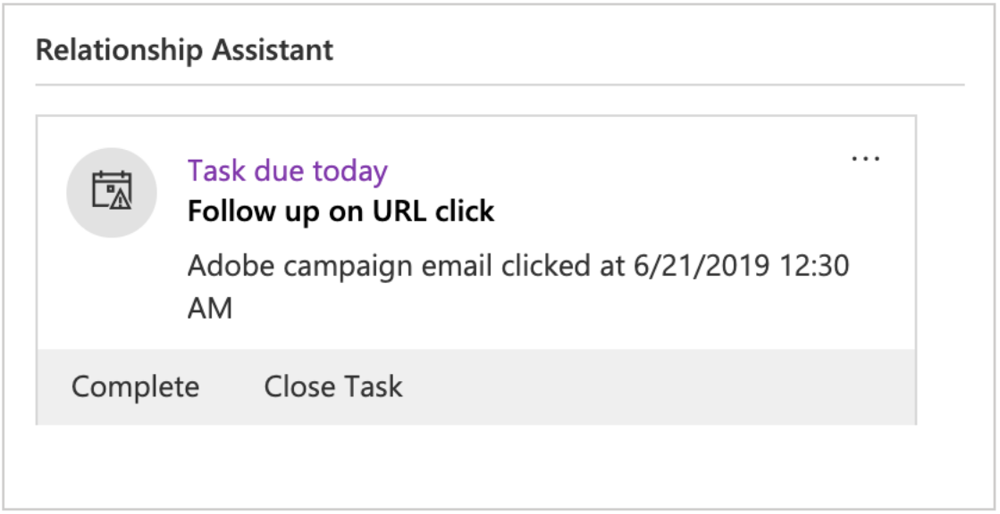

# Using the Microsoft Dynamics 365 with Campaign Standard integration

There are several jobs that this integration performs:

* **Contact sync**: Contacts are sent from Dynamics 365 to Campaign (note: one-way sync).
* **Custom entity sync**: Custom entity records are sent from Dynamics 365 to Campaign (note one-way sync).  See the page on custom entities for more information.
* **Event display**: Certain email marketing events are sent from Campaign to Dynamics 365. See Note below.
* **Contact deletion**: Campaign profile is added to privacy related delete queue when corresponding Contact is deleted in Dynamics 365. 
* **Opt-Out sync**: Opt-outs are synchronized between Dynamics 365 and Campaign depending on the configuration that customer selects during onboarding (i.e., Dynamics 365 to Campaign sync, Campaign to Dynamics 365 sync, or bi-directional sync).
* **Single Sign On (SSO)**: Your integration details in Unifi can be accessed directly from Campaign, using your Adobe IMS authentication.

>[!NOTE]
>
>For **Event display**, a maximum of 10k events will be retrieved each time the egress job runs in Unifi.

## Adobe Campaign Standard User Experience

When a contact is created new or modified in Dynamics 365, it will be synchronized over to Campaign after Contacts sync has run.  These contacts will be visible in the Profiles screen in Campaign and can be targeted in marketing campaigns.  See the Profiles screen below.

When a contact is deleted in Dynamics 365, the corresponding profile in Campaign is added to the privacy service delete queue in the Privacy Request screen in Campaign.  For more details on executing data subject delete requests as required to comply with applicable data privacy laws in Campaign, please refer to How to execute legally mandated delete requests in Adobe Campaign Standard.

It is important to note that, if you have the 2-step process activated in the properties screen, you will need to manually confirm the deletion of each record in the Privacy Screen before they are finally deleted.  See the 2-step process screen below:

When an opt-out/blacklist attribute is modified in Campaign, it will be reflected in Dynamics 365 if you’ve selected the Campaign-to-Dynamics 365 or bi-directional opt-out configuration, and if you have that particular attribute mapped correctly.

To access your integration details via single sign on, go to Campaign Navigation menu and click Administration > Microsoft Dynamics 365 Integration. 

This page contains links to documentation on the integration and guidelines on how to use the features in accordance with your potential legal obligations. Click on the globe icon, which will automatically route and log you into your Unifi instance where you can manage your integration details.

You can see a video of this functionality in the below video.

>[!VIDEO](https://video.tv.adobe.com/v/29254)

>[!NOTE]
>
>You will need to submit a ticket to Adobe Customer Care (either directly or through your Adobe contact) to have the single-sign-on feature flag enabled in your Campaign instance.

>[!NOTE]
>
>You will not see the Microsoft Dynamics 365 Integration icon in your  admin panel out-of-the-box.  You (or your Adobe contact) will need to submit a ticket to have this feature flag enabled for your Campaign instance.
>
>Also, Unifi will need to enable users for SSO access before they can successfully log on via SSO from Campaign.

## Microsoft Dynamics 365 User Experience

For events display, the following email marketing events are sent from Campaign to Dynamics 365 and displayed in the Dynamics 365 Timeline view as custom activities:

* Adobe Campaign Email Send

* Adobe Campaign Email Open

* Adobe Campaign Email URL Click

* Adobe Campaign Email Bounce

To view a contact’s Timeline, navigate to your contacts list by clicking on Sales Hub from the Dynamics 365 drop down menu.  Then click on Contacts on the left hand menu bar and select a contact.

>[!NOTE]
>
>The Adobe Campaign for Dynamics 365 app in AppSource will need to be installed in your Dynamics 365 instance in order to view these events.

Below you can see a snapshot of the Contact screen for “Dynamics User”.  In the Timeline view, you you’ll notice that Dynamics User was sent an email associated with Campaign Name “2019LoyaltyCamp” and Delivery Name “DM190”.  Dynamics User opened the email and also clicked a URL in the email; both of these actions created events which also show below.  If you look to the right corner, you’ll see the Relationship Assistant (RA) card; currently, it contains a task to follow up on the clicked URL.

See below for a close up of the Timeline view for Dynamics User.

Below is a close up of the Relationship Assistant (RA) card.  The AppSource app contains a workflow that watches for an Adobe Email URL Click event.  When this event occurs, it creates a task and sets a due date.  This allows the task to show up in the RA card, giving it additional visibility.  There is a similar workflow for Adobe Email Bounce events, adding a task to reconcile the invalid email address.  These workflows can be turned off in the solution.

If you click on the subject of the send event, you’ll see a form similar to the one below.  The forms for open and bounce events are similar.

The form for email url click events adds an additional attribute for the URL that was clicked:

The following is a list of the attributes and a description:

* Subject: Subject of the event; composed of the Campaign ID and Delivery ID of the email delivery

* Owner: The application user that is created in the post-provisioning steps

* Regarding: The name of the Contact

* Campaign Name: The Campaign ID in Campaign Standard

* Delivery Name: The Delivery ID in Campaign Standard

* Date Sent/Opened/Clicked/Bounced: Date/time when the event was created

* Tracking URL: URL that was clicked

* Mirror Page URL: The URL to the mirror page of the email that was sent/opened/clicked/bounced

You can see a video of the mirror page URL being used in the below video.

>[!VIDEO](https://video.tv.adobe.com/v/29253)

>[!NOTE]
>
>For opt-out, when an opt-out attribute is modified in Dynamics 365, it will be reflected in Campaign if you’ve selected the Dynamics 365-to-Campaign or bi-directional opt-out configuration, and if you have that particular attribute mapped correctly.

**Related Topics**

* Configure Campaign for Campaign/Dynamics 365 integration
* Configure Dynamics for Campaign/Dynamics 365 integration
* Configure Unifi for Campaign/Dynamics 365 integration
* Learn how to map custom resources and custom entities