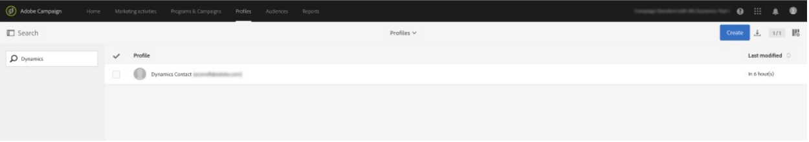
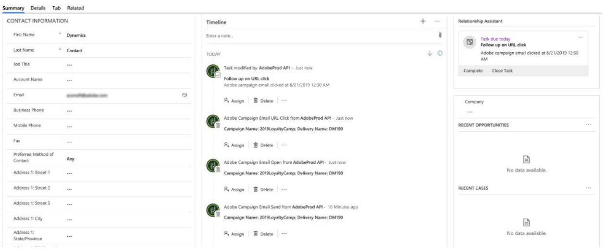
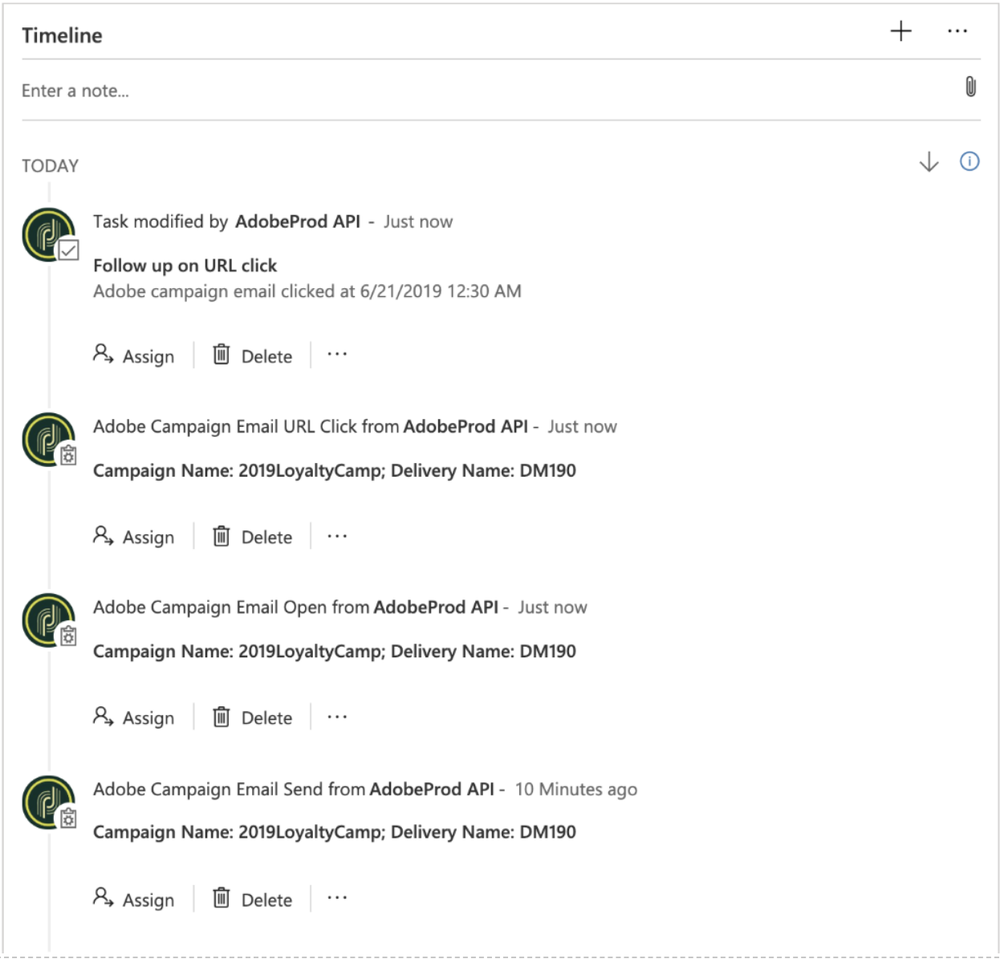
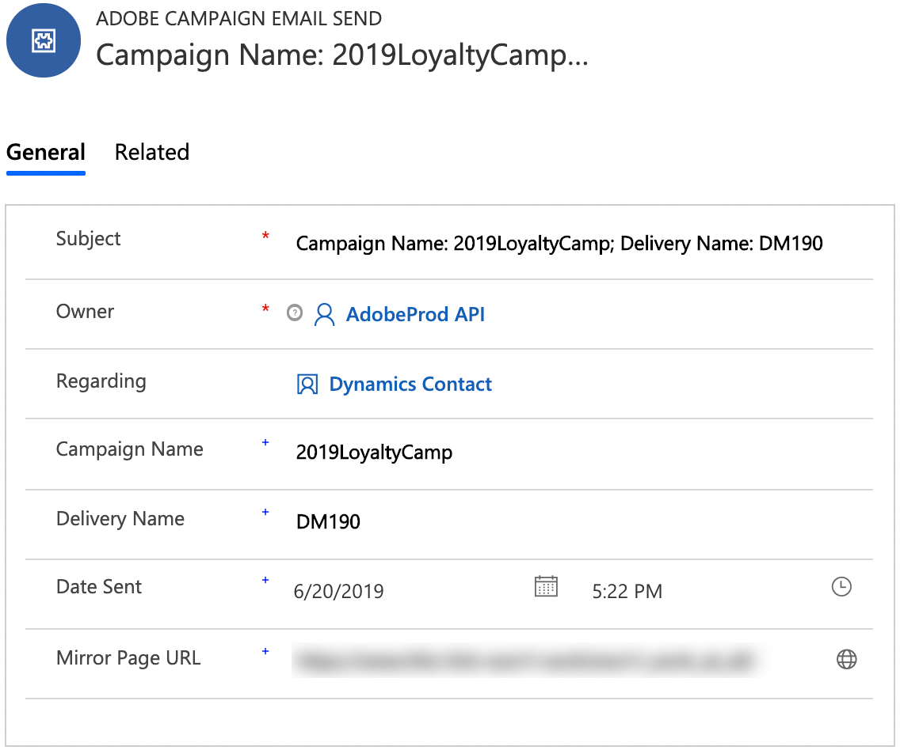

# Use the Microsoft Dynamics 365 integration

There are several jobs that this integration performs:

* **Ingress**:

    * Bring in **contacts** from Dynamics 365 into Campaign

    * **Custom entities**: Bring in custom tables from Dynamics 365 to Campaign. Learn more [in this section](../../integrating/using/map-campaign-custom-resources-and-dynamics-365-custom-entities.md).

* **Egress**: Bring in email marketing events from ACS to D365 (email send, open, click, bounce)

* **Opt-out**: Bi-directionally sync opt-out status (e.g., denyList)

More details on the data flows can be found [in this section](#data-flows).

## Adobe Campaign Standard User Experience

When a contact is created or modified (or deleted, if enabled) in Dynamics 365, it will be sent over to Campaign.  These contacts will be visible in the Profiles screen in Campaign and can be targeted in marketing campaigns.  See the Profiles screen below.

When an opt-out attribute is modified in Campaign, it will be reflected in Dynamics 365 if you’ve selected the Campaign-to-Dynamics 365 or bi-directional opt-out configuration, and if you have that particular attribute mapped correctly.

## Microsoft Dynamics 365 User Experience

For egress, the following email marketing events are sent from Campaign to Dynamics 365 and displayed in the Dynamics 365 Timeline view as custom activities:

* Adobe Campaign Email Send

* Adobe Campaign Email Open

* Adobe Campaign Email URL Click

* Adobe Campaign Email Bounce

To view a contact’s Timeline, navigate to your contacts list by clicking on Sales Hub from the Dynamics 365 drop down menu.  Then click on Contacts on the left hand menu bar and select a contact.

>[!NOTE]
>
>The Adobe Campaign for Dynamics 365 app in AppSource will need to be installed in your Dynamics 365 instance in order to view these events.

Below you can see a snapshot of the Contact screen for “Dynamics User”.  In the Timeline view, you you’ll notice that Dynamics User was sent an email associated with Campaign Name “2019LoyaltyCamp” and Delivery Name “DM190”.  Dynamics User opened the email and also clicked a URL in the email; both of these actions created events which also show below.  If you look to the right corner, you’ll see the Relationship Assistant (RA) card; currently, it contains a task to follow up on the clicked URL.

See below for a close up of the Timeline view for Dynamics User.

Below is a close up of the Relationship Assistant (RA) card.  The AppSource app contains a workflow that watches for an Adobe Email URL Click event.  When this event occurs, it creates a task and sets a due date.  This allows the task to show up in the RA card, giving it additional visibility.  There is a similar workflow for Adobe Email Bounce events, adding a task to reconcile the invalid email address.  These workflows can be turned off in the solution.

If you click on the subject of the send event, you’ll see a form similar to the one below.  The forms for open and bounce events are similar.

The form for email url click events adds an additional attribute for the URL that was clicked:

The following is a list of the attributes and a description:

* Subject: Subject of the event; composed of the Campaign ID and Delivery ID of the email delivery

* Owner: The application user that is created in the post-provisioning steps

* Regarding: The name of the contact

* Campaign Name: The Campaign ID in Campaign Standard

* Delivery Name: The Delivery ID in Campaign Standard

* Date Sent/Opened/Clicked/Bounced: Date/time when the event was created

* Tracking URL: URL that was clicked

* Mirror Page URL: The URL to the mirror page of the email that was sent/opened/clicked/bounced

>[!NOTE]
>
>The expiry period of the email mirror page can be modified in the configuration screen of the corresponding Campaign email channel activity (see [Validity period parameters](../../administration/using/configuring-email-channel.md#validity-period-parameters)).

>[!NOTE]
>
>For opt-out, when an opt-out attribute is modified in Dynamics 365, it will be reflected in Campaign if you’ve selected the Dynamics 365-to-Campaign or bi-directional opt-out configuration, and if you have that particular attribute mapped correctly.

## Data Flows {#data-flows}

### Contact and custom entity Ingress

New and updated (and deleted, if enabled) records are sent from the Dynamics 365 contact table to the Campaign profile table.

Table mappings can be configured to map Dynamics 365 table attributes to Campaign table attributes. The table mappings can be modified to add/remove attributes, as needed.

The initial run of the data flow is designed to transfer all mapped records, including those marked as “inactive”; subsequently, the integration will only process incremental updates. The exception to this is if a filter is configured; basic, attribute-based, filtering rules can be configured to determine which records to sync to Campaign.

Basic replacement rules can be configured to replace an attribute value with a different value (e.g., “green” for “#00FF00”, “F” for 1, etc.).

Depending on the volume of records, your Campaign SFTP storage may need to be utilized for the initial data transfer.  See section on “Initial Data Transfer.”

The Campaign profile table attribute externalId must be populated with the Dynamics 365 contact attribute contactId in order for contact ingress to work. Campaign custom entities must also be populated with a Dynamics 365 unique ID attribute; however, this attribute can be stored in any Campaign custom entity attribute (i.e., doesn’t have to be externalId).

>[!NOTE]
>
>For custom entity ingress, change tracking must be enabled within Dynamics 365 for synchronized custom entities.

### Email Marketing Event Flow

Email marketing events are sent from Campaign to Dynamics 365 to appear in the Timeline view.

Supported marketing event types:
* Send – email sent to recipient
* Open – email opened by recipient
* Click – URL within email clicked by recipient
* Bounce – email to recipient experienced a hard bounce

The following event attributes are displayed within D365:
* Marketing campaign name
* Email delivery name
* Timestamp
* Email mirror page URL
* URL clicked (click events only)

Email Marketing Events can be enabled/disabled by type (send, open, click, bounce) so that only the event types you select will be passed to Dynamics 365.

### Opt-Out Flow

Opt-out (e.g., denyList) values are synchronized between systems; you have the following options to choose from when onboarding:
* Dynamics 365 is source of truth for opt-outs: opt-out attributes will be synchronized in one direction from Dynamics 365 to Campaign Standard
* Campaign Standard is the source of truth for opt-outs: opt-out attributes will be synchronized in one direction from Campaign Standard to Dynamics 365
* Dynamics 365 AND Campaign Standard are both sources of truth: opt-out attributes will be synchronized bi-directionally between Campaign Standard and Dynamics 365

Alternatively, if you have a separate process to manage opt-out synchronization between the systems, the integration's opt-out data flow can be disabled.

Opt-out flow mapping is to be specified by the customer since business requirements can differ between companies.  On the Campaign side, only the OOTB opt-out attributes can be used for opt-out mapping:
* denyList
* denyListEmail
* denyListFax
* denyListMobile
* denyListPhone
* denyListPostalMail
* denyListPushnotification
* ccpaOptOut

In Dynamics 365, most opt-out fields have the “donot” prefix; however, you can also utilize other attributes for opt-out purposes if the data-types are compatible.

### Initial data transfer

Dynamics 365 tables over 500k records will need to be exported to your Campaign SFTP storage to be imported via Campaign workflow.

The initial data transfer is a one-time, file-based transfer of data. After the data transfer, the integration will use APIs for the incremental updates.
