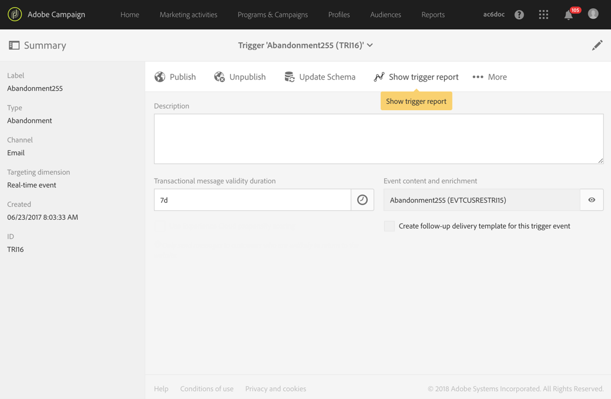

# Using Triggers in Campaign{#using-triggers-in-campaign}

## Creating a mapped trigger in Campaign {#creating-a-mapped-trigger-in-campaign}

>[!NOTE]
>
>To create Triggers, you will need the **[!UICONTROL Administration]** role or to be in the **[!UICONTROL Administrators]** security group. For more information on this, refer to this [page](../../administration/using/list-of-roles.md).

You should make sure to define the behaviors that you want to monitor beforehand in Adobe Experience Cloud ( **[!UICONTROL Triggers]** core service). For more on this, refer to the [Adobe Experience Cloud documentation](https://experienceleague.adobe.com/docs/core-services/interface/activation/triggers.html). Note that when you define the trigger, you need to enable the aliases. For each behavior (browsing/form abandonment, adding/deleting products, session expired, etc.), a new trigger must be added in Adobe Experience Cloud.

You now have to create a trigger event in Adobe Campaign based on an existing Adobe Experience Cloud trigger.

You can watch this [video](https://helpx.adobe.com/marketing-cloud/how-to/email-marketing.html#step-two) to help you understand how triggers are set up in Adobe Campaign.

The steps for putting this into place are:

1. Click the **Adobe** logo, in the top left corner, then select **[!UICONTROL Marketing plans]** > **[!UICONTROL Transactional messages]** > **[!UICONTROL Experience Cloud Triggers]**. 

   

1. Click the **[!UICONTROL Create]** button. The creation wizard that opens displays the list of all of the triggers defined in Adobe Experience Cloud. The **[!UICONTROL Fired by Analytics]** column displays the number of events sent by the Adobe Experience Cloud trigger to Campaign. This is mapping of triggers created in the Experience Cloud interface.

   

1. Select the Adobe Experience Cloud trigger that you want to use and click **[!UICONTROL Next]**.
1. Configure the general properties of the trigger. At this step of the wizard, also specify the channel and the targeting dimension to use for the trigger (see [targeting dimensions and resources](../../automating/using/query.md#targeting-dimensions-and-resources)). Then confirm the trigger creation.
1. Click the button to the right of the **[!UICONTROL Event content and enrichment]** field to view the content of the payload. This screen also allows you to enrich the event data with profile data stored in the Adobe Campaign database. The enrichment is performed in the same way as for a standard transactional message. 

   

1. In the **[!UICONTROL Transactional message validity duration]** field, define the duration for which the message will stay valid after the event is sent by Analytics. If a duration of 2 days is defined, the message will no longer be sent after that duration has passed. If you put several messages on hold, this ensures that those messages will not be sent if you resume them after a certain period of time.

   

1. You can now publish your triggers. For more on this, refer to [Publishing a trigger in Campaign](../../integrating/using/using-triggers-in-campaign.md#publishing-trigger-in-campaign).

## Publishing a trigger in Campaign {#publishing-trigger-in-campaign}

After creating a trigger event in Adobe Campaign based on an existing Adobe Experience Cloud trigger, you now need to publish it.

1. From your previously created trigger, Click the **[!UICONTROL Publish]** button to start publishing the trigger event.

   

1. You can check the progress of your trigger publication under **[!UICONTROL Publication]**.

   

1. When publication is done, the following message will appear under **[!UICONTROL Publication]**.

   

1. If you need to make a change in your trigger schema even after publishing your trigger event, click the **[!UICONTROL Update schema]** button to retrieve the latest changes.

   Please note that this action will unpublish your trigger and transactional message, you will be required to republish them afterwards.

   

1. Click **[!UICONTROL Show Trigger in Experience Cloud]** button allows you to view the trigger definition in Adobe Experience Cloud.

Once the event has been published, a transactional template linked to the new event is then automatically created. You then have to modify and publish the template that was just created. For more on this, refer to the [Editing the template](../../start/using/marketing-activity-templates.md) section.

## Editing the transactional message template {#editing-the-transactional-message-template}

Once you have created and published the trigger event, the corresponding transactional template is created automatically. For more on this, refer to the [Creating a mapped trigger in Campaign](#creating-a-mapped-trigger-in-campaign) section.

In order for the event to trigger sending a transactional message, you have to personalize the template, then test it and publish it. These steps are the same as for a standard transactional message. For more on this, refer to the [Editing a transactional message](../../channels/using/editing-transactional-message.md) section.

>[!NOTE]
>
>If you unpublish the template, it will automatically unpublish the trigger event.

When editing content, you can add a personalization field based on the information sent by the Analytics trigger. If you enrich the event data with Adobe Campaign profile data, you can personalize the message based on this information. To personalize your message, select **[!UICONTROL Transactional event]** > **[!UICONTROL Event context]** and select a field.

## Accessing the reports {#accessing-the-reports}

To view the dedicated trigger report in Adobe Campaign, open the trigger event that you previously created, and click **[!UICONTROL Show trigger report]**. 

The report shows the number of processed events compared to the number of events sent by Analytics. It also displays a list of all the recent triggers. 

