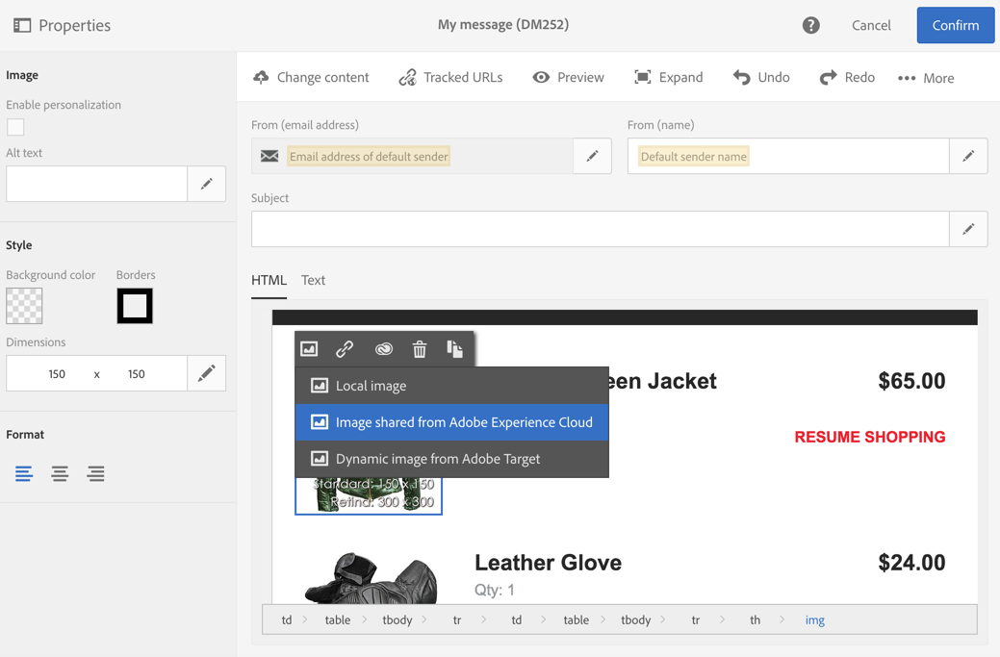
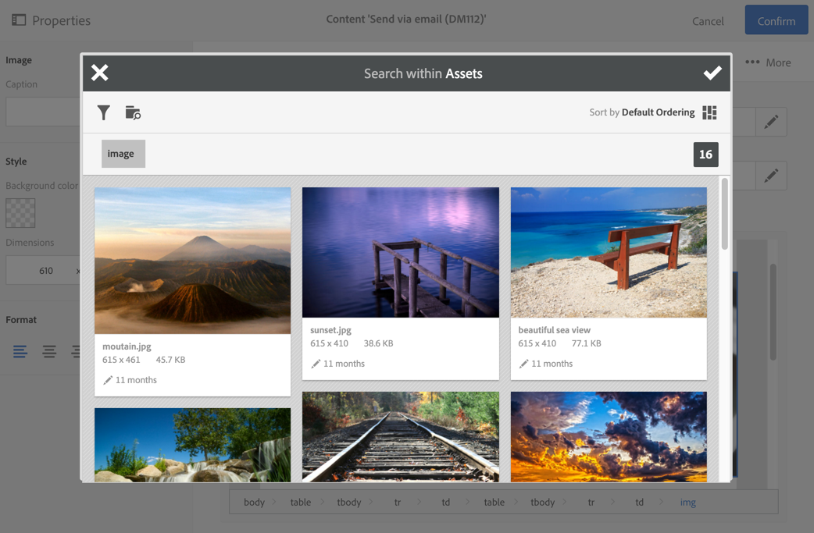

# Working with Campaign and Assets core service{#working-with-campaign-and-assets-core-service}

Integrating Assets core service or Assets on Demand (depending on the configuration of your Adobe Experience Cloud environment) with Adobe Campaign allows you to use any assets that are shared within Adobe Experience Cloud in your Adobe Campaign emails and landing pages.

Resources shared from Adobe Experience Cloud can be used in your emails and landing pages.

1. When editing the content of an email or landing page, go to an image block, then select **[!UICONTROL Image shared from Adobe Experience Cloud]** via the contextual menu.

   

1. In the selection window that opens, select an image, then confirm.

   

The image is then inserted. The delivery can now be personalized as needed and sent.

**Related topics:**

* [Assets and Sharing](https://marketing.adobe.com/resources/help/en_US/mcloud/experience-cloud-assets.html) 
* [Content editor](../../designing/using/example--email-personalization.md)

