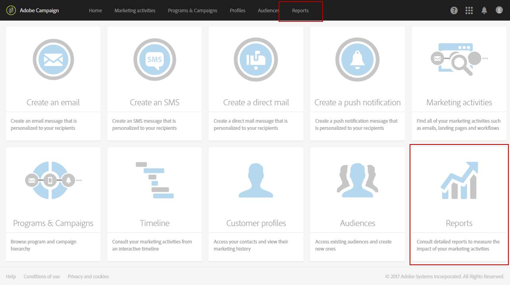
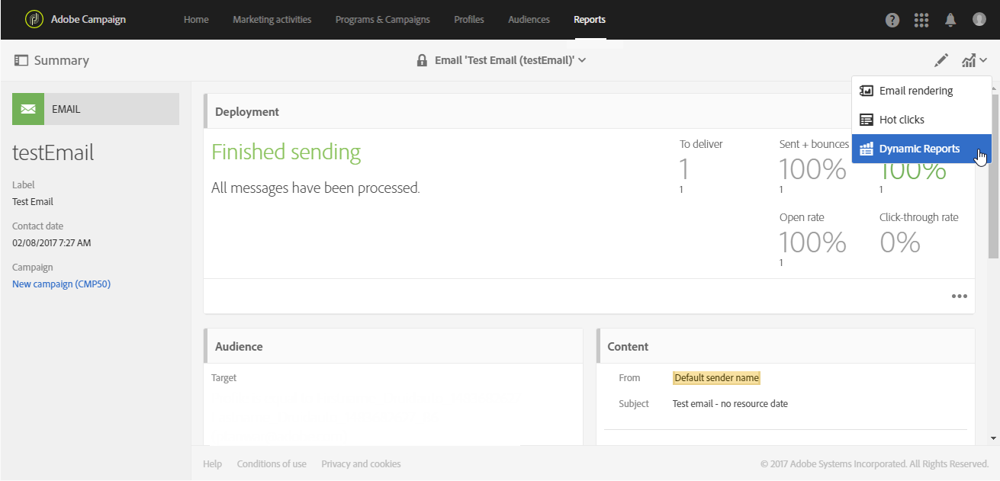
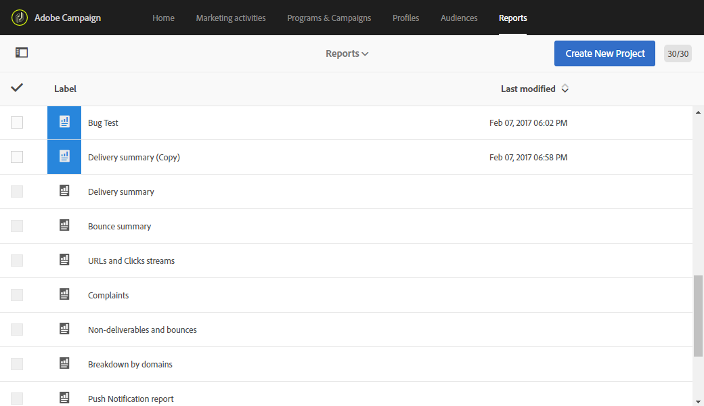
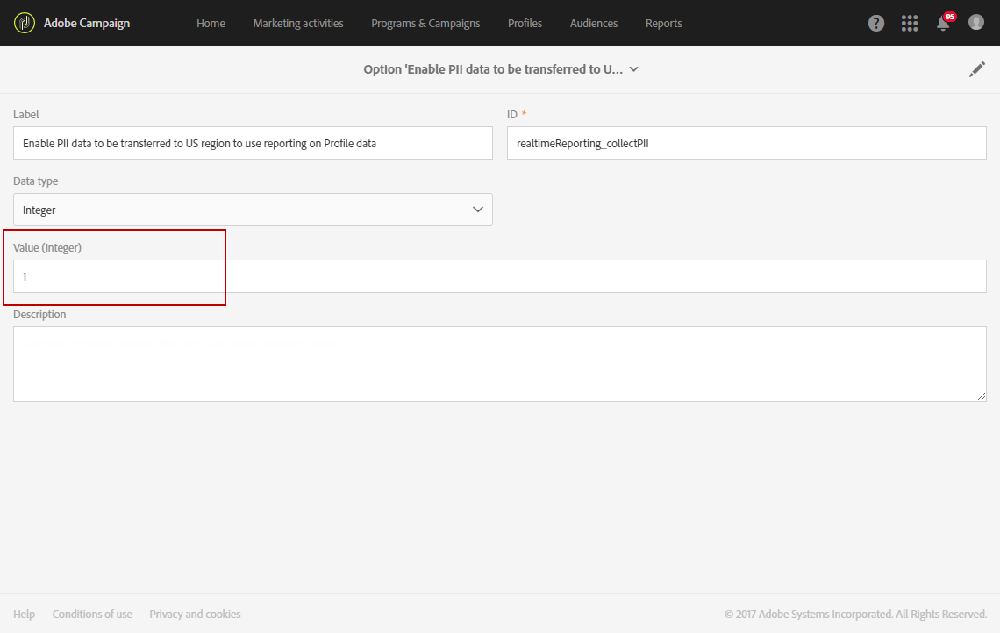

# About dynamic reports{#about-dynamic-reports}

>[!NOTE]
>
>Only users with administration rights or with organizational units set to **All** can create or save a new report. For more on this, refer to this [section](../../administration/using/users-management.md).

Dynamic Reporting provides fully customizable and real-time  reports. It adds access to profile data, enabling demographic analysis by profile dimensions such as gender, city and age in addition to functional email campaign data like opens and clicks. With the drag-and-drop interface, you can explore data, determine how your email campaigns performed against your most important customer segments and measure their impact on recipients.

Thanks to its drag and drop menu and customizable visualizations, the dynamic reports feature allows you to combine dimensions, metrics and time range in any combination, with unlimited breakdowns and comparisons.

**Related topics:**

* [Report list](../../reporting/using/defining-the-report-period.md)
* [Organizational units](../../administration/using/organizational-units.md)
* [Dynamic reports](https://helpx.adobe.com/campaign/kt/acs/using/acs-creating-a-dynamic-report-feature-video-use.html) video

## Accessing dynamic reports {#accessing-dynamic-reports}

Reports can be accessed:

* From the home page by selecting **[!UICONTROL Reports]** tab in the top bar or the **[!UICONTROL Reports]** card to access reports for all deliveries.

  

* In each program, campaign, and message, from the **Reports** button by clicking **Dynamic Reports** to only view the reports specific to the delivery.

  

Certain reports cannot be available immediately after a delivery, depending on the time it takes to collect and process information.

Dynamic reports are divided into two categories:

* **Templates**, which can be modified by copying them using the **Save as** option (**Project > Save As..**) in the template.
* **Custom reports** (identified in blue), which can be directly created by clicking the **Create New Project** button on the **Reports** home page.

>[!NOTE]
>
>Data are filtered depending of your organizational units.

## Dynamic reporting usage agreement {#dynamic-reporting-usage-agreement}

The Dynamic reporting usage agreement's purpose is to function as a pop-up consent for data processing and to be up-to-date with the latest functionalities added. By default, the agreement is only visible and can only be accepted or declined by users assigned with administration rights.

Three options are available:

* **[!UICONTROL Ask me later]**: By clicking Ask me later, the window will stop showing for 24 hours.
* **[!UICONTROL Accept]**: By accepting this agreement, you authorize Adobe Campaign to collect your customers' Personal identification information and to transfer them to the reporting cluster or data center.
* **[!UICONTROL Decline]**: By declining the agreement, the profile dimensions will not appear in your reports and your customers' Personal identification information will not be collected or sent.

The table below displays the result following your action with this agreement.

<table> 
 <thead> 
  <tr>
  <th rowspan=2></th>
  <th colspan=2>Agreed</th>
  <th colspan=2>Did not agree</th>
</tr>
  <tr> 
    <th>Dynamic reporting</th> 
    <th>Microsoft Dynamics 365 connector</th> 
    <th>Dynamic reporting</th>
    <th>Microsoft Dynamics 365 connector</th>  
  </tr> 
 </thead> 
 <tbody> 
  <tr> 
   <td>Americas & APAC</td> 
   <td><strong>Feature available.</strong>
  
   All out-of-the-box & custom profiles information pushed into the US reporting cluster.</td> 
   <td><strong>Feature available.</strong>
  
   All out-of-the-box & custom profiles fields and Adobe Campaign Standard event fields processed in the US data cluster.</td> 
   <td><strong>Feature available.</strong>
  
   No out-of-the-box & custom profiles information pushed into the US reporting cluster. </td> 
   <td><strong>Feature available.</strong>
  
   No out-of-the-box or custom profile fields sent to the US data center with the exception of profileExternalID. All Adobe Campaign Standard event fields processed in the US data center with the exception of segment code and mirror page ID.</td> 
  </tr> 
  <tr> 
   <td>EMEA</td> 
   <td><strong>Feature available.</strong>
  
   All out-of-the-box & custom profiles information pushed into the EMEA reporting cluster.</td> 
   <td><strong>Feature available.</strong>
  
   All out-of-the-box & custom profiles fields and Adobe Campaign Standard event fields processed in the EMEA data cluster.</td> 
   <td><strong>Feature available.</strong>
  
   No out-of-the-box & custom profiles information pushed into the EMEA reporting cluster. </td>
   <td><strong>Feature available.</strong>
  
   No out-of-the-box or custom profile fields sent to the EMEA data center with the exception of profileExternalID. All Adobe Campaign Standard event fields processed in the EMEA data center with the exception of segment code and mirror page ID.</td>  
  </tr> 
 </tbody> 
</table>

This choice is not final, you can always change it by selecting **[!UICONTROL Enable PII data to be transferred to US region to use reporting on Profile data]** in **[!UICONTROL Administration]** > **[!UICONTROL Application Settings]** > **[!UICONTROL Options]**.

The value can be changed at any time. The value -1 corresponds to **[!UICONTROL Ask me later]**, 1 **[!UICONTROL Accept]** and 0 **[!UICONTROL Decline]**.

