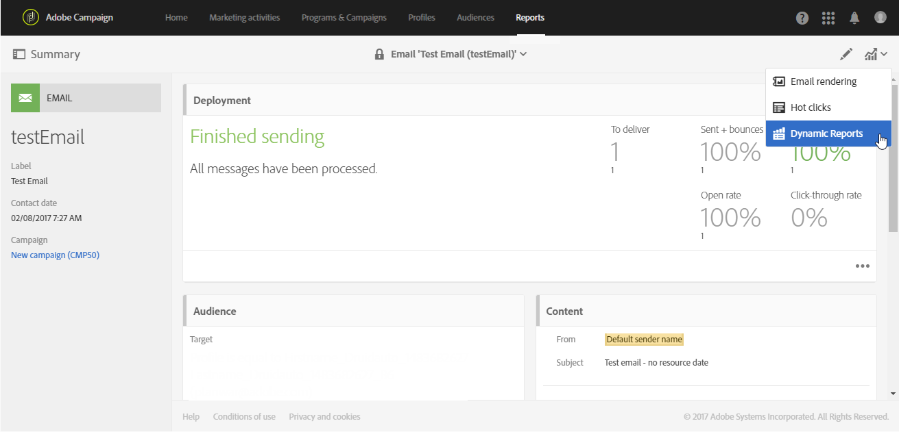
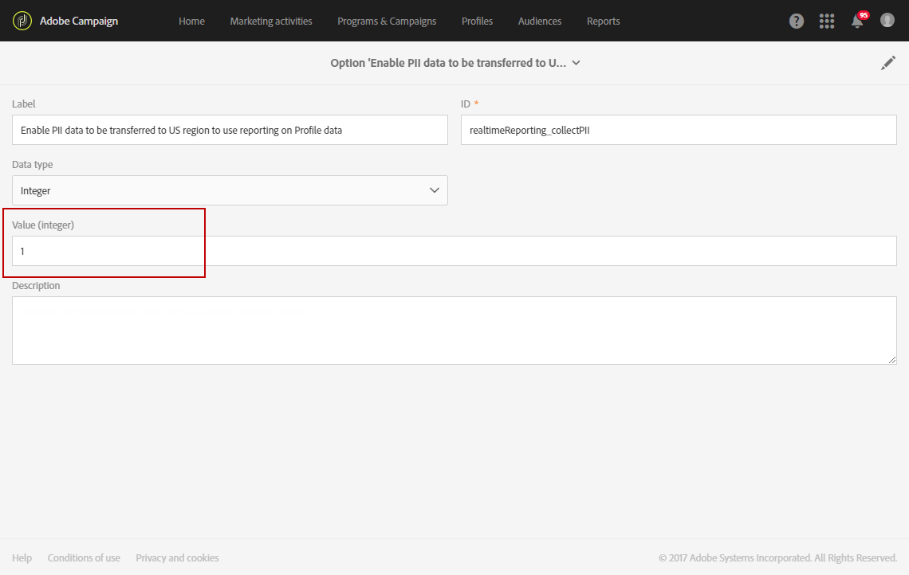

# Get started with dynamic reports {#about-dynamic-reports}

Dynamic Reporting provides fully customizable and real-time reports. It adds access to profile data, enabling demographic analysis by profile dimensions such as gender, city and age in addition to functional email campaign data like opens and clicks. With the drag-and-drop interface, you can explore data, determine how your email campaigns performed against your most important customer segments and measure their impact on recipients.

>[!NOTE]
>
>Only users with administration rights or with organizational units set to **All** can create or save a new report. For more on this, refer to this [section](../../administration/using/users-management.md).

## Accessing dynamic reports {#accessing-dynamic-reports}

Reports can be accessed:

* From the home page by selecting **[!UICONTROL Reports]** tab in the top bar or the **[!UICONTROL Reports]** card to access reports for all deliveries.

  

* In each program, campaign, and message, from the **Reports** button by clicking **Dynamic Reports** to only view the reports specific to the delivery.

  

Certain reports cannot be available immediately after a delivery, depending on the time it takes to collect and process information.

Dynamic reports are divided into two categories:

* **Templates**, which can be modified by copying them using the **Save as** option (**Project > Save As..**) in the template.
* **Custom reports** (identified in blue), which can be directly created by clicking the **Create New Project** button on the **Reports** home page.

>[!NOTE]
>
>Data are filtered depending of your organizational units.

## Dynamic reporting usage agreement {#dynamic-reporting-usage-agreement}

The Dynamic reporting usage agreement's purpose is to function as a pop-up consent for data processing. By default, the agreement is only visible and can only be accepted or declined by users assigned with administration rights.

Three options are available:

* **[!UICONTROL Ask me later]**: By clicking **Ask me later**, the window will stop showing for 24 hours. Until you accept or decline the agreement, the profile dimensions will not appear in your reports and your customers' Personal identification information will not be collected or sent.
* **[!UICONTROL Accept]**: By accepting this agreement, you authorize Adobe Campaign to collect your customers' Personal identification information and to transfer them to the reporting or data center.
* **[!UICONTROL Decline]**: By declining the agreement, the profile dimensions will not appear in your reports and your customers' Personal identification information will not be collected or sent. Note that in this case externalID will still be collected and used to identify end-users.

The table below displays what happens after accepting with this agreement depending on your region.

|  |Dynamic reporting|Microsoft Dynamics 365 connector|
|---|---|---|
|Americas & APAC (Asia Pacific)| **Feature available**.  All out-of-the-box (i.e. city, country/region, state, gender and segments on the age basis) & custom profiles information pushed into the US reporting center. For more information on profile dimensions, refer to this [page](../../reporting/using/list-of-components.md) |**Feature available**.  All out-of-the-box & custom profiles fields and Adobe Campaign Standard event fields are processed in the US data center.|
|EMEA (Europe Middle East & Africa)|**Feature available**.  All out-of-the-box (i.e. city, country/region, state, gender and segments on the age basis) & custom profiles information pushed into the EMEA reporting center. For more information on profile dimensions, refer to this [page](../../reporting/using/list-of-components.md)|**Feature available.**  All out-of-the-box & custom profiles fields and Adobe Campaign Standard event fields processed in the EMEA data center.  **[!UICONTROL Control data]** which contains Adobe I/O registration data and IDs of customer end-user events sent and stored in the US data center.|

The table below displays what happens after declining this agreement depending on your region. Note that even if you decline this agreement, reporting on deliveries and Microsoft Dynamics 365 integration will still be available.

|  Region |Dynamic reporting|Microsoft Dynamics 365 connector|
|---|---|---|
|Americas & APAC (Asia Pacific)|**Feature available**.   No out-of-the-box & custom profiles information pushed into the US reporting center with the exception of ExternalID.|**Feature available**.  No out-of-the-box or custom profile fields sent to the US data center with the exception of External ID and Recipient ID.  All Adobe Campaign Standard event fields processed in the US data center with the exception of mirror page ID.  For more information on Microsoft Dynamics 365 integration, refer to this [page](../../integrating/using/d365-acs-get-started.md).|
|EMEA (Europe Middle East & Africa)|**Feature available**.  No out-of-the-box & custom profiles information pushed into the EMEA reporting center with the exception of ExternalID.|**Feature available.**  No out-of-the-box or custom profile fields sent to the EMEA data center with the exception of External ID and Recipient ID.  All Adobe Campaign Standard event fields processed in the EMEA data center with the exception of mirror page ID.   **[!UICONTROL Control data]** which contains Adobe I/O registration data and IDs of customer end-user events sent and stored in the US data center. For more information on Microsoft Dynamics 365 integration, refer to this [page](../../integrating/using/d365-acs-get-started.md).|

This choice is not final, you can always change it by selecting **[!UICONTROL Enable PII data to be transferred to US region to use reporting on Profile data]** in **[!UICONTROL Administration]** > **[!UICONTROL Application Settings]** > **[!UICONTROL Options]**.

The value can be changed at any time. The value 1 corresponds to **[!UICONTROL Ask me later]**, 2 **[!UICONTROL Decline]** and 3 **[!UICONTROL Accept]**.

