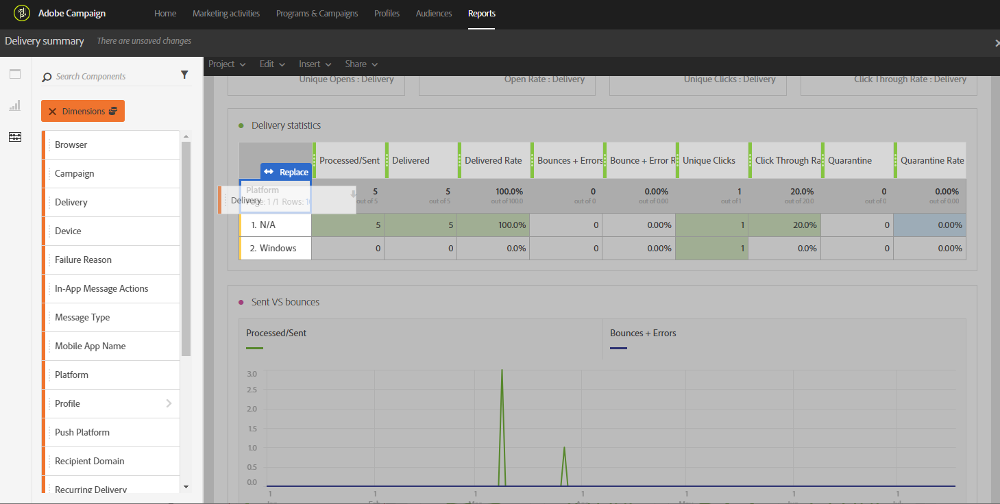
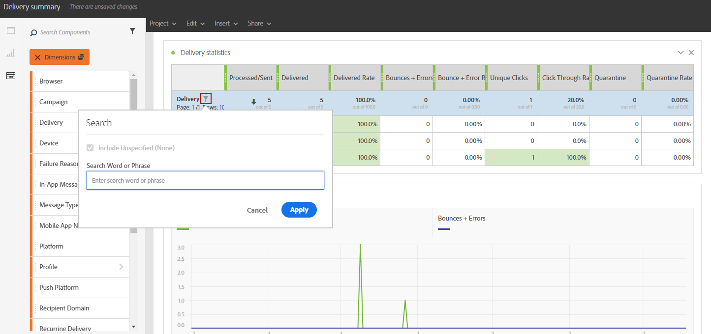

# Adding components{#adding-components}

Components help you customize your reports with different dimensions, metrics, and time periods.

1. Click the **[!UICONTROL Components]** tab to access the list of components.

   

1. Each category presented in the **[!UICONTROL Components]** tab displays the five most used items, click the name of a category to access its full list of components.

   The components table is divided into four categories:

    * **Dimensions**: Get details from the deliveries log, such as the recipient's browser or domain, or the success of a delivery.
    * **Metrics**: Get details on the status of a message. For example, if a message was delivered and did the user open it. 
    * **[!UICONTROL Segments]**: Filter data depending on the recipient's age range. **[!UICONTROL Segments]** can be dragged and dropped directly in a freeform table or in the top bar of the panel.

      This category is only available once the administrator approved the terms and conditions of the Dynamic Reporting Usage Agreement that will be displayed on screen. If the administrator declines the agreement, the segments will not be visible in the **[!UICONTROL Components]** tab and data will not be collected.
    
    * **Time**: Set a time period for your table.

1. Drag and drop components in a panel to start filtering your data.

   

1. After drag and dropping your component, you can further configure your table with the **[!UICONTROL Row settings]** option.

   

1. You can also further filter your table by clicking the **Search** icon. With this search, you can look for specific results such as a specific delivery or browser for example.

   

You can drag and drop as many components as needed and compare them to one another.

**Related topics:**

* [List of components](../../reporting/using/list-of-components.md)
* [List of reports](../../reporting/using/defining-the-report-period.md)
