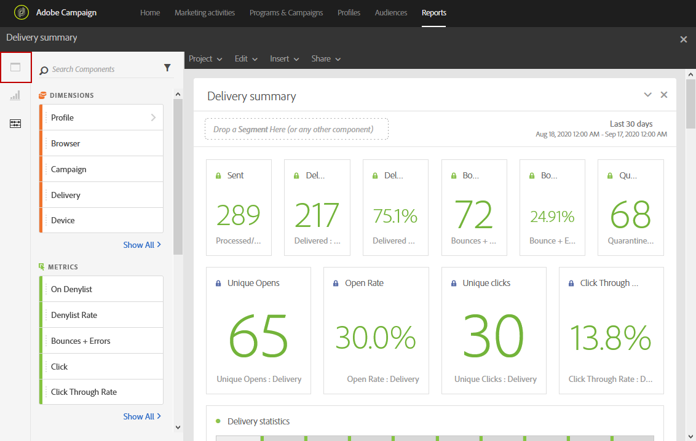

# Adding panels{#adding-panels}

## Adding a blank panel {#adding-a-blank-panel}

To start your report, you can add a set of panels to an out of the box or custom report. Each panel contains different data sets and is composed of freeform tables and visualizations.

This panel allows you to build your reports as needed. You can add as many panels as you want in your reports in order to filter your data with different time periods.

1. Click the **Panels** icon. You can also add a panel by clicking the **Insert tab** and selecting **New Blank Panel**. 

   

1. Drag and drop the **Blank Panel** into your dashboard. 

   

You can now add a freeform table to your panel to start targeting data.

## Adding a freeform table {#adding-a-freeform-table}

Freeform tables allow you to create a table to analyze your data using the different metrics and dimensions available in the **Component** table.

Each table and visualization is resizable and can be moved to better customize your report.

1. Click the **Panels** icon.

   

1. Drag and drop the **Freeform** item into your dashboard.

   You can also add a table by clicking the **Insert** tab and selecting **New Freeform** or by clicking **Add a freeform table** in an empty panel. 

   

1. If needed, drag and drop **[!UICONTROL Segments]** from the **[!UICONTROL Components]** tab into the top bar to filter your report depending on your recipient's age range.

   

1. Drag and drop items from the **Components** tab into the columns and rows to build your table.

   

1. Click the **Settings** icon to change how the data is displayed in your columns.

   

   The **[!UICONTROL Column settings]** is composed of:

    * **[!UICONTROL Number]** : lets you show or hide summary numbers in the column.
    * **[!UICONTROL Percent]** : lets you show or hide percent in the column.
    * **[!UICONTROL Interpret zero as no value]** : lets you show or hide when value equals zero.
    * **[!UICONTROL Background]** : lets you show or hide the horizontal progress bar in cells.
    * **[!UICONTROL Include retries]** : lets you include retries in the result. This is only available for **[!UICONTROL Sent]** and **[!UICONTROL Bounces + Errors]** .

1. Select one or multiple rows and click the **Visualize** icon. A visualization is added to reflect the rows you have selected.

   

You can now add as many components as you need and also add visualizations to give graphical representations of your data.
