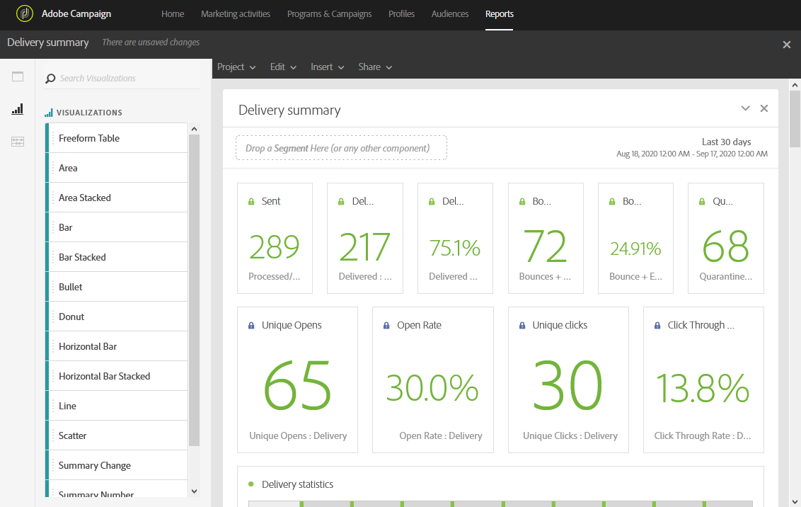
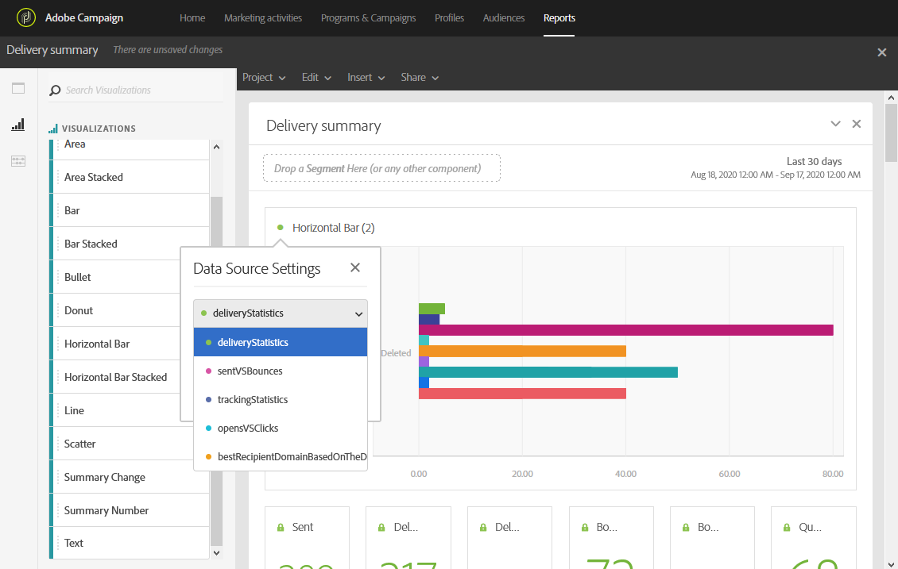
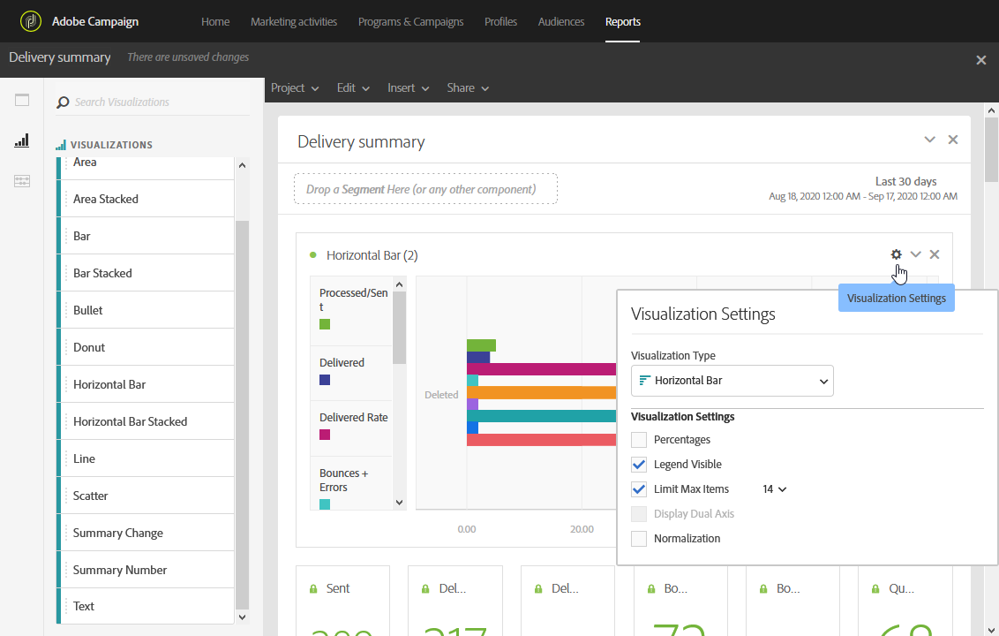

# Adding visualizations{#adding-visualizations}

Adding visualizations

The **Visualizations** tab lets you drag and drop visualization items, such as area, donut and graph. Visualizations give you graphical representations of your data.

1. In the **Visualizations** tab, drag and drop a visualization item in a panel.

   

1. After adding a visualization to your panel, Dynamic reports automatically detects the data in your freeform table. Select the settings for your visualization.
1. If you have more than one freeform table, choose the available data source to add in your graph in the **Data Source Settings** window. This window is also available by clicking on the colored dot next to your visualization title.

   

1. Click the **Visualization** settings button to directly change the graph type or what is displayed on it, such as:

    * **Percentages**: Displays the values in percentage. 
    * **Anchor Y Axis at Zero**: Forces the y axis to zero even if values range above zero. 
    * **Legend visible**: Lets you hide the legend.
    * **Normalization**: Forces values to match.
    * **Display Dual Axis**: Adds another axis to your graph.
    * **Limit Max Items**: Limits the number of graphs displayed.
    * **Threshold**: Let you set a threshold to your graph. It appears as a black dotted line.

   

This visualization allows you to have a clearer view of your data in your reports.
