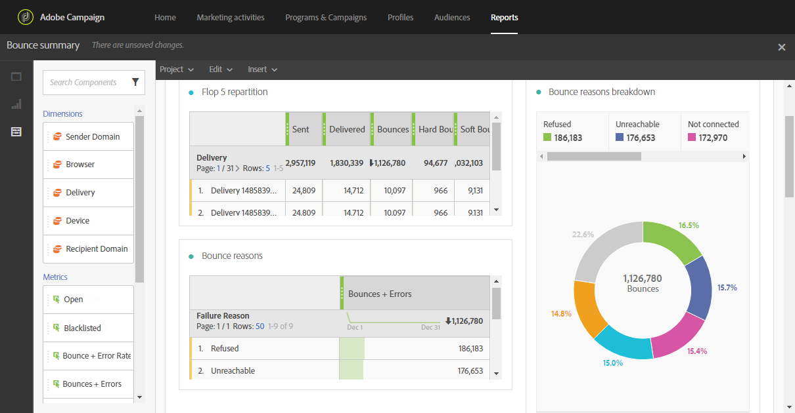

# Bounce summary{#bounce-summary}

This report details the overall hard and soft errors encountered during deliveries as well as the automatic processing of bounces (see [Understanding delivery failures](../../sending/using/understanding-delivery-failures.md)). 

Each table is represented by summary numbers and charts. You can change how the details are shown in their respective visualization settings.

**Flop 5 repartition** lists the five deliveries with the highest number of quarantines:

The **Bounce reasons** table contains the available data for the types of errors that caused bounces for each delivery:

* **[!UICONTROL User unknown]**: The type of error generated when a delivery is sent to an invalid email address.
* **[!UICONTROL Invalid domain]**: The type of error generated when a delivery is sent to an email address whose domain is wrong or no longer exists.
* **[!UICONTROL Unreachable]**: The type of error encountered in the message delivery string, such as domain temporarily unreachable.
* **[!UICONTROL Account disabled]**: The type of error generated when a delivery is sent to an email address that no longer exists.
* **[!UICONTROL Mailbox full]**: The type of error generated when the recipient's inbox is full. There are five attempts to deliver the message before this error is generated.
* **[!UICONTROL Not connected]**: The type of error generated when the recipient's mobile phone is off or it is not connected to a network at the time the message is sent.

  >[!NOTE]
  >
  >This type of error only concerns deliveries on mobile channels.

* **[!UICONTROL Refused]**: The type of error generated when an address is refused by the Internet service provider (ISP). For example, when a security rule has been applied by anti-Spam software.

The **Domain repartition** table displays the overall problems encountered during the deliveries according to the recipient domain.
