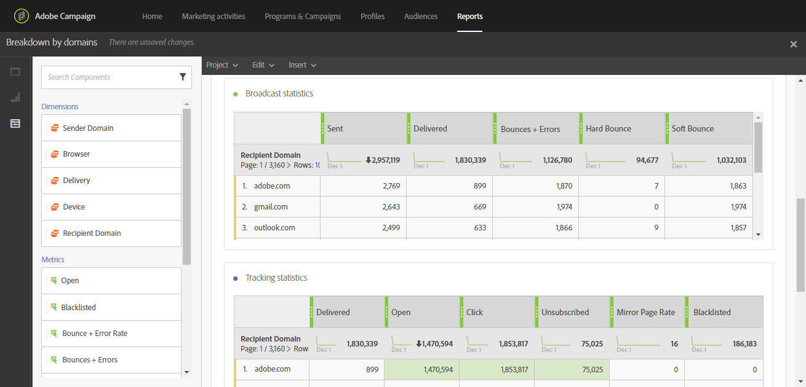

# Breakdown by domains{#breakdown-by-domains}

This report contains the performance data for each domain represented in the audience for an email delivery. If it is a campaign or program report, the performance data is available for multiple audiences. This data allows you to analyze the behavior of each domain in reaction to specific events. For example, link display, URL on denylist, etc.

The table **Broadcast statistics** contains the available data for possible errors encountered with each domain, such as:

* **Processed/sent**: The number of emails sent.
* **Delivered**: The number of emails delivered.
* **Bounces + Errors**: The number of messages that could not be delivered.
* **Hard bounce**: The total number of permanent errors, such as a wrong email address.
* **Soft bounce**: The total number of temporary errors, such as a full inbox.

The second table, **Tracking statistics**, contains the available data for recipient reactivity to delivery, such as:

* **Delivered**: The number of emails delivered
* **Open**: The number of times a message was opened in a delivery.
* **Click**: The number of times content was clicked in a delivery.
* **Unsubscribed**: The number of clicks on the subscription link.
* **Mirror Page**: The number of clicks on the mirror page link.
* **On denylist**: The number of recipients who have declared an email as spam or junk. [Learn more](../../audiences/using/about-opt-in-and-opt-out-in-campaign.md)
